| Detail | Value |
| --- | --- |
| Title | Client Management |

| Date | By | Description |
| --- | --- | --- |
| 05/01/2025 | FPTG | Initial draft |
| 07/02/2025 | FPTG | Component section imports |
| 08/08/2025 | FPTG | Final review. Submitted to TFI. |

# Section I – Functional Category/ Module Overview
This section introduces the Client Management module, emphasizing its role in capturing and maintaining comprehensive client records across programs and services within the TFI One system. It covers the module’s purpose and core functionalities, including demographic intake, enrollment tracking, identity verification, and cross-agency record visibility. The module enables accurate, up-to-date client information is available to authorized users and supports coordination of care, compliance with state data standards, and integration with dependent modules. Key terms and acronyms are defined, and critical dependencies are identified to ensure proper configuration and use.
# 1. Purpose
The purpose of this Functional Design Specification (FDS) is to define the system functionality, user interfaces, business rules, screen elements, and security for each screen in the Client Management module. It serves as a blueprint for development and a reference for stakeholders to ensure that system design aligns with TFI requirements.
# 2. General Functional Category Description
The Client Management module supports TFI staff in the intake, identification, and ongoing maintenance of individual client records across the child welfare continuum. This module facilitates accurate capture and tracking of client demographics, enrollment history, household associations, and program involvement. The purpose is to ensure a single, consistent source of truth for client identity, eligibility, and participation.
Key functional capabilities include:
- Capturing and updating demographic and contact information.
- Managing multiple identifiers, aliases, and enrollment records.
- Associating clients with households, caregivers, and legal representatives.
- Verifying identity and preventing duplicate records.
- Tracking client status across agencies and programs.
- Supporting eligibility determinations and service planning.
# 3. Module Terms and Glossary
The Module Terms and Glossary section defines key terms and acronyms used throughout the Client Management module. It ensures a common understanding among all stakeholders and supports clarity in system design and implementation.

| Term | Description |
| --- | --- |
| ARD (Admission, Review, Dismissal) | Education process for evaluating and placing students with special needs |
| IEP (Individualized Education Program) | Customized education plan for students with disabilities |
| ECAP | External system used for placement and assessment data exchange |
| PID | Unique client identifier used across systems |
| TPG | Third-party group or system receiving placement transmissions |
| TEP (Temporary Placement) | Temporary placement |
| CPA | Child Placing Agency |
| CMP | Case Management Provider |
| GRO | General Residential Operation |
| OPPLA | Other Planned Permanent Living Arrangement |
| ICWA | Indian Child Welfare Act status indicator |
| PRTF | Psychiatric Residential Treatment Facility |
| Alias | Alternate name used for a client, often due to legal name changes |
| Face Sheet | Summary screen displaying key client information and program tiles |
| Intake | Initial process of enrolling a client into a program |
| Placement Request | Formal request for client placement into a program or facility |
| Service Package | Defined set of services provided to a client based on needs |
| Assessment | Evaluation of client needs, often used for placement or service planning |
| Recruitment Event | Outreach activity to identify potential adoptive families |
| Matched Event | Interaction event between prospective adoptive families and children |
| Home Study | Evaluation of a home’s suitability for foster or adoptive placement |
| Staffing | Formal meeting to discuss placement or adoption decisions |
| Client Alert | Notification of critical client status or behavior |
| Case Participant | Individual associated with a client’s case, such as caregiver or legal rep |

# 4. Target TFI Agency and Scoping Considerations
The Client Management module is utilized by all TFI agencies, including CPA, CMP, and Behavioral Health, and serves as the central hub for client-related data across the system. It is designed to support a unified client record accessible to authorized users across programs and geographic regions.
The Client Management module supports:
- Agency-wide access to client demographics and enrollment history.
- Integration with intake, service planning, and case management functions.
- Association of clients with households, legal reps, and caregivers.
- Support for cross-agency coordination and shared service delivery.
- Deduplication and identity resolution across systems.
- Compliance with state and federal data standards.
# 5. Functional Category Dependencies
The Contract Management module relies on integration with several other core functional areas of TFI One:
- General
- Client Management
- Case Management
- Service Requests
# Section II – High-Level Workflows/Data Flows
# 6. Workflow 1 – Intake
## Description
The Intake workflow describes the process of creating a new intake for any program enrollment when a client referral is received. It defines the process for initiating a client’s enrollment into TFI programs following a referral. It guides users through creating an intake record, entering required information, and associating clients with appropriate programs. The workflow supports multiple paths based on program type (e.g., Foster Care, Adoption, Behavioral Health), and includes logic for incomplete intakes and pending statuses. Integrated with ECAP via API, it ensures accurate client creation, triggers placement requests when applicable, and populates the Client Face Sheet with relevant data tiles for coordinated care.
## Actors

| Actors |  |
| --- | --- |
| 1. | IPD workers |

## Preconditions

| Preconditions |  |
| --- | --- |
| 1. | Client referral has been received. |

## Workflow Diagram

## Main Flow – Foster Care, Adoption, Residential, Family Preservation or Independent Living Program Enrollment

| Main Flow |  |
| --- | --- |
| 1. | Create new Intake. |
| 2. | Complete required fields on the Intake Information screen. |
| 3. | Create client and add Program Enrollment. If Foster Care, Adoption, Residential Treatment, Family Preservation or Independent Living proceed with step 4. If other, proceed with step 8. |
| 4. | Complete remaining required Intake fields. |
| 5. | Click "Submit Placement Request". |
| 6. | Intake information is sent to ECAP and Placement Request record is created on the Placement Request dashboard with a status = Awaiting Placement. |
| 7. | Client Facesheet is created with all configured facesheet tiles. |

## Alternate Flows

| Alternate Flow - Other Program Enrollment (Behavioral Health,) |  |
| --- | --- |
| 8. | Complete remaining required Intake fields. |
| 9. | Click "Complete Intake". |
| 10. | Client Facesheet is created with all configured facesheet tiles. |
| 11. | Task is created on the task dashboard (serve as notification). |

| Alternate Flow – User does not have all of the Intake information |  |
| --- | --- |
| 1. | Create new Intake. |
| 2. | Click "Save and Close" at any point in the Intake process. |
| 3. | Record displays on the Intake Dashboard with a Pending Status. |

## 6.1 Dashboard – User Interfaces

| Step 1: Intake Information (CoBRIS screenshot) |
| --- |
|  |

| Step 2: Client Information (Mockup) |
| --- |
|  |

| Add/Edit Client (Mockup) |
| --- |
|  |

| Submit Intake (CoBRIS screenshot) |
| --- |
|  |

## 6.2 Dashboard – Business Rules

| # | Rule Description |
| --- | --- |
| Intake/Admission – General |  |
| 1. | The Program Enrollment selection will determine which cards to display on the Client Face Sheet and if the client needs a placement If a client has more than one program enrollment, the client face sheet will display each tile associated to the program enrollment.  Duplicate tiles will only display once. |
| 2. | Submit Placement Request will trigger the ECAP API call.  Refer to the General FDS – Section: Interfaces. |
| 3. | Intake/Admission is a three-step wizard. |
| Step 1: Intake Information |  |
| 1. | Intake Coordinator dropdown values will display workers based on their roles. |
| 2. | If an existing case number is entered, the case name will auto-populate. |
| 3. | If Case Number and Case Name are blank, the system will auto-generate a Case Name and Case Number following this format: “TFI-#####” Auto-generated Case Names and Case Numbers will be the same.  See example: Case Number: TFI-12345 Case Name: TFI-12345 |
| 4. | Case County dropdown values will display according to the logged-in user’s organization. |
| Step 2: Client and Case Participant Information |  |
| 1. | Intake Number will be auto-generated by the system. |
| 2. | This step displays two data grids: Clients and Case Participants. At least one client must be added before moving on to the next step. Clients are also considered case participants but will only display in the client table on this screen. |
| 3. | Clicking the [Add Client] button will open the Add/Edit Client screen. |
| 4. | Clicking the [Add Case Participant] button will open the Add/Edit Case Participant form. Refer to the Case Management FDS – Section: Case Participants for the business rules and element descriptions. |
| 5. | Clients Data Grid: The following actions display for all records, depending on the logged in user’s permissions: [View]: Opens the View Client modal with read-only labels and values from the Add/Edit Client screen. [Edit]: Opens the Edit Client screen. [Delete]: Opens the Remove Client from Intake modal. |
| 6. | Case Participants Data Grid: The following actions display for all records, depending on the logged in user’s permissions: [View]: Opens the View Case Participant modal with read-only labels and values from the Add/Edit Case participant screen. Refer to Case FDS. [Edit]: Opens the Edit Case Participant screen. Refer to Case FDS. [Delete]: Opens the Remove Case Participant from Intake modal. |
| Step 2: Add/Edit Client |  |
| 1. | All fields will be disabled except for the Program Enrollment field and Begin Date field. Once both of those fields have been completed, the remaining fields will become enabled. |
| 2. | Selecting different program enrollments can change form behaviors: Foster Care: Removal Date becomes required. Adoption: Removal Date becomes required. Kansas Residential: PRTF Client dropdown will display and is required. |
| 3. | Role will automatically be set to “Client” and the record will get added to the “Case Participants” section on the Client facesheet and Case facesheet. |
| 4. | Entering an existing PID will populate the form. |
| 5. | Client Agency dropdown values will be defined in the Configuration FDS. |
| 6. | Program Enrollments that signify the need for a placement: Foster Care Adoption Residential Treatment Family Preservation Independent Living Kansas Residential Kansas specific value – should only display for KS Orgs Program Enrollments that do not need a placement: Behavioral Health |
| Step 2: Add/Edit Case Participant |  |
| 1. | The Intake/Admission form will contain the Case Participants component. Refer to the Case Management FDS – Section: Case Participants. |
| Step 3: Submit Intake |  |
| 1. | [Submit Placement] will mark the Intake status as “Complete”.  Placement Request record will queue to the Placement Request dashboard.  Intake record will fall off the dashboard. [Complete Intake] will mark the Intake status as “Complete”.  Intake record will fall off the dashboard.  This action will be used for clients that are receiving services other than placement. It will only display if the only program enrollment selection is Behavioral Health across all clients. [Save and Close] will mark the Intake status as “Pending” and queue a record to the Intake dashboard. |

## 6.3 Dashboard – Element Descriptions

| Element Name | Description/ Attributes | Element Type | Editable | Required | Core |
| --- | --- | --- | --- | --- | --- |
| Intake Information (1) |  | Wizard Step |  |  | Y |
| Menu | Text: “1. Intake Information” | Menu | N/A | N/A | Y |
| Intake Coordinator | Label: “Intake Coordinator” Dropdown Values: Select Coordinator (Default) See business rules. | Dropdown | Y | Y | Y |
| Date of Call | Label: “Date of Call” | Date Picker | Y | Y | Y |
| Time of Call | Label: “Time of Call” | Textbox | Y | Y | Y |
| Date Call Ended | Label: “Date Call Ended” | Date Picker | Y | Y | Y |
| Time Call Ended | Label: “Time Call Ended” | Textbox | Y | Y | Y |
| Who Will Provide Transportation | Label: “Who Will Provide Transportation”Dropdown Values: Select (Default) Agency CPS TFI Shared No Visits | Dropdown | Y | N | Y |
| Case Number | Label: “Case Number” See business rules. | Textbox | Y | Y | Y |
| Case Name | Label: “Case Name” See business rules. | Textbox | Y | Y | Y |
| Case County | Label: “Case County”Dropdown Values: Select County (Default) See business rules. | Dropdown | Y | Y | Y |
| Next Button | Text: “Next” | Button | N/A | N/A | Y |
| Save Button | Text: “Save” | Button | N/A | N/A | Y |
| Save and Close | Text: “Save and Close” | Button | N/A | N/A | Y |
| Client and Case Participant Information Screen (2) |  | Wizard Step |  |  | Y |
| Menu | Text: “2. Client and Case Participant Information” | Menu | N/A | N/A | Y |
| Intake Number | Label: “Intake Number”Value: “{Intake Number}” See business rules. | Label and Value | N/A | N/A | Y |
| Case Number | Label: “Case Number”Value: “{Case Number}” | Label and Value | N/A | N/A | Y |
| Case Name | Label: “Case Name”Value: “{Case Name}” | Label and Value | N/A | N/A | Y |
| Client(s) Data Grid |  | Data Grid |  |  | Y |
| Header Text | Text: “Clients” | Header | N/A | N/A | Y |
| Add Client Button | Text: “Add Client” | Button | N/A | N/A | Y |
| Name Column | Column Header: “Name”Column Value: “{Client Last Name}, {First Name}” | Text Column | N | N/A | Y |
| DOB Column | Column Header: “DOB”Column Value: “{DOB}” | Date Column | N | N/A | Y |
| SSN Column | Column Header: “SSN”Column Value: “{SSN}” | Numerical Column | N | N/A | Y |
| Race Column | Column Header: “Race”Column Value: “{Race}” | Text Column | N | N/A | Y |
| Gender Column | Column Header: “Gender”Column Value: “{Gender}” | Text Column | N | N/A | Y |
| Program Enrollment(s) | Column Header: “Program Enrollment(s)”Column Value: “{Program Enrollment(s)}” | Text Column | N | N/A | Y |
| Actions Column | Column Header: “Actions”Buttons: [View] [Edit] [Delete] | Button Column | N/A | N/A | Y |
| Case Participants Data Grid |  | Data Grid |  |  | Y |
| Header Text | Text: “Case Participants” | Header | N/A | N/A | Y |
| Add Case Participant Button | Text: “Add Case Participant” | Button | N/A | N/A | Y |
| Name Column | Column Header: “Name”Column Value: “{Case Participant Last Name}, {First Name}” | Text Column | N | N/A | Y |
| DOB Column | Column Header: “DOB”Column Value: “{DOB}” | Date Column | N | N/A | Y |
| SSN Column | Column Header: “SSN”Column Value: “{SSN}” | Numerical Column | N | N/A | Y |
| Race Column | Column Header: “Race”Column Value: “{Race}” | Text Column | N | N/A | Y |
| Gender Column | Column Header: “Gender”Column Value: “{Gender}” | Text Column | N | N/A | Y |
| Role | Column Header: “Role”Column Value: “{Role}” | Text Column | N | N/A | Y |
| Actions Column | Column Header: “Actions”Buttons: [View] [Edit] [Delete] | Button Column | N/A | N/A | Y |
| Previous Button | Text: “Previous” | Button | N/A | N/A | Y |
| Next Button | Text: “Next” | Button | N/A | N/A | Y |
| Save Button | Text: “Save” | Button | N/A | N/A | Y |
| Save and Close Button | Text: “Save and Close” | Button | N/A | N/A | Y |
| Add/Edit Client |  | Form Screen |  |  | Y |
| Header Text | Text: “Add/Edit Client” | Header | N/A | N/A | Y |
| Program Enrollment | Label: “Program Enrollment”Dropdown Values: Select Program Enrollment (Default) See business rules. | Dropdown | Y | Y | Y |
| Begin Date | Label: “Begin Date” | Date Picker | Y | Y | Y |
| PRTF Client | Label: “PRTF Client” See business rules. | Dropdown | Y | Y | N |
| PID | Label: “PID” | Textbox | Y | N | Y |
| First Name | Label: “First Name” | Textbox | Y | Y | Y |
| Last Name | Label: “Last Name” | Textbox | Y | Y | Y |
| DOB | Label: “DOB” | Date Picker | Y | Y | Y |
| SSN | Label: “SSN” | Textbox | Y | N | Y |
| Gender | Label: “Gender”Dropdown Values: Select Gender (Default) See business rules. | Dropdown | Y | Y | Y |
| Ethnicity | Label: “Ethnicity”Dropdown Values: Select Ethnicity (Default) See business rules. | Dropdown | Y | Y | Y |
| Race | Label: “Race”Dropdown Values: Select Race (Default) See business rules. | Multi-selection | Y | Y | Y |
| Address Line 1 | Label: “Address Line 1” | Textbox | Y | N | Y |
| Address Line 2 | Label: “Address Line 2” | Textbox | Y | N | Y |
| City | Label: “City” | Textbox | Y | N | Y |
| State | Label: “State”Dropdown Values: Select State Alphabetical List of States | Dropdown | Y | N | Y |
| County | Label: “County”Dropdown Values: Select County (Default) (Alphabetical list of counties in selected state) | Dropdown | Y | N | Y |
| Zip Code | Label: “Zip Code” | Textbox | Y | N | Y |
| Removal Date | Label: “Removal Date” | Date Picker | Y | Y | Y |
| Status | Label: “Status”Dropdown Values: Select Status (Default) Active Closed | Dropdown | Y | N | Y |
| Region | Label: “Region”Dropdown Values: Select Region (Default) See business rules. | Dropdown | Y | Y | Y |
| Client Agency | Label: “Client Agency”Dropdown Values: Select Client Agency (Default) See business rules. | Dropdown | Y | Y | Y |
| Medicaid Number | Label: “Medicaid Number” | Textbox | Y | N | Y |
| ICWA Status | Label: “ICWA Status”Dropdown Values: Select ICWA Status (Default) Applicable Pending N/A | Dropdown | Y | Y | Y |
| Tribe Name | Label: “Tribe Name” | Textbox | Y | N | Y |
| State of Custody | Label: “State of Custody”Dropdown Values: Select State (Default) Alphabetical List of States | Dropdown | Y | Y | Y |
| Birth City | Label: “Birth City” | Textbox | Y | N | Y |
| Permanency Goal | Label: “Permanency Goal”Dropdown Values: Select Permanency Goal (Default) Adoption Guardianship OPPLA Permanent Placement with a Fit & Willing Relative Reunification | Dropdown | Y | N | Y |
| Start Date | Label: “Start Date” | Date Picker | Y | N | Y |
| Secondary Permanency Goal | Label: “Secondary Permanency Goal”Dropdown Values: Select Permanency Goal (Default) Adoption Guardianship OPPLA Permanent Placement with a Fit & Willing Relative Reunification | Dropdown | Y | N | Y |
| Start Date | Label: “Start Date” | Date Picker | Y | N | Y |
| Assigned Case Worker | Label: “Assigned Case Worker”Dropdown Values: Select Case Worker (Default) See business rules. | Dropdown | Y | N | Y |
| Go Back Button | Text: “Go Back” | Button | N/A | N/A | Y |
| Save Button | Text: “Save” | Button | N/A | N/A | Y |
| Remove Client from Intake Modal |  | Modal |  |  | Y |
| Modal Header | Text: “Remove Client” | Header | N/A | N/A | Y |
| Confirmation Message | Text: “Are you sure you want to remove this client?” | Label | N/A | N/A | Y |
| Cancel Button | Text: “Cancel” | Button | N/A | N/A | Y |
| Confirm Button | Text: “Confirm” | Button | N/A | N/A | Y |
| Remove Case Participant  from Intake Modal |  | Modal |  |  | Y |
| Modal Header | Text: “Remove Case Participant” | Header | N/A | N/A | Y |
| Confirmation Message | Text: “Are you sure you want to remove this case participant?” | Label | N/A | N/A | Y |
| Cancel Button | Text: “Cancel” | Button | N/A | N/A | Y |
| Confirm Button | Text: “Confirm” | Button | N/A | N/A | Y |
| Submit Intake (3) |  | Wizard Step |  |  | Y |
| Menu | Text: “3. Submit” | Menu | N/A | N/A | Y |
| Intake Notes | Label: “Intake Notes” | Multi-Line Textbox | Y | N | Y |
| Previous Button | Text: “Previous” | Button | N/A | N/A | Y |
| Submit Placement Request Button | Text: “Submit Placement Request” See business rules. | Button | N/A | N/A | Y |
| Complete Intake Button | Text: “Complete Intake” See business rules. | Button | N/A | N/A | Y |
| Save and Close | Text: “Save and Close” | Button | N/A | N/A | Y |

## 6.4 Dashboard – Security

| Permission Type | Permission Name | Description |
| --- | --- | --- |
| Access | AccessIntakeInformation | Access to the intake menu option and screen |
| Action | CreateClient | Ability to create a new client |
| Action | ViewClient | Ability to view a client's face sheet |
| Action | EditClient | Ability to modify client information |
| Action | DeleteIntakeClient | Ability to remove client from intake |
| Action | CreateIntakeForm | Ability to complete and submit intake form |
| Action | CreateCaseParticipant | Ability to create a case participant |
| Action | ViewCaseParticipant | Ability to view a case participant |
| Action | EditCaseParticipant | Ability to edit a case participant |
| Action | DeleteIntakeCaseParticipant | Ability to delete a case participant from intake |

# 7. Workflow 2 – Placement
## Description
The Placement workflow describes the process of assigning or reassigning a placement from the Placement Requests Dashboard. It outlines the steps for finalizing a client’s placement following referral and intake. It begins with reviewing placement requests on the dashboard and includes worker assignment, selection of service package/tier , and designation of placement types such as TEP or Kinship. The workflow supports negotiated rate entry and triggers updates to the Client Face Sheet upon finalization. Integrated with ECAP via API, this workflow ensures accurate placement tracking, supports financial and service planning, and maintains compliance with agency protocols.
## Actors

| Actors |  |
| --- | --- |
| 1. | IPD |

## Preconditions

| Preconditions |  |
| --- | --- |
| 1. | Placement has been finalized in ECAP and placement API has transferred the data to the TFI. |

## Workflow Diagram

## Main Flow – Placement

| Main Flow |  |
| --- | --- |
| 1. | User navigates to the Placement Request dashboard. |
| 2. | Does worker need to be assigned or reassigned? If yes > proceed to step 3 If no > proceed to step 4 |
| 3. | Click [Actions] > [Assign/Reassign] > select worker and click [Save Changes]. |
| 4. | Click [Actions] > [Finalize Placement]. |
| 5. | Select the Service Package/Tier. |
| 6. | Is the placement a TEP placement? If yes > box gets checked If no > proceed to step 7 |
| 7. | Is the placement a Kinship placement? If yes > box gets checked If no > proceed to step 8 |
| 8. | Does the placement require a negotiated rate? If yes > check box and proceed to step 9 If no > proceed to step 10 |
| 9. | Enter the dollar amount of the negotiated rate. |
| 10. | Click [Finalize Placement]. |
| 11. | Placement record is saved to the client face sheet and record falls off the dashboard. |

## 7.1 Dashboard – User Interfaces

| Placement Request Dashboard (Mockup) |
| --- |
|  |

| Add New Placement Request (Mockup) |
| --- |
|  |

| Actions Menu Client Column (Mockup) |
| --- |
|  |

| Actions Menu Dashboard (Mockup) |
| --- |
|  |

| Cancel Request Form (CoBRIS Screenshot) |
| --- |
|  |

| Reassign Worker (CoBRIS Screenshot) |
| --- |
|  |

| Placement Notes Data Grid (CoBRIS Screenshot) |
| --- |
|  |

| {Add} Placement Note (CoBRIS Screenshot) |
| --- |
|  |

| [View] Placement Note (CoBRIS Screenshot) |
| --- |
|  |

| Finalize Placement (no prior placement in ECAP) (CoBRIS Screenshot) |
| --- |
|  |

| Finalize Placement (Prior placement was closed in ECAP) (CoBRIS Screenshot) |
| --- |
|  |

## 7.2 Dashboard – Business Rules

| # | Rule Description |
| --- | --- |
| Placement Request Dashboard – General |  |
| 1. | Dashboard displays submitted Intake records.  When the placement is made in ECAP, the dashboard data will be updated. |
| 2. | Display My Requests Only Checkbox filters the dashboard by the logged in user. |
| 3. | Request Status values: Awaiting Placement – Intake has been submitted to ECAP Placement Confirmed – Placement data has been successfully received from ECAP Rejected from ECAP – Placement data was rejected for a validation error |
| 4. | Placement Validations: Client’s Removal Date must be less than or equal to the Placement Begin Date Client cannot have more than one open Paid placement at a time Provider must be selected and exist in TFI One Provider’s Agency must have contracted rates within the placement dates Start Date is required Start Date must be less than or equal to the End Date Start Date must be less than or equal to current date A placement can have multiple agencies during the placement's date range.  The system will look at the provider’s first agency record and the latest agency record to validate that the placement’s date range falls between the earliest agency start date and the latest agency’s end date. Additional validations may be configured. |
| 5. | Rate validations are defined in the Client FDS: Client Placement. |
| 6. | Data exchange between ECAP and TFI One will be defined in the API documentation. |
| 7. | [Add New Request] button is permission based and should only display if the user has the permission. |
| Add New Placement |  |
| 1. | When [Submit] is selected, the request record will queue to the dashboard with a status = Awaiting Placement. |
| 2. | Client dropdown will display all active clients.  If a new client needs to be created, the user will go through the Intake process (See Client FDS – Intake/Admission) |
| 3. | Region and State of Custody values will be defined in the Configuration document. |
| 4. | Worker dropdown values will display all workers filtered by role = TBD. |
| 5. | This functionality should only be used if a placement is not going through ECAP (e.g. kinship placements). |
| Actions Column Actions Menu |  |
| 1. | The Actions menu under the Actions Column displays the following button options: [Cancel Request] [Reassign Worker] [Request PDF] |
| Cancel Request Form |  |
| 1. | Cancel Reason dropdown values are specific to the organization. |
| Reassign Worker Form |  |
| 1. | Current Worker value is pre-populated with the Worker currently linked to the request.  If no worker is currently assigned the value will be blank. |
| 2. | New Worker dropdown values are specific to the organization’s available workers. |
| Request PDF |  |
| 1. | The [Request PDF] Button brings the user to a read-only PDF of the Request Information document in a new browser. |
| Client Column Actions Menu |  |
| 1. | The Actions Menu under the Client Column displays the following menu options: [View Client Facesheet] [Finalize Placement] |
| 2. | View brings the user to the client’s face sheet |
| Placement Notes Data Grid |  |
| 1. | The [View] button brings the user to a read-only view of the placement note |
| {Add/View} Placement Note |  |
| 1. | Note type dropdown values are specific to the user’s organization and note types used. |
| 2. | The [View] button opens the placement note in a read-only format with labels and values.  The placement note is only editable by the user who created the note. |
| Finalize Placement |  |
| 1. | [Finalize Placement] will become enabled when the Request Status = Placement Confirmed |
| 2. | Finalize Placement screen will display read-only data received from ECAP. |
| 3. | See Client FDS – Placement – Placement Worksheet for business rules surrounding TEP, Kinship, Negotiated Rate and Service Package/Tier validations. |
| 4. | Fields will be editable by permission. |

## 7.3 Dashboard – Element Descriptions

| Element Name | Description/ Attributes | Element Type | Editable | Required | Core |
| --- | --- | --- | --- | --- | --- |
| Placement Request Dashboard |  | Dashboard |  |  | Y |
| Header Text | Text: “Placement Request Dashboard” | Header | N/A | N/A | Y |
| Add New Request Button | Text: “Add New Request” See business rules. | Button | N/A | N/A | Y |
| Display My Requests Only Checkbox | Label: “Display My Requests Only” See business rules. | Checkbox | Y | N | Y |
| Export Results Button | Text: “Export Results” | Button | N/A | N/A | Y |
| Intake Date/Time Column | Column Header: “Intake Date/Time” Column Value: “{Intake Date/Time}” | Date/Time Column | N | N/A | Y |
| Due Date Column | Column Header: “Due Date” Column Value: “{Due Date}” | Date Column | N | N/A | Y |
| Request Type Column | Column Header: “Request Type” Column Value: “{Request Type} – {Request Sub-type}” | Text Column | N | N/A | Y |
| Client Column | Column Header: “Client” Column Value: “{Last Name}, {First Name} {(PID: {PID Number})} {(Age: {Age}- Gender: {Gender})}” Button: [Actions] | Text and Button Column | N | N/A | Y |
| Region Column | Column Header: “Region” Column Value: “{Region}” | Text Column | N | N/A | Y |
| State of Custody Column | Column Header: “State of Custody” Column Value: “{State of Custody}” | Text Column | N | N/A | Y |
| County Column | Column Header: “County” Column Value: “{County}” | Text Column | N | N/A | Y |
| Worker Column | Column Header: “Worker” Column Value: “{Worker Last Name}, {First Name}” | Text Column | N | N/A | Y |
| Request Status Column | Column Header: “Request Status” Column Value: “{Request Status}” | Text Column | N | N/A | Y |
| Note Column | Column Header: “Note” Button(s): [Add/Edit] | Button Column | N/A | N/A | Y |
| Actions Column | Column Header: “Actions” Button(s): [Actions] | Button Column | N/A | N/A | Y |
| Add New Request |  |  |  |  |  |
| Header | Text: “Placement Request” | Header | N/A | N/A | Y |
| Intake Date | Label: “Intake Date” | Date Field | Y | Y | Y |
| Intake Time | Label: “Intake Time” | Time Field | Y | Y | Y |
| Due Date | Label: “Due Date” | Date Field | Y | Y | Y |
| Request Type | Label: “Request Type” Dropdown Values: Select Type (Default) Emergency Non-Emergency | Dropdown | Y | Y | Y |
| Request Sub-type | Label: “Request Sub-Type” Dropdown Values: Select Sub-Type (Default) Paid Non-Paid | Dropdown | Y | Y | Y |
| Client | Label: “Client” Dropdown Values: Select Client (Default) See business rules. | Dropdown | Y | Y | Y |
| Region | Label: “Region” Dropdown Values: Select Region (Default) See business rules. | Dropdown | Y | Y | Y |
| State of Custody | Label: “State of Custody” Dropdown Values: Select State (Default) See business rules. | Dropdown | Y | Y | Y |
| Worker | Label: “Worker” Dropdown Values: Select Worker (Default) See business rules. | Dropdown | Y | Y | Y |
| Close Button | Text: “Close” | Button | N/A | N/A | Y |
| Submit Button | Text: “Submit” | Button | N/A | N/A | Y |
| Actions Menu |  | Menu |  |  | Y |
| Actions Menu | Client Column Button Values: View Client Facesheet Finalize Placement | Menu | N/A | N/A | Y |
| Actions Menu |  | Menu |  |  | Y |
| Actions Menu | Action Column Button Values: [Cancel Request] [Reassign Worker] [Request PDF] | Menu | N/A | N/A | Y |
| Cancel Request Modal |  | Modal |  |  | Y |
| Header Text | Text: “Cancel Request” | Header | N/A | N/A | Y |
| Cancel Reason | Label: “Cancel Reason” Dropdown Values: Select Reason (default) See business rules. | Dropdown | Y | Y | Y |
| Date | Label: “Date” | Date Picker | Y | Y | Y |
| Time | Label: “Time” | Time Picker | Y | Y | Y |
| Notes | Label: “Notes” | Multi-Line Textbox | Y | Y | Y |
| Cancel Button | Text: “Cancel” | Button | N/A | N/A | Y |
| Save Changes | Text: “Save Changes” | Button | N/A | N/A | Y |
| Reassign Worker Modal |  | Modal |  |  | Y |
| Header Text | Text: “Reassign Worker” | Header | N/A | N/A | Y |
| Current Worker | Label: “Current Worker” Value: “{Worker Last Name}, {First Name}” See business rules. | Label and Value | N/A | N/A | Y |
| New Worker | Label: “New Worker” Dropdown Values: Select Worker (Default) See business rules. | Dropdown | Y | N | Y |
| Cancel Button | Text: “Cancel” | Button | N/A | N/A | Y |
| Save Changes Button | Text: “Save Changes” | Button | N/A | N/A | Y |
| Add/Edit Placement Notes |  | Data Grid |  |  | Y |
| Header Text | Text: “Placement Notes” | Header | N/A | N/A | Y |
| Add Note Button | Text: “Add Note” | Button | N/A | N/A | Y |
| Export Results Button | Text: “Export Results” | Button | N/A | N/A | Y |
| Entered By Column | Column Header: “Entered By” Column Value: “{Last Name}, {First Name}” | Text Column | N | N/A | Y |
| Note Date Column | Column Header: “Note Date” Column Value: “{Date}” | Date Column | N | N/A | Y |
| Note Time Column | Column Header: “Note Time” Column Value: “{Time XX:XX AM/PM}” | Time Column | N | N/A | Y |
| Note Type Column | Column Header: “Note Type” Column Value: “{Type}” | Text Column | N | N/A | Y |
| Note Column | Column Header: “Note” Column Value: “{Note}” | Text Column | N | N/A | Y |
| Actions Column | Column Header: “Actions” Button(s): [View] | Button Column | N/A | N/A | Y |
| Placement Note Modal |  | Modal |  |  | Y |
| Header Text | Text: “Placement Note” | Header | N/A | N/A | Y |
| Note Date | Label: “Note Date” | Date Picker | Y | Y | Y |
| Note Time | Label: “Note Time” | Time Picker | Y | Y | Y |
| Note Type | Label: “Note Type” Dropdown Values: Select Note Type (Default) See business rules. | Dropdown | Y | Y | Y |
| Note | Label: “Note” | Multi-Line Textbox | Y | Y | Y |
| Cancel Button | Text: “Cancel” | Button | N/A | N/A | Y |
| Save Changes Button | Text: “Save Changes” | Button | N/A | N/A | Y |
| Finalize Placement – No prior placement in ECAP |  |  |  |  |  |
| Header Text | Text: “Finalize Placement” | Header | N/A | N/A | Y |
| Provider | Label: “Provider” | Text | N | N | Y |
| Start Date | Label: “Start Date” | Date | N | N | Y |
| Start Time | Label: “Start Time” | Time | N | N | Y |
| Service Package/Tier | Label: “Service Package/Tier” Dropdown Values: Select Service Package/Tier (Default) See business rules. | Dropdown | Y | Y | Y |
| TEP | Label: “TEP” | Checkbox | Y | N | Y |
| Kinship | Label: “Kinship” | Checkbox | Y | N | Y |
| Is Negotiated Rate | Label: “Is Negotiated Rate” See business rules. | Checkbox | Y | N | Y |
| Negotiated Rate | Label: “Negotiated Rate” See business rules. | Textbox | Y | Y | Y |
| Finalize Placement – Prior Placement ended in ECAP |  |  |  |  |  |
| Header Text | Text: “Finalize Placement” | Header | N/A | N/A | Y |
| Sub header Text | Text: “Ended Placement” | Sub Header | N/A | N/A | Y |
| Provider | Label: “Provider” Value: “{Provider Name (Provider RID)}” | Label and Value | N/A | N/A | Y |
| Service Package/Tier | Label: “Service Package/Tier” Value: “{Service Package/Tier}” | Label and Value | N/A | N/A | Y |
| Start Date | Label: “Start Date” Value: “{Start Date}” | Label and Value | N/A | N/A | Y |
| Start Time | Label: “Start Time” Value: “{Start Time}” | Label and Value | N/A | N/A | Y |
| End Date | Label: “End Date” Value: “{End Date}” | Label and Value | N/A | N/A | Y |
| End Time | Label: “End Time” Value: “{End Time}” | Label and Value | N/A | N/A | Y |
| End Reason | Label: “End Reason” Value: “{End Reason}” | Label and Value | N/A | N/A | Y |
| Next Living Situation | Label: “Next Living Situation” Value: “{Next Living Situation}” | Label and Value | N/A | N/A | Y |

## 7.4 Dashboard – Security

| Permission Type | Permission Name | Description |
| --- | --- | --- |
| Access | AccessPlacementRequestDashboard | Access to the placement request dashboard and data grid |
| Action | ViewPlacementRequestDashboard | Ability to view the placement request dashboard |
| Action | CreatePlacementRequest | Ability to create a placement request |
| Action | CancelRequest | Ability to cancel requests made |
| Action | ManageRequestWorker | Ability to reassign worker associated with placement |
| Action | EditPlacementInformation | Ability to edit the read-only fields |
| Action | CreatePlacementNotes | Ability to create a new placement note |
| Action | ViewNotes | Ability to view notes in read-only view |

# Section III – Feature / Component (Screen) Definitions
# 8. Intake/Admission
The Intake/Admission module facilitates the entry of new clients into the system through a structured, three-step wizard: Intake Information, Client and Case Participant Information, and Submit Intake. It supports multiple program enrollments and allows intake via UI, API, or file import. Business rules guide the form behavior based on program type, ensuring required fields and validations are enforced. Integrated with ECAP and the Placement Request dashboard, this module ensures accurate client onboarding, supports service planning, and maintains compliance with agency workflows.
Relevant requirement(s):
4.035 - The system will provide a mechanism to input clients (e.g., child, BH client) into the system using the User Interface.
4.040 - The system will provide a mechanism to input clients into the system using API (e.g., ECAP) and/or file import.
4.041 - The system will provide a mechanism to enroll clients in one or more programs (e.g., Foster Care, Adoption, Independent Living, Behavioral Health, Family Preservation).
## Navigation
Main Menu > Intake
## User Interfaces

| Step 1: Intake Information (CoBRIS screenshot) |
| --- |
| 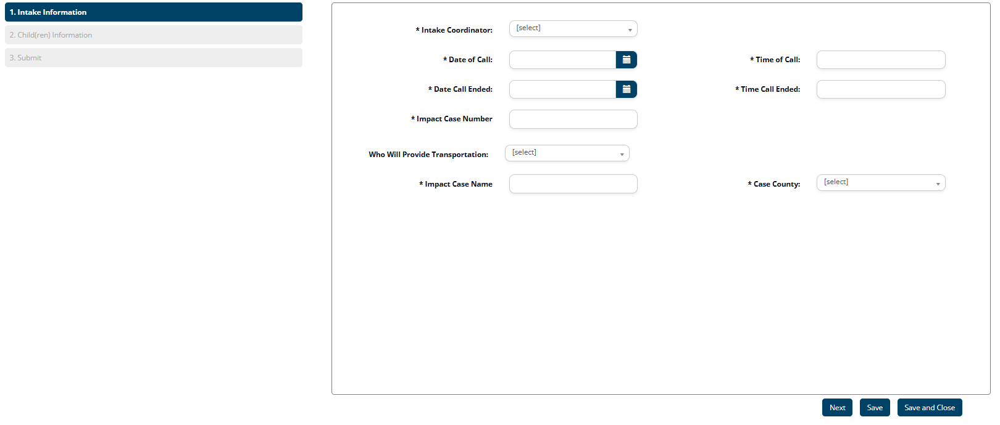 |

| Step 2: Client Information (Mockup) |
| --- |
|  |

| Step 2: Add/Edit Client (Mockup) |
| --- |
|  |

| Step 3: Submit Intake (CoBRIS screenshot) |
| --- |
| 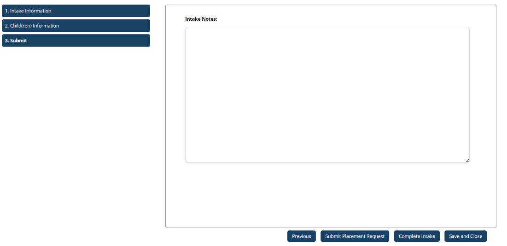 |

## Business Rules

| # | Rule Description |
| --- | --- |
| Intake/Admission – General |  |
| 1. | The Program Enrollment selection will determine which cards to display on the Client Face Sheet. |
| 2. | Submit Placement Request will trigger the ECAP API call.  Refer to the General FDS – Section: Interfaces. |
| 3. | Intake/Admission is a three-step wizard. |
| 4. | Clients can only be entered into the system through Intake/Admission. |
| Step 1: Intake Information |  |
| 1. | Intake Coordinator dropdown values will display workers based on their roles. |
| 2. | If an existing case number is entered, the case name will auto-populate. |
| 3. | If Case Number and Case Name are blank, the system will auto-generate a Case Name and Case Number following this format: “TFI-#####” Auto-generated Case Names and Case Numbers will be the same.  See example: Case Number: TFI-12345 Case Name: TFI-12345 |
| 4. | Case County dropdown values will display according to the logged-in user’s organization. |
|  | Region dropdown will populate once a state is selected. |
| Step 2: Client and Case Participant Information |  |
| 1. | Intake Number will be auto-generated by the system using the formula “UN########”. |
| 2. | This step displays two data grids: Clients and Case Participants. At least one client must be added before moving on to the next step. Clients are also considered case participants but will only display in the client table on this screen. |
| 3. | Clicking the [Add Client] button will open the Add/Edit Client screen. |
| 4. | Clicking the [Add Case Participant] button will open the Add/Edit Case Participant form. Refer to the Case Management FDS – Section: Case Participants for the business rules and element descriptions. |
| 5. | Clients Data Grid: The following actions display for all records, depending on the logged in user’s permissions: [View]: Opens the View Client screen with read-only labels and values from the Add/Edit Client screen. [Edit]: Opens the Edit Client screen. [Delete]: Opens the Remove Client from Intake modal. |
| 6. | Case Participants Data Grid: The following actions display for all records, depending on the logged in user’s permissions: [View]: Opens the View Case Participant modal with read-only labels and values from the Add/Edit Case participant screen. Refer to Case FDS. [Edit]: Opens the Edit Case Participant screen. Refer to Case FDS. [Delete]: Opens the Remove Case Participant from Intake modal. |
| Step 2: Add/Edit Client |  |
| 1. | All fields will be disabled except for the Program Enrollment field and Start Date field. Once both of those fields have been completed, the remaining fields will become enabled. |
| 2. | Selecting different program enrollments can change form behaviors: Foster Care: Removal Date becomes required. Adoption: Removal Date becomes required. Kansas Residential: PRTF Client dropdown will display and is required. |
| 3. | When adding a client, the role will automatically be set to “Client”. |
| 4. | Entering an existing PID will populate the form. |
| 5. | Client Agency dropdown values will be defined in the Configuration FDS. |
| 6. | Program Enrollment, Removal Date, and Removal Address fields are unique to the intake-client relationship. |
| Step 2: Add/Edit Case Participant |  |
| 1. | The Intake/Admission form will contain the Case Participants component. Refer to the Case Management FDS – Section: Case Participants. |
| Step 3: Submit Intake |  |
| 1. | [Submit Placement] will mark the Intake status as “Complete”.  Placement Request record will queue to the Placement Request dashboard.  Intake record will fall off the dashboard. [Complete Intake] will mark the Intake status as “Complete”.  Intake record will fall off the dashboard. Only one of the two buttons will display between [Submit Placement] and [Complete Intake]. If any clients have a program enrollment other than Behavioral Health, [Submit Placement] will display. If the only program enrollment across all clients is Behavioral Health, [Complete Intake] will display. [Save and Close] will mark the Intake status as “Pending” and queue a record to the Intake dashboard. All actions will return user to the My TFI One home screen. |

## Element Descriptions

| Element Name | Description/ Attributes | Element Type | Editable | Required | Core |
| --- | --- | --- | --- | --- | --- |
| Intake Information (1) |  | Wizard Step |  |  | Y |
| Menu | Text: “1. Intake Information” | Menu | N/A | N/A | Y |
| Intake Coordinator | Label: “Intake Coordinator” Dropdown Values: Select Coordinator (Default) See business rules. | Dropdown | Y | Y | Y |
| Date of Call | Label: “Date of Call” | Date Picker | Y | Y | Y |
| Time of Call | Label: “Time of Call” | Time Picker | Y | Y | Y |
| Date Call Ended | Label: “Date Call Ended” | Date Picker | Y | Y | Y |
| Time Call Ended | Label: “Time Call Ended” | Time Picker | Y | Y | Y |
| Who Will Provide Transportation | Label: “Who Will Provide Transportation”Dropdown Values: Select Option (Default) Agency CPS TFI Shared No Visits | Dropdown | Y | N | Y |
| Case Number | Label: “Case Number” See business rules. | Textbox | Y | N | Y |
| Case Name | Label: “Case Name” See business rules. | Textbox | N | N | Y |
| Case County | Label: “Case County”Dropdown Values: Select County (Default) See business rules. | Dropdown | Y | Y | Y |
| Next Button | Text: “Next” | Button | N/A | N/A | Y |
| Save Button | Text: “Save” | Button | N/A | N/A | Y |
| Save and Close | Text: “Save and Close” | Button | N/A | N/A | Y |
| Client and Case Participant Information Screen (2) |  | Wizard Step |  |  | Y |
| Menu | Text: “2. Client and Case Participant Information” | Menu | N/A | N/A | Y |
| Intake Number | Label: “Intake Number”Value: “{Intake Number}” See business rules. | Label and Value | N/A | N/A | Y |
| Case Number | Label: “Case Number”Value: “{Case Number}” | Label and Value | N/A | N/A | Y |
| Case Name | Label: “Case Name”Value: “{Case Name}” | Label and Value | N/A | N/A | Y |
| Client(s) Data Grid |  | Data Grid |  |  | Y |
| Header Text | Text: “Clients” | Header | N/A | N/A | Y |
| Add Client Button | Text: “Add Client” | Button | N/A | N/A | Y |
| Name Column | Column Header: “Name”Column Value: “{Client Last Name}, {First Name}” | Text Column | N | N/A | Y |
| DOB Column | Column Header: “DOB”Column Value: “{DOB}” | Date Column | N | N/A | Y |
| SSN Column | Column Header: “SSN”Column Value: “{SSN}” | Numerical Column | N | N/A | Y |
| Race Column | Column Header: “Race”Column Value: “{Race}” | Text Column | N | N/A | Y |
| Gender Column | Column Header: “Gender”Column Value: “{Gender}” | Text Column | N | N/A | Y |
| Program Enrollment(s) | Column Header: “Program Enrollment(s)”Column Value: “{Program Enrollment(s)}” | Text Column | N | N/A | Y |
| Actions Column | Column Header: “Actions”Buttons: [View] [Edit] [Delete] | Button Column | N/A | N/A | Y |
| Case Participants Data Grid |  | Data Grid |  |  | Y |
| Header Text | Text: “Case Participants” | Header | N/A | N/A | Y |
| Add Case Participant Button | Text: “Add Case Participant” | Button | N/A | N/A | Y |
| Name Column | Column Header: “Name”Column Value: “{Case Participant Last Name}, {First Name}” | Text Column | N | N/A | Y |
| DOB Column | Column Header: “DOB”Column Value: “{DOB}” | Date Column | N | N/A | Y |
| SSN Column | Column Header: “SSN”Column Value: “{SSN}” | Numerical Column | N | N/A | Y |
| Race Column | Column Header: “Race”Column Value: “{Race}” | Text Column | N | N/A | Y |
| Gender Column | Column Header: “Gender”Column Value: “{Gender}” | Text Column | N | N/A | Y |
| Role | Column Header: “Role”Column Value: “{Role}” | Text Column | N | N/A | Y |
| Actions Column | Column Header: “Actions”Buttons: [View] [Edit] [Delete] | Button Column | N/A | N/A | Y |
| Screen Buttons |  |  |  |  | Y |
| Previous Button | Text: “Previous” | Button | N/A | N/A | Y |
| Next Button | Text: “Next” | Button | N/A | N/A | Y |
| Save Button | Text: “Save” | Button | N/A | N/A | Y |
| Save and Close Button | Text: “Save and Close” | Button | N/A | N/A | Y |
| Add/Edit Client |  | Form Screen |  |  | Y |
| Header Text | Text: “Add/Edit Client” | Header | N/A | N/A | Y |
| Program Enrollment | Label: “Program Enrollment”Dropdown Values: Select Program Enrollment (Default) See business rules. | Dropdown | Y | Y | Y |
| Start Date | Label: “Start Date” | Date Picker | Y | Y | Y |
| PRTF Client | Label: “PRTF Client”Dropdown Values: Select Option Yes No Unknown | Dropdown | Y | Y | N |
| PID | Label: “PID” | Textbox | Y | N | Y |
| First Name | Label: “First Name” | Textbox | Y | Y | Y |
| Last Name | Label: “Last Name” | Textbox | Y | Y | Y |
| DOB | Label: “DOB” | Date Picker | Y | Y | Y |
| SSN | Label: “SSN” | Textbox | Y | N | Y |
| Gender | Label: “Gender”Dropdown Values: Select Gender (Default) See business rules. | Dropdown | Y | Y | Y |
| Ethnicity | Label: “Ethnicity”Dropdown Values: Select Ethnicity (Default) See business rules. | Dropdown | Y | Y | Y |
| Race | Label: “Race”Dropdown Values: Select Race (Default) See business rules. | Multi-selection | Y | Y | Y |
| Removal Address Line 1 | Label: “Address Line 1” | Textbox | Y | N | Y |
| Removal Address Line 2 | Label: “Address Line 2” | Textbox | Y | N | Y |
| Removal City | Label: “City” | Textbox | Y | N | Y |
| Removal State | Label: “State”Dropdown Values: Select State Alphabetical List of States | Dropdown | Y | N | Y |
| Removal Zip Code | Label: “Zip Code” | Textbox | Y | N | Y |
| Removal County | Label: “County”Dropdown Values: Select County (Default) (Alphabetical list of counties in selected state) | Dropdown | Y | N | Y |
| Removal Date | Label: “Removal Date” | Date Picker | Y | Y | Y |
| Status | Label: “Status”Dropdown Values: Select Status (Default) Active Closed | Dropdown | Y | N | Y |
| Region | Label: “Region”Dropdown Values: Select Region (Default) See business rules. | Dropdown | Y | Y | Y |
| Client Agency | Label: “Client Agency”Dropdown Values: Select Client Agency (Default) See business rules. | Dropdown | Y | Y | Y |
| Medicaid Number | Label: “Medicaid Number” | Textbox | Y | N | Y |
| ICWA Status | Label: “ICWA Status”Dropdown Values: Select ICWA Status (Default) Applicable Pending N/A | Dropdown | Y | Y | Y |
| Tribe Name | Label: “Tribe Name” | Textbox | Y | N | Y |
| State of Custody | Label: “State of Custody”Dropdown Values: Select State (Default) Alphabetical List of States | Dropdown | Y | Y | Y |
| Birth City | Label: “Birth City” | Textbox | Y | N | Y |
| Permanency Goal | Label: “Permanency Goal”Dropdown Values: Select Permanency Goal (Default) Adoption Guardianship OPPLA Permanent Placement with a Fit & Willing Relative Reunification | Dropdown | Y | N | Y |
| Start Date | Label: “Permanency Goal Start Date” | Date Picker | Y | N | Y |
| Secondary Permanency Goal | Label: “Secondary Permanency Goal”Dropdown Values: Select Permanency Goal (Default) Adoption Guardianship OPPLA Permanent Placement with a Fit & Willing Relative Reunification | Dropdown | Y | N | Y |
| Start Date | Label: “Secondary Permanency Goal Start Date” | Date Picker | Y | N | Y |
| Assigned Case Worker | Label: “Assigned Case Worker”Dropdown Values: Select Case Worker (Default) See business rules. | Dropdown | Y | N | Y |
| Go Back Button | Text: “Go Back” | Button | N/A | N/A | Y |
| Save Button | Text: “Save Changes” | Button | N/A | N/A | Y |
| Remove Client from Intake Modal |  | Modal |  |  | Y |
| Modal Header | Text: “Remove Client” | Header | N/A | N/A | Y |
| Confirmation Message | Text: “Are you sure you want to remove this client?” | Label | N/A | N/A | Y |
| Cancel Button | Text: “Cancel” | Button | N/A | N/A | Y |
| Confirm Button | Text: “Confirm” | Button | N/A | N/A | Y |
| Remove Case Participant from Intake Modal |  | Modal |  |  | Y |
| Modal Header | Text: “Remove Case Participant” | Header | N/A | N/A | Y |
| Confirmation Message | Text: “Are you sure you want to remove this case participant?” | Label | N/A | N/A | Y |
| Cancel Button | Text: “Cancel” | Button | N/A | N/A | Y |
| Confirm Button | Text: “Confirm” | Button | N/A | N/A | Y |
| Submit Intake (3) |  | Wizard Step |  |  | Y |
| Menu | Text: “3. Submit” | Menu | N/A | N/A | Y |
| Intake Notes | Label: “Intake Notes” | Multi-Line Textbox | Y | N | Y |
| Previous Button | Text: “Previous” | Button | N/A | N/A | Y |
| Submit Placement Request Button | Text: “Submit Placement Request” See business rules. | Button | N/A | N/A | Y |
| Complete Intake Button | Text: “Complete Intake” See business rules. | Button | N/A | N/A | Y |
| Save and Close | Text: “Save and Close” | Button | N/A | N/A | Y |

## Security

| Permission Type | Permission Name | Description |
| --- | --- | --- |
| Access | AccessIntakeInformation | Access to the intake menu option and screen |
| Action | CreateClient | Ability to create a new client |
| Action | ViewClient | Ability to view a client’s face sheet |
| Action | EditClient | Ability to modify client information |
| Action | DeleteIntakeClient | Ability to remove client from intake |
| Action | CreateIntakeForm | Ability to complete and submit intake form |
| Action | CreateCaseParticipant | Ability to create a case participant |
| Action | ViewCaseParticipant | Ability to view a case participant |
| Action | EditCaseParticipant | Ability to edit a case participant |
| Action | DeleteIntakeCaseParticipant | Ability to delete a case participant from intake |

# 9. Client Search
The Client Search module enables users to locate and access client records using a wide range of search parameters, including name, ID, demographics, program enrollment, provider details, and case information. It supports role-based filtering and displays active alerts via icons with tooltips for quick identification of critical client conditions. Search results are presented in a data grid with actionable options based on user permissions. Integrated with the Client Face Sheet and other modules, this tool ensures efficient navigation, data visibility, and streamlined case management.
Relevant requirement(s):
- 4.000 - The system will allow users to search for Clients by various criteria.
## Navigation
Main Menu > Client Search
## User Interfaces

| Client Search Parameters (Mockup) |
| --- |
| 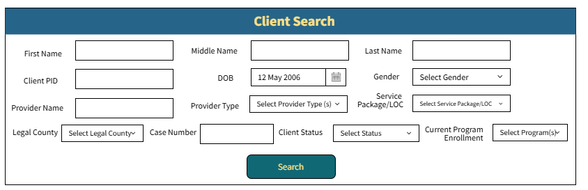 |

| Client Search Results Data Grid (Mockup) |
| --- |
| 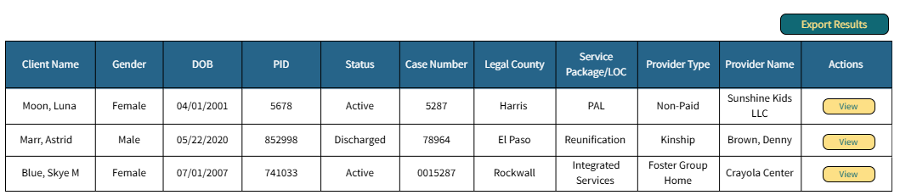 |

## Business Rules

| # | Rule Description |
| --- | --- |
| Client Search – General |  |
| 1. | Client Search will only execute a search when the [Search] button is clicked. |
| 2. | Service Package / Tier, Legal County, Gender, Provider Type and Program Enrollment search parameter dropdowns will populate according to the user’s organization. |
| 3. | The following actions display for all records, depending on the logged in user’s assigned permissions: [View]: Opens the specific client’s face sheet. |
| 4. | Active client alerts are indicated by an icon next to the client’s name. The icon displays a tooltip with the alert details. |

## Element Descriptions

| Element Name | Description/ Attributes | Element Type | Editable | Required | Core |
| --- | --- | --- | --- | --- | --- |
| Client Search Panel |  | Screen |  |  | Y |
| Client Search Header | Text: “Client Search” | Header | N/A | N/A | Y |
| First Name | Label: “First Name” | Textbox | Y | N | Y |
| Middle Name | Label: “Middle Name” | Textbox | Y | N | Y |
| Last Name | Label: “Last Name” | Textbox | Y | N | Y |
| Client ID | Label: “Client ID” | Textbox | Y | N | Y |
| DOB | Label: “DOB” | Date Picker | Y | N | Y |
| Gender | Label: “Gender”Dropdown Values: Select Gender (Default) See business rules. | Dropdown | Y | N | Y |
| Provider Name | Label: “Provider Name” | Textbox | Y | N | Y |
| Provider Type | Label: “Provider Type”Dropdown Values: Select Provider Type(s) (Default) See business rules. | Multi-Selection | Y | N | Y |
| Service Package / Tier | Label: “Service Package / Tier”Dropdown Values: Select Service Package / Tier (Default) See business rules. | Multi-Selection | Y | N | Y |
| Legal County | Label: “Legal County”Dropdown Values: Select Legal County (Default) See business rules. | Dropdown | Y | N | Y |
| Case Number | Label: “Case Number” | Textbox | Y | N | Y |
| Client Status | Label: “Client Status”Dropdown Values: Select Status (Default) Active Discharged | Multi-Selection | Y | N | Y |
| Current Program Enrollment | Label: “Current Program Enrollment”Dropdown Values: Select Program(s) (Default) See business rules. | Multi-Selection | Y | N | Y |
| Search Button | Text: “Search” | Button | N/A | N/A | Y |
| Client Search Results |  | Data Grid |  |  | Y |
| Export Results Button | Text: “Export Results” | Button | N/A | N/A | Y |
| Client Name Column | Column Header: “Client Name”Column Value: “{Client Last Name}, {Client First Name} {Client Middle Name/Initial}” See business rules. | Text Column | N | N/A | Y |
| Gender Column | Column Header: “Gender”Column Value: “{Gender}” | Text Column | N | N/A | Y |
| DOB Column | Column Header: “DOB”Column Value: “{DOB}” | Date Column | N | N/A | Y |
| ID Column | Column Header: “ID”Column Value: “{ID}” | Text Column | N | N/A | Y |
| Status Column | Column Header: “Status”Column Value: “{Status}” | Text Column | N | N/A | Y |
| Case Number Column | Column Header: “Case Number”Column Value: “{Case Number}” | Text Column | N | N/A | Y |
| Legal County Column | Column Header: “Legal County”Column Value: “{Legal County}” | Text Column | N | N/A | Y |
| Service Package / Tier | Column Header: “Service Package / Tier”Column Value: “{Service Package / Tier}” | Text Column | N | N/A | Y |
| Provider Column | Column Header: “Provider Type”Column Value: “{Provider Type}” | Text Column | N | N/A | Y |
| Provider Name Column | Column Header: “Provider Name”Column Value: “{Provider Name}” | Text Column | N | N/A | Y |
| Actions Column | Column Header: “Actions”Buttons: [View] See business rules. | Button Column | N/A | N/A | Y |

## Security

| Permission Type | Permission Name | Description |
| --- | --- | --- |
| Access | AccessClientSearch | Access to the Client Search screen and ability to conduct a search |
| Action | ViewClient | Ability to view a client’s face sheet |

# 10. Client Face Sheet
The Client Face Sheet module provides a centralized, role-based view of a client’s profile, displaying key information such as demographics, program enrollments, alerts, and associated records. It includes configurable tiles based on the client’s services and agency, and supports document uploads, image display, and quick access to submodules like Legal, Education, Medical, and Placement. Designed for efficiency and clarity, the face sheet ensures that authorized users can quickly assess client status and navigate to detailed records, supporting coordinated care and compliance.
## Navigation
Main Menu > Client Search > Client Face Sheet
## User Interfaces

| Client Face Sheet (Mockup) |
| --- |
| 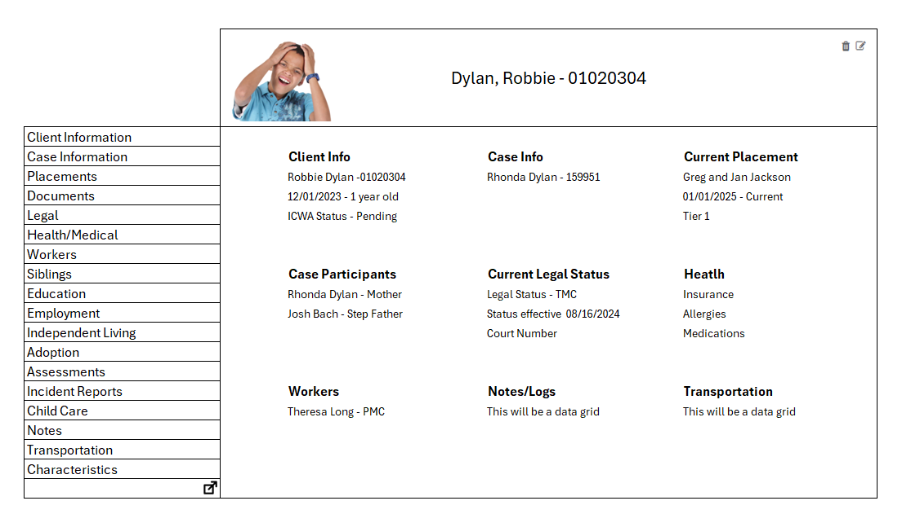 |

## Business Rules

| # | Rule Description |
| --- | --- |
| Client Face Sheet – General |  |
| 1. | The face sheet will have a menu that consists of the following, depending on the logged in user’s role/organization and the client’s program enrollments: Client Home Client Information Case Information Placements Documents Legal Health/Medical Workers Siblings Education Employment Independent Living Adoption Assessments Incident Report Notes Characteristics |
| 3. | Client Home is the default landing screen for the face sheet and displays high-level information pertaining to the client. |
| 4. | The header displays an uploaded image, Client Name, and Client ID. |
| 5. | Header picture criteria: Document must be 3mb or less Allowed File Types: .jpg,.png,.jpeg, or .gif file type |
| 6. | An alert banner will display if a client has pending documents. |
| 7. | The [Client Face Sheet] button will be displayed on the Client Information Header, and will be available in all menu options when a data grid screen is open, so the user has the ability to return to the Client Face Sheet without any further navigation via the menu bar. |
| Face Sheet Components |  |
| 1. | The cards that display on the landing page of the Client Face Sheet are dependent on the client’s program enrollments and user role/organization. |

## Element Descriptions

| Element Name | Description/ Attributes | Element Type | Editable | Required | Core |
| --- | --- | --- | --- | --- | --- |
| Client Face Sheet |  | Face Sheet |  |  | Y |
| Header Text | Text: “[Client Name - Client ID]” | Header | N/A | N/A | Y |
| Client Face Sheet Button | Text: “Client Face Sheet” See business rules. | Button | N/A | N/A | Y |
| Picture | Picture Display | Picture | Y | N/A | Y |
| Delete Picture | Icon: Trash Can | Icon | N/A | N/A | Y |
| Upload Picture | Icon: Upload | Icon | N/A | N/A | Y |
| Client Menu | See business rules. | Menu | N/A | N/A | Y |
| Face Sheet Components |  | Screen |  |  | Y |
| Client Information | See Client Information section. | Module | N/A | N/A | Y |
| Case Information | See FDS 6 – Case Management, Case Information section. | Module | N/A | N/A | Y |
| Placements | See Request/Placement History > Placement Information section. | Module | N/A | N/A | Y |
| Workers | See Client Workers section. | Module | N/A | N/A | Y |
| Siblings | See Siblings section. | Module | N/A | N/A | Y |
| Assessments | See Assessments section. | Module | N/A | N/A | Y |
| Notes | See Client Notes section. | Module | N/A | N/A | Y |
| Medical File | See Medical File section. | Module | N/A | N/A | Y |
| Legal | See Legal section. | Module | N/A | N/A | Y |
| Education Overview | See Education Overview section. | Module | N/A | N/A | Y |
| Employment | See Employment section, | Module | N/A | N/A | Y |
| Independent Living | See Independent Living section. | Module | N/A | N/A | Y |
| Adoption Overview | See Adoption section. | Module | N/A | N/A | Y |
| Incident Reports | See Incident Reports section. | Module | N/A | N/A | Y |

## Security

| Permission Type | Permission Name | Description |
| --- | --- | --- |
| Action | ViewClient | Ability to view a client’s face sheet |

# 11. Client Information
The Client Information module centralizes demographic, contact, and permanency goal data for each client, supporting accurate recordkeeping and service planning. It includes editable fields for names, identifiers, addresses, and program-specific attributes, with integrated access to alias and address history. The module ensures that client profiles reflect the most current and validated information and supports updates via both UI and API. Embedded within the Client Face Sheet, it enables authorized users to view and manage client details efficiently while maintaining compliance with organizational and regulatory standards.
Relevant Requirement(s):
4.045 - The system will allow users to create or update Client Demographic Information.
## 11.1 Client Information
The Client Information subsection organizes and displays essential demographic, contact, and permanency goal data for each client. It includes editable fields such as name, date of birth, gender, race, ethnicity, SSN, Medicaid number, and address.
### Navigation
Main Menu > Client Search > Client Face Sheet
### User Interfaces

| Client Information Face Sheet Tile(Mockup) |
| --- |
| 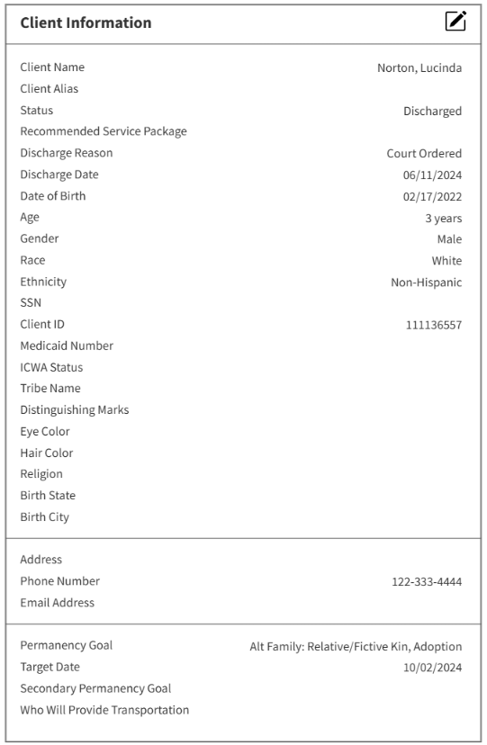 |

### Business Rules

| Client Demographic Information – General |  |
| --- | --- |
| 1. | The Client Information face sheet card will contain three sections: Demographic Information Contact Information Permanency Goals |
| 2. | The Action Menu will display the following options, depending on the logged in user’s permissions: Edit Client Info: Opens the Edit Client Information screen. Alias History: Opens the Alias History data grid. Address History: Opens the Address History data grid. |
| 3. | Address value displays the most recent, non-end-dated address for the client. This field can be edited from the Address History data grid. |
| 4. | Current Alias value displays the most recent, non-end-dated alias for the client. This field can be edited from the Alias History data grid. |
| 5. | Recommended Service Package value displays the most recent recommended service package entered in the eCANS card. Field should be hidden for non-TX configuration. |
| 6. | ICWA Status and Tribe Name values can be updated by the ECAP API. |

### Element Descriptions

| Element Name | Description/ Attributes | Element Type | Editable | Required | Core |
| --- | --- | --- | --- | --- | --- |
| Client Information |  | Face Sheet Component Tile |  |  | Y |
| Header Text | Text: “Client Information” | Header | N/A | N/A | Y |
| Action Menu | Icon: Pencil and PaperValues: Edit Client Info Alias History Address History | Action Menu | N/A | N/A | Y |
| Demographic Information |  | Face Sheet Card Section |  |  | Y |
| Client Name | Label: “Client Name”Value: “{Last Name}, {First Name}” | Label and Value | N/A | N/A | Y |
| Client Alias | Label: “Client Alias”Value: “{Client Alias}” | Label and Value | N/A | N/A | Y |
| Status | Label: “Status”Value: “{Status}” | Label and Value | N/A | N/A | Y |
| Recommended Service Package | Label: “Recommended Service Package”Value: “{Recommended Service Package}” See business rules. | Label and Value | N/A | N/A | N |
| Discharge Reason | Label: “Discharge Reason”Value: “{Discharge Reason}” | Label and Value | N/A | N/A | Y |
| Discharge Date | Label: “Discharge Date”Value: “{Discharge Date}” | Label and Value | N/A | N/A | Y |
| Date of Birth | Label: “Date of Birth”Value: “{Client DOB}” | Label and Value | N/A | N/A | Y |
| Age | Label: “Age”Value: “{Client Age}” | Label and Value | N/A | N/A | Y |
| Gender | Label: “Gender”Value: “{Client Gender}” | Label and Value | N/A | N/A | Y |
| Race | Label: “Race”Value: “{Race}” | Label and Value | N/A | N/A | Y |
| Ethnicity | Label: “Ethnicity”Value: “{Ethnicity}” | Label and Value | N/A | N/A | Y |
| SSN | Label: “SSN”Value: “{SSN}” | Label and Value | N/A | N/A | Y |
| Child ID | Label: “Client ID”Value: “{Client ID}” | Label and Value | N/A | N/A | Y |
| Medicaid Number | Label: “Medicaid Number”Value: “{Medicaid Number}” | Label and Value | N/A | N/A | Y |
| ICWA Status | Label: “ICWA Status”Value: “{ICWA Status}” | Label and Value | N/A | N/A | Y |
| Tribe Name | Label: “Tribe Name”Value: “{Tribe Name}” | Label and Value | N/A | N/A | Y |
| Region | Label: “Region”Value: “{Region}” | Label and Value | N/A | N/A | Y |
| Birth State | Label: “Birth State”Value: “{Birth State}” | Label and Value | N/A | N/A | Y |
| Birth City | Label: “Birth City”Value: “{Birth City}” | Label and Value | N/A | N/A | Y |
| Contact Information |  | Face Sheet Card Section |  |  | Y |
| Address | Label: “Address”Value: “{Full Address}” | Label and Value | N/A | N/A | Y |
| Phone Number | Label: “Phone Number”Value: “{Phone Number}” | Label and Value | N/A | N/A | Y |
| Email Address | Label: “Email Address”Value: “{Email Address}” | Label and Value | N/A | N/A | Y |
| Permanency Goal Section |  | Face Sheet Card Section |  |  | Y |
| Permanency Goal | Label: “Permanency Goal”Value: “{Permanency Goal}” | Label and Value | N/A | N/A | Y |
| Start Date (Primary Permanency Goal} | Label: “Start Date (Primary Permanency Goal)” Value: “{Primary Permanency Goal Start Date}” | Label and Value | N/A | N/A | Y |
| Secondary Permanency Goal | Label: “Secondary Permanency Goal”Value: “{Secondary Permanency Goal}” | Label and Value | N/A | N/A | Y |
| Start Date (Secondary Permanency Goal) | Label: “Start Date (Secondary Permanency Goal)”Value: “{Secondary Permanency Goal Start Date}” | Label and Value | N/A | N/A | Y |

### Security

| Permission Type | Permission Name | Description |
| --- | --- | --- |
| Action | ViewClient | Ability to view a client’s face sheet |
| Access | AccessClientInformation | Access to Client Information module |
| Action | EditClientInformation | Ability to edit client information |
| Access | AccessClientAliasHistory | Access to the Client Alias History menu option and data grid |
| Access | AccessClientAddressHistory | Access to the Client Address History menu option and data grid |

## 11.2 Edit Client Information
The Edit Client Information subsection enables authorized users to update key client demographic fields such as name, date of birth, SSN, gender, race, ethnicity, Medicaid number, and permanency goals. It includes validation rules for dropdowns and conditional field requirements, such as enabling the Tribe Name field when ICWA Status is set to Pending or Applicable.
### Navigation
Main Menu > Client Search > Client Face Sheet > Client Information > Edit Client Info
### User Interfaces

| Edit Client Info Form (Mockup) |
| --- |
| 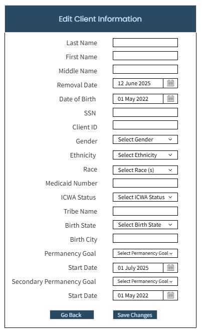 |

### Business Rules

| # | Rule Description |
| --- | --- |
| Edit Client Information Form |  |
| 1. | Gender, Ethnicity, and Race dropdowns will populate according to the user’s organization. |
| 2. | The Tribe Name field is enabled and required when the ICWA Status dropdown selection is Pending or Applicable. |

### Element Descriptions

| Element Name | Description/ Attributes | Element Type | Editable | Required | Core |
| --- | --- | --- | --- | --- | --- |
| Edit Client Info Form |  | Form Screen |  |  | Y |
| Header Text | Text: “Edit Client Information” | Header | N/A | N/A | Y |
| Last Name | Label: “Last Name” | Textbox | Y | Y | Y |
| First Name | Label: “First Name” | Textbox | Y | Y | Y |
| Middle Name | Label: “Middle Name” | Textbox | Y | N | Y |
| Removal Date | Label: “Removal Date” | Date Picker | Y | N | Y |
| Date of Birth | Label: “Date of Birth” | Date Picker | Y | Y | Y |
| SSN | Label: “SSN” | Textbox | Y | N | Y |
| Client ID | Label: “Client ID” | Textbox | Y | N | Y |
| Gender | Label: “Gender”Dropdown Values: Select Gender (Default) See business rules. | Dropdown | Y | Y | Y |
| Ethnicity | Label: “Ethnicity”Dropdown Values: Select Ethnicity (Default) See business rules. | Dropdown | Y | Y | Y |
| Race | Label: “Race”Dropdown Values: Select Race(s) (Default) See business rules. | Multi-Selection | Y | Y | Y |
| Medicaid Number | Label: “Medicaid Number” | Textbox | Y | N | Y |
| ICWA Status | Label: “ICWA Status”Dropdown Values: Select ICWA Status (Default) Applicable Pending N/A See business rules. | Dropdown | Y | N | Y |
| Tribe Name | Label: “Tribe Name” See business rules. | Textbox | N | N | Y |
| Birth State | Label: “Birth State”Dropdown Values: Select Birth State (Default) Alphabetical List of States See business rules. | Dropdown | Y | N | y |
| Birth City | Label: “Birth City” | Textbox | Y | N | Y |
| Permanency Goal | Label: “Permanency Goal”Dropdown Values: Select Permanency Goal (Default) Adoption Guardianship OPPLA Permanent Placement with a Fit & Willing Relative Reunification | Dropdown | Y | N | Y |
| Start Date | Label: “Start Date” | Date Picker | Y | N | Y |
| Secondary Permanency Goal | Label: “Secondary Permanency Goal”Dropdown Values: Select Permanency Goal (Default) Adoption Guardianship OPPLA Permanent Placement with a Fit & Willing Relative Reunification | Dropdown | Y | N | Y |
| Start Date | Label: “Start Date” | Date Picker | Y | N | Y |
| Go Back Button | Text: “Go Back” | Button | N/A | N/A | Y |
| Save Changes Button | Text: “Save Changes” | Button | N/A | N/A | Y |

### Security

| Permission Type | Permission Name | Description |
| --- | --- | --- |
| Access | AccessClientInformation | Access to Client Information module |
| Action | EditClientInformation | Ability to edit client information |

## 11.3 Alias History
Client Alias is used when a client has had their name legally changed while in care or prior to returning to care.  The Alias History module tracks historical name changes for clients, supporting documentation of legal or identity updates during or prior to care. It maintains a chronological record of aliases with start and end dates, ensuring continuity and traceability of client identity. Business rules enforce date validations and automatic updates to prior records.
### Navigation
Main Menu > Client Search > Client Face Sheet > Client Information > Alias History
### User Interfaces

| Alias History (Mockup) |
| --- |
| 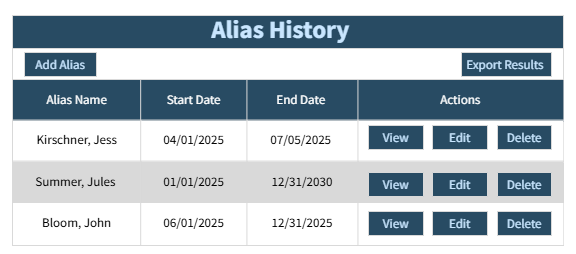 |

| Add/Edit Alias (Mockup) |
| --- |
| 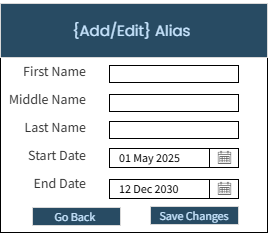 |

| Delete Alias (Mockup) |
| --- |
| 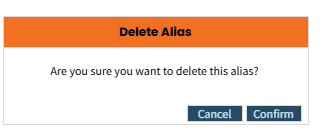 |

### Business Rules

| # | Rule Description |
| --- | --- |
| Alias History – General |  |
| 1. | The following actions display for all records, depending on the logged in user’s permissions: [Edit]: Opens the Edit Alias modal. [Delete]: Opens the Delete Alias modal. |
| Alias History Data Grid |  |
| 1. | Alias History data grid will sort by Start Date, descending. |
| Add/Edit Alias |  |
| 1. | Start Date must occur before the End Date. |
| 2. | If there is a previous alias, the previous Alias End Date is set to the day before the new Alias Start Date. |

### Element Descriptions

| Element Name | Description/ Attributes | Element Type | Editable | Required | Core |
| --- | --- | --- | --- | --- | --- |
| Alias History Data Grid |  | Data Grid |  |  | Y |
| Header Text | Text: “Alias History” | Header | N/A | N/A | Y |
| Add Alias Button | Text: “Add Alias” | Button | N/A | N/A | Y |
| Export Results Button | Text: “Export Results” | Button | N/A | N/A | Y |
| Alias Name Column | Column Header: “Alias Name”Column Value: “{Last Name}, {First Name}” | Text Column | N | N/A | y |
| Start Date Column | Column Header: “Start Date”Column Value: “{Start Date}” | Date Column | N | N/A | Y |
| End Date Column | Column Header: “End Date”Column Value: “{End Date}” | Date Column | N | N/A | Y |
| Actions Column | Column Header: “Actions”Button(s): [Edit] [Delete] | Button Column | N | N/A | Y |
| Add/Edit Alias Modal |  | Modal |  |  | Y |
| Add/Edit Alias Header | Text: “{Add/Edit} Alias” | Header | N/A | N/A | Y |
| First Name | Label: “First Name” | Textbox | Y | Y | Y |
| Middle Name | Label: “Middle Name” | Textbox | Y | N | Y |
| Last Name | Label: “Last Name” | Textbox | Y | Y | Y |
| Start Date | Label: “Start Date” | Date Picker | Y | Y | Y |
| End Date | Label: “End Date” | Date Picker | Y | N | Y |
| Cancel Button | Text: “Cancel” | Button | N/A | N/A | Y |
| Save Changes Button | Text: “Save Changes” | Button | N/A | N/A | Y |
| Delete Alias Modal |  | Modal |  |  | Y |
| Header Text | Text: “Delete Alias” | Header | N/A | N/A | Y |
| Confirmation Text | Text: “Are you sure you want to delete this alias?” | Label | N/A | N/A | Y |
| Cancel Button | Text: “Cancel” | Button | N/A | N/A | Y |
| Confirm Button | Text: “Confirm” | Button | N/A | N/A | Y |

### Security

| Permission Type | Permission Name | Description |
| --- | --- | --- |
| Access | AccessClientInformation | Access to Client Information module |
| Access | AccessClientAliasHistory | Access to the client Alias History menu option and data grid |
| Action | CreateClientAliasRecord | Ability to create a client alias record |
| Action | EditClientAliasRecord | Ability to edit a client alias record |
| Action | DeleteClientAliasRecord | Ability to delete a client alias record |

## 11.4 Address History
The Address History module maintains a chronological record of client addresses, phone numbers, and email addresses to ensure accurate contact tracking over time. It supports add, edit, and delete actions with validations for date ranges and address verification. Special logic handles cases such as homelessness, disabling address fields when applicable.
### Navigation
Main Menu > Client Search > Client Face Sheet > Client Information > View Address History
### User Interfaces

| Client Address History (Mockup) |
| --- |
| 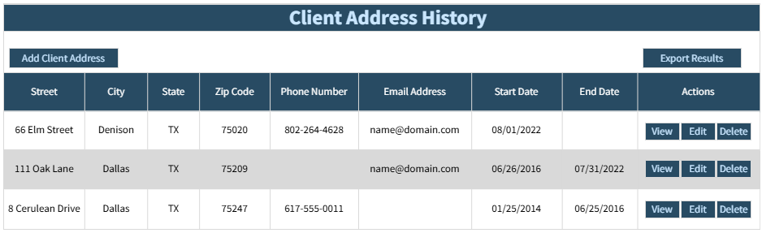 |

| Add Client Address (Mockup) |
| --- |
| 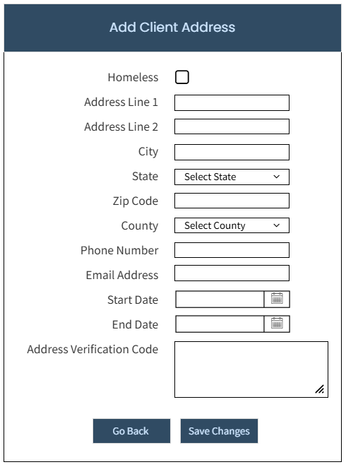 |

| Delete Address Modal (Mockup) |
| --- |
| 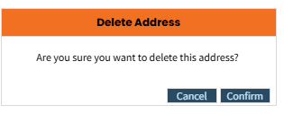 |

### Business Rules

| # | Rule Description |
| --- | --- |
| Address History – Data Grid |  |
| 1. | The following actions display for all records, depending on the logged in user’s permissions: [Edit]: Opens the Edit Address screen. [Delete]: Opens the Delete Address modal. |
| Add/Edit Address |  |
| 1. | Start Date must occur before the End Date. |
| 2. | If there is a previous address, the previous Address End Date is set to the day before the new Address Start Date. |
| 3. | If the Homeless checkbox is selected, the following fields become disabled: Address Line 1 Address Line 2 City State Zip Code County |
| 4. | Addresses must be validated upon add or edit. |

### Element Descriptions

| Element Name | Description/ Attributes | Element Type | Editable | Required | Core |
| --- | --- | --- | --- | --- | --- |
| Address History |  | Data Grid |  |  | Y |
| Header Text | Text: “Client Address History” | Header | N/A | N/A | Y |
| Add Client Address Button | Text: “Add Client Address” | Button | N/A | N/A | Y |
| Export Results Button | Text: “Export Results” | Button | N/A | N/A | Y |
| Street Column | Column Header: “Street”Column Value: “{Address Line 1} {Address Line 2}” | Text Column | N | N/A | Y |
| City Column | Column Header: “City”Column Value: “{City}” | Text Column | N | N/A | Y |
| State Column | Column Header: “State”Column Value: “{State}” | Text Column | N | N/A | Y |
| Zip Code Column | Column Header: “Zip Code”Column Value: “{Zip Code}” | Numerical Column | N | N/A | Y |
| Phone Number Column | Column Header: “Phone Number”Column Value: “{Phone Number}” | Text Column | N | N/A | Y |
| Email Address Column | Column Header: “Email Address”Column Value: “{Email Address}” | Text Column | N | N/A | Y |
| Start Date Column | Column Header: “Start Date”Column Value: “{Start Date}” | Date Column | N | N/A | Y |
| End Date Column | Column Header: “End Date”Column Value: “{End Date}” | Date Column | N | N/A | Y |
| Actions Column | Column Header: “Actions”Button(s): [Edit] [Delete] | Button Column | N/A | N/A | Y |
| Add/Edit Client Address |  | Form Screen |  |  | Y |
| Header Text | Text: “{Add/Edit} Address” | Header | N/A | N/A | Y |
| Homeless Checkbox | Label: “Homeless” See business rules. | Checkbox | Y | N | Y |
| Address Line 1 | Label: “Address Line 1” | Textbox | Y | Y | Y |
| Address Line 2 | Label: “Address Line 2” | Textbox | Y | N | Y |
| City | Label: “City” | Textbox | Y | Y | Y |
| State | Label: “State”Dropdown Values: Select State (Default) Alphabetical List of States See business rules. | Dropdown | Y | Y | Y |
| Zip Code | Label: “Zip Code” | Textbox | Y | N | Y |
| County | Label: “County”Dropdown Values: Select County (Default) (Alphabetical list of counties in selected state) | Dropdown | Y | N | Y |
| Phone Number | Label: “Phone Number” | Textbox | Y | N | Y |
| Email Address | Label: “Email Address” | Textbox | Y | N | Y |
| Start Date | Label: “Start Date” | Date Picker | Y | Y | Y |
| End Date | Label: “End Date” | Date Picker | Y | N | Y |
| Go Back Button | Text: “Go Back” | Button | N/A | N/A | Y |
| Save Changes Button | Text: “Save Changes” | Button | N/A | N/A | Y |
| Delete Address Modal |  | Modal |  |  | Y |
| Header Text | Text: “Delete Address” | Header | N/A | N/A | Y |
| Confirmation Text | Text: “Are you sure you want to delete this address?” | Label | N/A | N/A | Y |
| Cancel Button | Text: “Cancel” | Button | N/A | N/A | Y |
| Confirm Button | Text: “Confirm” | Button | N/A | N/A | Y |

### Security

| Permission Type | Permission Name | Description |
| --- | --- | --- |
| Access | AccessClientInformation | Access to Client Information module |
| Access | AccessClientAddressHistory | Access to the client Address History menu option and data grid |
| Action | CreateClientAddressRecord | Ability to create a client address record |
| Action | EditClientAddressRecord | Ability to edit a client address record |
| Action | DeleteClientAddressRecord | Ability to delete a client address record |

# 12. Client Documents
The Client Documents module manages the upload, organization, and retrieval of client-related documentation. It supports single and bulk uploads, automatic document generation from workflow events, and structured storage using configurable document trees. Access is role-based, with navigation available via both the Client Face Sheet and Client Search. The module ensures compliance with documentation standards, facilitates audit readiness, and integrates with other modules.
Relevant requirement(s):
4.135 – The system will have the ability to upload documents (single, multiple) using the User Interface.
4.140 – The system will generate and store documents based on specific workflow events.
This Documents section is written from the standpoint of the Client module. It details variances or additions to the General Document functionality as defined in the General FDS – Documents and Document Configuration sections.
## Navigation
Main Menu > Client Search > Client Face Sheet > Documents Main Menu > Client Search > Documents
## User Interfaces

| Document Scren (CoBRIS Screenshot) |
| --- |
| 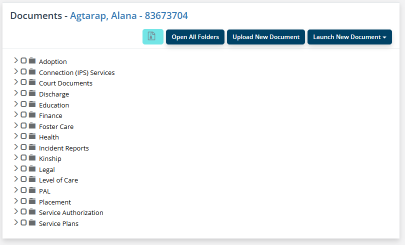 |

## Business Rules

| # | Rule Description |
| --- | --- |
| Client Documents – General |  |
| 1. | There are two (2) ways to access the Documents screen, which depends on the logged in user’s permissions: ViewClient: Main Menu > Client Search > Client Face Sheet > Documents AuditClientDocuments: Main Menu > Client Search > Documents |
| 2. | The Client Documents screen displays the Document tree scoped to the current provider. |
| Document Tree |  |
| 1. | Client module Document Categories and Document Expectancy are based on organization Document Management configuration (See General FDS – Document section). |

## Element Descriptions

| Element Name | Description/ Attributes | Element Type | Editable | Required | Core |
| --- | --- | --- | --- | --- | --- |
| Documents Screen |  | Screen |  |  | Y |
| Header Text | Text: “Documents – {Client Name} – {Client ID}” | Header | N/A | N/A | Y |
| Back Button | Text: “Go Back” | Button | N/A | N/A | Y |

## Security

| Permission Type | Permission Name | Description |
| --- | --- | --- |
| Action | ViewClient | Ability to view a client’s face sheet |
| Access | AccessClientDocuments | Access to the Client Documents screen from the Client Face Sheet |
| Action | AuditClientDocuments | Access to the Client Documents from the Client Search |

# 13. Request/Placement History
The Request/Placement History module provides a comprehensive view of a client’s placement lifecycle, including active placements, historical requests, service packages, and alerts. It displays key details such as placement dates, provider information, and negotiated rates, with links to related components like Placement Notes, Service Package/Tier History, and Client Alerts. The module supports auditability and decision-making by maintaining a complete, time-stamped record of placement activity.
Relevant requirement(s):
- 4.050 - The system will support client placement management (e.g., tier, service package, history).
## 13.1 Placement Information
The Placement Information module provides a real-time view of a client’s current placement details, including provider, service package/tier, placement type, and associated alerts. It features an action menu for accessing related histories such as placement requests, service packages, worksheets, and alerts. The module highlights in-transit placements and links provider names to their face sheets. Integrated with the Client Face Sheet, it ensures that placement data is visible, actionable, and aligned with service planning and compliance requirements.
### Navigation
Main Menu > Client Search > Client Face Sheet
### User Interfaces

| Placement Information Tile (Mockup) |
| --- |
| 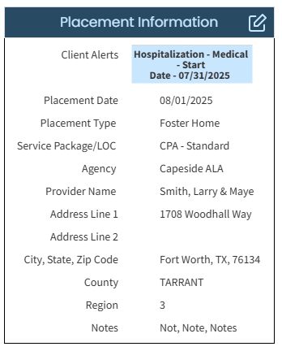 |

### Business Rules

| # | Rule Description |
| --- | --- |
| Placement Information – General Tile |  |
| 1. | This screen displays all active placements. A column will display for each placement containing the values from Placement Date through Notes. |
| 2. | The Action Menu will display the following options, depending on the logged in user’s permissions: Request Placement History: Opens the Client Placement Request History data grid. Service Package/Tier History: Opens the Service Package/Tier History data grid. Placement Worksheet: Opens the Placement Worksheet. Client Alerts: Opens the Client Alerts data grid. |
| 3. | Provider name displays as a hyperlink that opens the Provider Face Sheet. |
| 4. | The Client Alert value populates if there is an open alert. The alert text will be highlighted. |
| 5. | An alert bar displays if there is an in-transit placement (non-paid placement). |

### Element Descriptions

| Element Name | Description/ Attributes | Element Type | Editable | Required | Core |
| --- | --- | --- | --- | --- | --- |
| Placement Information |  | Face Sheet Component Tile |  |  | Y |
| Header Text | Text: “Placement Information” | Header | N/A | N/A | Y |
| Action Menu | Actions: Request Placement History Service Package/Tier History Placement Worksheet Client Alerts | Action Menu | N/A | N/A | Y |
| Client Alerts | Label: “Client Alerts”Value: “{Alert Type} – {Start Date}” See business rules. | Label and Value | N/A | N/A | Y |
| Placement Date | Label: “Placement Date” Value: “{Placement Date}” | Label and Value | N/A | N/A | Y |
| Placement Type | Label: “Placement Type” Value: “{Placement Type}” | Label and Value | N/A | N/A | Y |
| Service Package/Tier | Label: “Service Package/Tier”Value: “{Service Package/Tier}” | Label and Value | N/A | N/A | Y |
| Agency | Label: “Agency”Value: “{Agency}” | Label and Value | N/A | N/A | Y |
| Provider Name | Label: “Provider Name”Value: “{Provider Name}” See business rules. | Label and Value | N/A | N/A | Y |
| Address Line 1 | Label: “Address Line 1”Value: “{Address}” | Label and Value | N/A | N/A | Y |
| Address Line 2 | Label: “Address Line 2”Value: “{Address}” | Label and Value | N/A | N/A | Y |
| City, State, Zip Code | Label: “City, State, Zip Code”Value: “{City}, {State} {Zip Code}” | Label and Value | N/A | N/A | Y |
| County | Label: “County”Value: “{County}” | Label and Value | N/A | N/A | Y |
| Region | Label: “Region”Value: “{Region}” | Label and Value | N/A | N/A | Y |
| Notes | Label: “Notes”Value: “{Notes}” | Label and Value | N/A | N/A | Y |

### Security

| Permission Type | Permission Name | Description |
| --- | --- | --- |
| Action | ViewClient | Ability to view a client’s face sheet |
| Action | ViewClientPlacementInformation | Ability to view client placement information |
| Access | AccessClientPlacementRequestHistory | Access to client placement history requests menu option and data grid |
| Access | AccessClientServicePackageTier | Access to the client service package/Tier menu option and data grid |
| Access | AccessClientPlacementWorksheet | Access to the client placement worksheet menu option and data grid |
| Access | AccessClientAlerts | Access to the Client Alerts menu option and data grid |

## 13.2 Request Placement History
The Request Placement History module tracks all placement requests for a client, including completed, active, and cancelled entries. It captures request types, dates, provider details, placement durations, and discharge reasons. Users can view associated notes, generate PDFs, and transmit requests to external systems like TPG.
### Navigation
Main Menu > Client Search > Client Face Sheet > Request/Placement History > Request Placement History
### User Interfaces

| Client Placement History (Mockup) |
| --- |
| 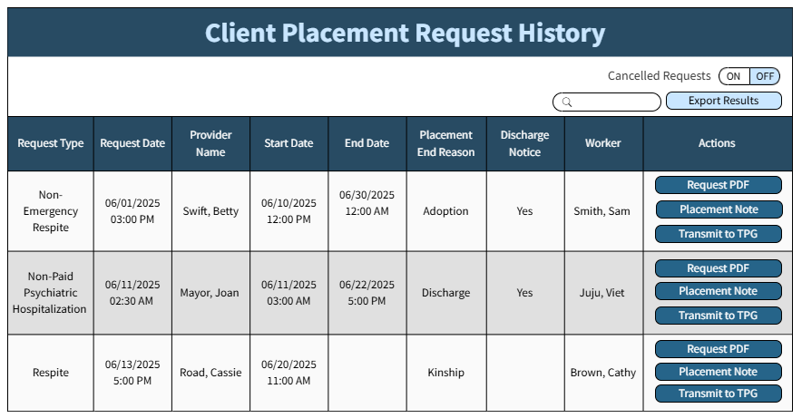 |

| Placement Notes Data Grid (CoBRIS Screenshot) |
| --- |
| 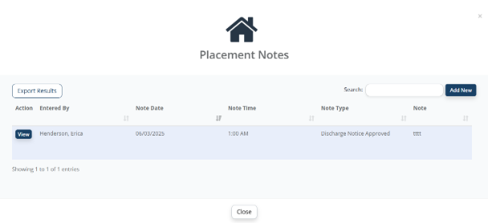 |

| Add Placement Note (CoBRIS Screenshot) |
| --- |
| 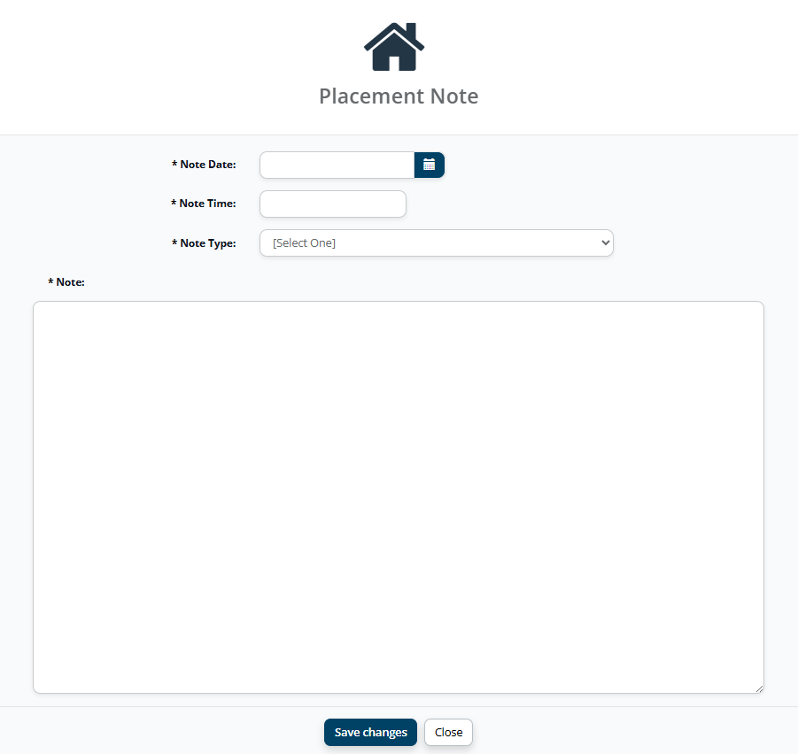 |

| Transfer to TPG (CoBRIS Screenshot) |
| --- |
| 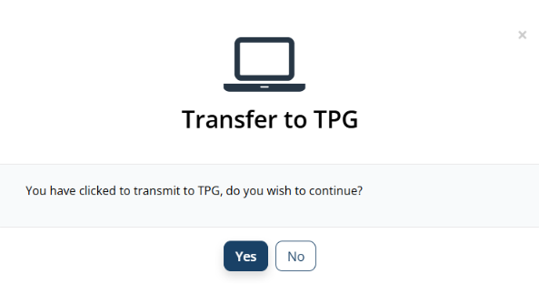 |

### Business Rules

| # | Rule Description |
| --- | --- |

| # | Rule Description |
| --- | --- |
| Client Placement Request History – Data Grid |  |
| 1. | The data grid will load all non-cancelled current and historical placements for the client, sorted by Request Date descending. Toggling the Cancelled Request to Yes will display the cancelled requests. |
| 2. | The Provider name is a hyperlink that will open the Provider Face Sheet. |
| 3. | Discharge Notice column indicates if the placement request was created via a Discharge Notice from TPG. |
| 4. | The following actions display for all records, depending on the logged in user’s permission: [Request PDF]: Opens the Request PDF in a new window. [Placement Notes]: Opens the Placement Notes data grid. [Transmit to TPG]: Opens the Transmit to TPG modal to confirm the action. Upon clicking [Confirm], a success toast message will display: “Placement has been updated and will be transmitted to TPG.” |
| Placement Notes – Data Grid |  |
| 1. | The [View] button in the Actions column will open the Placement Note screen as read-only. |
| 2. | Placement Notes cannot be edited or deleted. |
| {Add/View} Placement Note |  |
| 1. | [View] form are all disabled values, except for the [Close] Button |
| 2. | Form is read-only if you are not the creator of the note, or it is a cancelled request |
| 3. | Note Type dropdown values will be configurable based on user’s organization. |

### Element Descriptions

| Element Name | Description/ Attributes | Element Type | Editable | Required | Core |
| --- | --- | --- | --- | --- | --- |
| Client Placement Request History |  | Data Grid |  |  | Y |
| Header Text | Text: “Client Placement Request History” | Header | N/A | N/A | Y |
| Cancelled Requests Toggle Switch | Label: “Cancelled Requests” Switch Text: “ON, OFF” See business rules. | Toggle Switch | Y | N/A | Y |
| Export Results Button | Text: “Export Results” | Button | N/A | N/A | Y |
| Request Type Column | Column Header: “Request Type”Column Value: “{Request Type}” | Text Column | N | N/A | Y |
| Request Sub-Type | Column Header: “Request Sub-Type”Column Value: “{Request Sub-Type}” | Text Column | N | N/A | Y |
| Request Date Column | Column Header: “Request Date”Column Value: “{Request Date} {Request Time}” | Date Column | N | N/A | Y |
| Provider Name Column | Column Header: “Provider Name”Column Value: “{Provider Last Name}, {First Name}” See business rules. | Text Column | N | N/A | Y |
| Start Date Column | Column Header: “Start Date”Column Value: “{Start Date} {Start Time}” | Date Column | N | N/A | Y |
| End Date Column | Column Header: “End Date”Column Value: “{End Date} {End Time}” | Date Column | N | N/A | Y |
| Placement End Reason Column | Column Header: “Placement End Reason”Column Value: “{Reason}” | Text Column | N | N/A | Y |
| Discharge Notice Column | Column Header: “Discharge Notice”Column Value: “{Discharge Notice}” See business rules. | Text Column | N | N/A | Y |
| Worker Column | Column Header: “Worker”Column Value: “{Worker Last Name}, {First Name}” | Text Column | N | N/A | Y |
| Actions Column | Column Header: “Actions”Buttons: [Request PDF] [Placement Notes] [Transmit to TPG] See business rules. | Button Column | N/A | N/A | Y |
| Placement Notes |  | Data Grid |  |  | Y |
| Header Text | Text: “Placement Notes” | Header | N/A | N/A | Y |
| Add Note Button | Text: “Add Note” | Button | N/A | N/A | Y |
| Export Results Button | Text: “Export Results” | Button | N/A | N/A | Y |
| Entered By Column | Column Header: “Entered By”Column Value: “{Last Name}, {First Name}” | Text Column | N | N/A | Y |
| Note Date Column | Column Header: “Note Date”Column Value: “{Note Date}” | Date Column | N | N/A | Y |
| Note Time Column | Column Header: “Note Time”Column Value: “{Note Time}” | Time Column | N | N/A | Y |
| Note Type Column | Column Header: “Note Type”Column Value: “{Type}” | Text Column | N | N/A | Y |
| Note Column | Column Header: “Note”Column Value: “{Note}” | Text Column | N | N/A | Y |
| Actions Column | Column Header: “Actions”Buttons: [View] See business rules. | Button Column | N/A | N/A | Y |
| Go Back Button | Text: “Go Back” | Button | N/A | N/A | Y |
| {Add/View} Placement Note Modal |  | Modal |  |  | Y |
| Header Text | Text: “Placement Note” | Header | N/A | N/A | Y |
| Note Date | Label: “Note Date” | Date Picker | Y | Y | Y |
| Note Time | Label: “Note Time”Dropdown Values: 24 Hours in 5-minute intervals | Dropdown | Y | Y | Y |
| Note Type | Label: “Note Type” Dropdown Values: Select Note Type (Default) See business rules. | Dropdown | Y | Y | Y |
| Note | Label: “Note” | Multi-Line Textbox | Y | Y | Y |
| Cancel Button | Text: “Cancel” | Button | N/A | N/A | Y |
| Save Changes Button | Text: “Save Changes” | Button | N/A | N/A | Y |
| Transfer to TPG Modal |  | Modal |  |  | Y |
| Header Text | Text: “Transfer to TPG” | Header | N/A | N/A | Y |
| Confirmation Message | Text: “Click Confirm to continue with the transfer to TPG.” | Label | N/A | N/A | Y |
| Cancel Button | Text: “Cancel” | Button | N/A | N/A | Y |
| Confirm Button | Text: “Confirm” | Button | N/A | N/A | Y |

### Security

| Permission Type | Permission Name | Description |
| --- | --- | --- |
| Action | ViewClientPlacementInformation | Ability to view client placement information |
| Access | AccessClientPlacementRequestHistory | Access to client placement history requests menu option and data grid |
| Access | AccessClientPlacementNotes | Access to the client Placement Notes data grid |
| Action | ViewClientPlacementNote | Ability to view a client placement note |
| Action | CreateClientPlacementNote | Ability to create a client placement note |
| Action | ClientPlacementRequestTransmitToTPG | Ability to transmit a placement request to TPG |

## 13.3 Service Package/Tier History
The Service Package/Tier History module tracks historical records of service packages and levels of care associated with client placements. It documents provider details, rate durations, and agency affiliations, enabling users to view the number of days each rate was active.
### Navigation
Main Menu > Client Search > Client Face Sheet > Request/Placement History > View Service Package/Tier History
### User Interfaces

| Service Package/Tier History (Mockup) |
| --- |
| 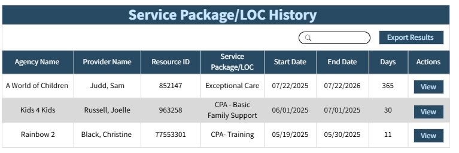 |

| View Service Package/Tier Record (Mockup) |
| --- |
| 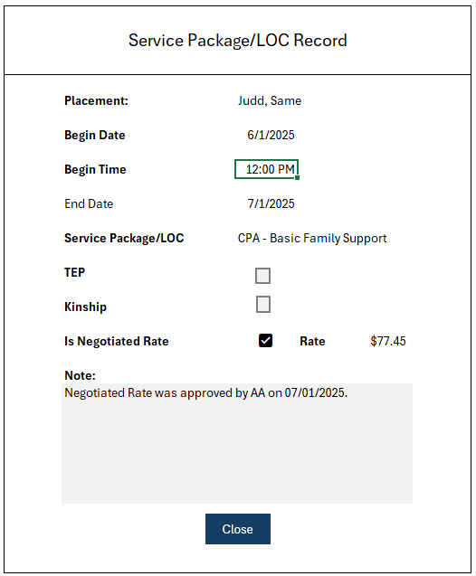 |

### Business Rules

| # | Rule Description |
| --- | --- |
| Service Package/Tier History Data Grid |  |
| 1. | The data grid will load all Service Packages/Tiers for each placement record sorted by Start Date descending. |
| 2. | The Days column is a calculation If the placement has an End Date Days = End Date - Start Date If the placement does not have an End Date: Days = Current Date - Start Date |
| 3. | The [View] button will open a read-only Service Package/Tier screen. |

### Element Descriptions

| Element Name | Description/ Attributes | Element Type | Editable | Required | Core |
| --- | --- | --- | --- | --- | --- |
| Service Package/ Tier History |  | Data Grid |  |  | Y |
| Header Text | Text: “Service Package/Tier History” | Header | N/A | N/A | Y |
| Export Results Button | Text: “Export Results” | Button | N/A | N/A | Y |
| Agency Name Column | Column Header: “Agency Name”Column Value: “{Agency Name}” | Text Column | N | N/A | Y |
| Provider Name Column | Column Header: “Provider Name”Column Value: “{Provider Name}” | Text Column | N | N/A | Y |
| Resource ID Column | Column Header: “Resource ID”Column Value: “{Resource ID}” | Numerical Column | N | N/A | Y |
| Service Package/Tier Column | Column Header: “Service Package/Tier”Column Value: “{Service Package/Tier}” | Text Column | N | N/A | Y |
| Start Date Column | Column Header: “Start Date”Column Value: “{Start Date}” | Date Column | N | N/A | Y |
| End Date Column | Column Header: “{End Date}” Column Value: “{End Date}” | Date Column | N | N/A | Y |
| Days Column | Column Header: “Days”Column Value: “{Days}” See business rules. | Numerical Column | N | N/A | Y |
| Actions Column | Column Header: “Actions”Button(s): [View] See business rules. | Button Column | N/A | N/A | Y |
| Service Package/Tier Record |  | Form Screen |  |  | Y |
| Header Text | Text: “Service Package/Tier Record” | Header | N/A | N/A | Y |
| Placement | Label: “Placement”Value: “{Placement}” | Label and Value | N/A | N/A | Y |
| Start Date | Label: “Start Date”Value: “{Start Date}” | Label and Value | N/A | N/A | Y |
| Start Time | Label: “Start Time”Value: “{Start Time}” | Label and Value | N/A | N/A | Y |
| End Date | Label: “End Date”Value: “{End Date}” | Label and Value | N/A | N/A | Y |
| Service Package/Tier | Label: “Service Package/Tier”Value: “{Service Package/Tier}” | Label and Value | N/A | N/A | Y |
| TEP | Label: “TEP” | Checkbox | Y | N | Y |
| Kinship | Label: “Kinship” | Checkbox | Y | N | Y |
| Is Negotiated Rate | Label: “Is Negotiated Rate” | Checkbox | Y | N | Y |
| Rate | Label: “Rate”Value: “{Rate}” | Label and Value | N/A | N/A | Y |
| Note | Label: “Note” | Multi-Line Textbox | N | N | Y |
| Go Back Button | Text: “Go Back” | Button | N/A | N/A | Y |

### Security

| Permission Type | Permission Name | Description |
| --- | --- | --- |
| Action | ViewClientPlacementInformation | Ability to view client placement information |
| Access | AccessClientServicePackageTier | Access to the client service package/Tier menu option and data grid |
| Action | ViewClientServicePackageTier | Ability to view a service package/Tier |

## 13.4 Placement Worksheet
The Placement Worksheet module provides a consolidated view of all client placements alongside their associated service packages and rates. It enables users to review and directly edit Service Package/Tier records, supporting financial accuracy and placement tracking. This module is designed for efficient rate management and historical analysis, helping staff ensure that placement decisions align with service needs and funding structures.
### Navigation
Client Face Sheet > Request/Placement History > Placement Worksheet
### User Interfaces

| Placement Worksheet (Mockup) |
| --- |
| 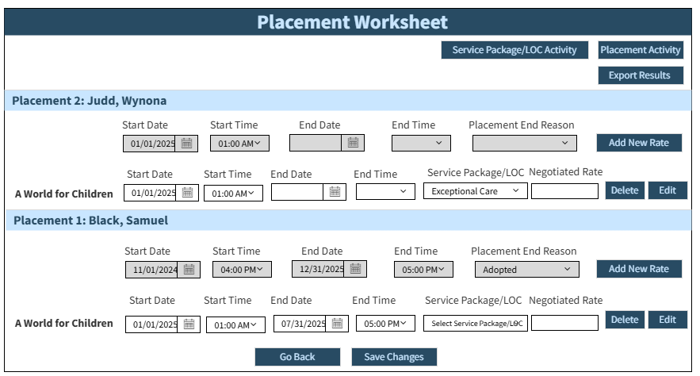 |

| Service Package / Tier History (CoBRIS Screenshot) |
| --- |
| 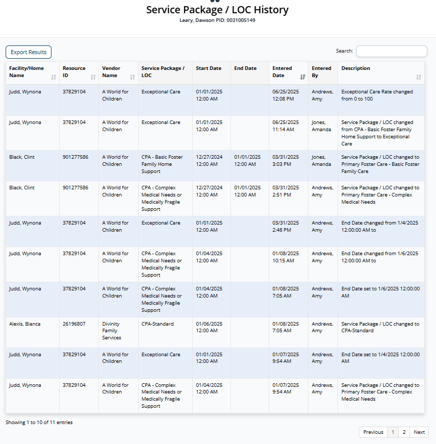 |

| Placement History (CoBRIS Screenshot) |
| --- |
| 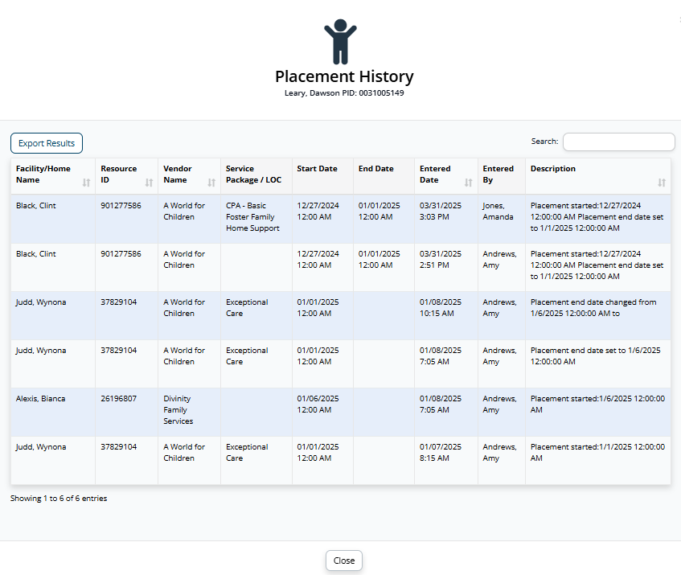 |

| Delete Placement Rate Record Modal (Mockup) |
| --- |
| 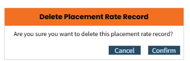 |

| {Add/Edit} Service Package/Tier (CoBRIS Screenshot) |
| --- |
| 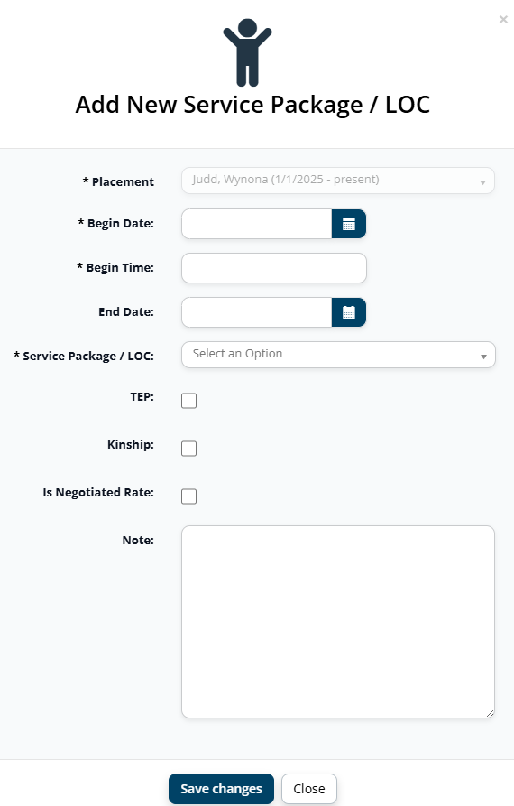 |

### Business Rules

| # | Rule Description |
| --- | --- |
| Placement Worksheet |  |
| 1. | The following buttons display above the data grid: [Service Package/Tier Activity]: Opens the Service Package/Tier History data grid. [Placement Activity]: Opens the Placement History data grid. |
| Placement Panel |  |
| 1. | Provider Name displays as a hyperlink that will navigate to the Provider Face Sheet. |
| 2. | Start Date must occur before End Date |
| 3. | Placement End Reason dropdown values will display according to the logged-in user’s organization |
| 4. | Client Placements are listed by Start Date descending. |
| 5. | Each placement panel will display the associated Service Package/Tiers by descending start date. |
| 6. | The first row displays the Placement Start Date, Start Time, End Date, End Time, Placement End Reason.  Each subsequent row displays the Service Package/Tier Start Date, Start Time, End Date, Service Package/Tier, Negotiated Rate, and [Delete] and [Edit] buttons. |
| 7. | Validations (kick off upon save): Rate start date is not before end date A placement rate must be within the begin/end date of the placement it is under. Rate start and end dates must be between earlier agency and latest agency dates Placement rate must be within the Provider Agency's start/end dates. No gaps allowed in placement rates under a placement Example: Placement 1: 1/1/2023 - 2/25/2023 Rate 1: 1/1/2023 - 1/5/2023 Rate 2: 1/7/2023 - 2/25/2023 Result: Gap Found Placement 1: 1/1/2023 - 2/25/2023 Rate 1: 1/1/2023 - 1/5/2023 Rate 2: 1/6/2023 - 2/25/2023 Result: No gap Rates cannot overlap Example: Example: Rate 1: 1/1/2023 - 1/5/2023 Rate 2: 1/4/2023 - 2/25/2023 Result: Overlap If Negotiated rate box is checked, the negotiated rate is required and must be greater than 0 Add On Rate must overlap with a valid Primary Rate Add On Rate cannot overlap another Add On rate of the same type Add-On for Transition Support can only be used for children 14 years old or older |
| 8. | The ability to create a new placement record is not reflected in the mockup but there should be a button that displays if the user has the correct permission.  This button should be named [Create New Placement] and should be located next to the Export button.  When this button is selected, it will open the Finalize Placement form (see Client FDS – Placement Request for screen elements and security). |
| Service Package/Tier Activity – Data Grid |  |
| 1. | Displays a read-only list of all Service Packages/Tiers that have been entered for every placement. |
| Placement Activity – Data Grid |  |
| 1. | Displays a read-only list of all placement changes, who made the change, and the date/time the change was made. |
| {Add/Edit} Service Package/Tier |  |
| 1. | The placement dropdown is read-only. It will display the provider’s name and placement start/end dates for the associated placement record. |
| 2. | Service Package/Tier Begin/End Dates must be within the placement start and end dates. |
| 3. | Service Package/Tier records cannot overlap. |
| 4. | Service Package/Tier dropdown values will display Service Packages and Tiers that the Provider’s Agency is contracted for within the specified placement dates.  See Financial FDS. |
| 5. | When the TEP and/or Kinship boxes are checked, color coded text (TEP – red text; Kinship – green text) indicating which box was checked will display in the Placement Tile, directly under the Service Package/Tier field. |
| 6. | When the Negotiated Rate box is checked, a textbox will display where the user will be required to enter the negotiated rate dollar amount. |
| 7. | When the following Service Package/Tier dropdown values are selected, an additional textbox will display where the user will be required to enter the rate dollar amount: Exceptional Care Child Specific |
| 8. | Start Date must occur before End Date. |
| 9. | The “End Time” field will be hidden if there is not an End Date entered. |

### Element Descriptions

| Element Name | Description/ Attributes | Element Type | Editable | Required | Core |
| --- | --- | --- | --- | --- | --- |
| Placement Worksheet |  | Form Screen |  |  | Y |
| Header Text | Text: “Placement Worksheet” | Header | N/A | N/A | Y |
| Service Package/ Tier Activity Button | Text: “Service Package/Tier Activity” | Button | N/A | N/A | Y |
| Placement Activity Button | Text: “Placement Activity” | Button | N/A | N/A | Y |
| Export Results Button | Text: “Export Results” | Button | N/A | N/A | Y |
| Placement Record | Displays for each placement | Panel |  |  | Y |
| Subheader Text | Text: “Placement {x}: {Provider Name}” See business rules. | Subheader | N/A | N/A | Y |
| Start Date | Label: “Start Date” See business rules. | Date Picker | Y | Y | Y |
| Start Time | Label: “Start Time”Dropdown Values: 24 Hours in 5-minute intervals | Dropdown | Y | Y | Y |
| End Date | Label: “End Date” See business rules. | Date Picker | Y | N | Y |
| End Time | Label: “End Time”Dropdown Values: 24 Hours in 5-minute intervals | Dropdown | Y | N | Y |
| Placement End Reason | Label: “Placement End Reason”Dropdown Values: Select Reason (Default) See business rules. | Dropdown | Y | N | Y |
| Provider Agency | Label: “{Provider’s Agency}” | Label | N/A | N/A |  |
| Start Date | Label: “Start Date” See business rules. | Date Picker | Y | Y | Y |
| Start Time | Label: “Start Time”Dropdown Values: 24 Hours in 5-minute intervals | Dropdown | Y | Y | Y |
| End Date | Label: “End Date” See business rules. | Date Picker | Y | N | Y |
| End Time | Label: “End Time”Dropdown Values: 24 Hours in 5-minute intervals | Dropdown | Y | N | Y |
| Service Package/Tier | Label: “Service Package/Tier”Dropdown Values: Select Service Package/Tier See business rules. | Dropdown | Y | N | Y |
| Negotiated Rate | Label: “Negotiated Rate” | Textbox | Y | N | Y |
| Buttons | Buttons: [Delete] [Edit] [Add New Rate] | Buttons | N/A | N/A | Y |
| Go Back Button | Text: “Go Back” | Button | N/A | N/A | Y |
| Save Changes Button | Text: “Save Changes” | Button | N/A | N/A | Y |
| Service Package/Tier History |  | Data Grid |  |  | Y |
| Header Text | Text: “Service Package/Tier History” | Header | N/A | N/A | Y |
| Subheader Text | Text: “{Client Last Name}, {First Name} ({PID})” | Subheader | N/A | N/A | Y |
| Export Results Button | Text: “Export Results” | Button | N/A | N/A | Y |
| Provider Name Column | Column Header: “Provider Name”Column Value: “{Provider Name}” | Text Column | N | N/A | Y |
| Resource ID Column | Column Header: “Resource ID”Column Value: “{Resource ID}” | Text Column | N | N/A | Y |
| Agency Name Column | Column Header: “Agency Name”Column Value: “{Agency Name}” | Text Column | N | N/A | Y |
| Service Package/Tier Column | Column Header: “Service Package/Tier”Column Value: “{Service Package/Tier}” | Text Column | N | N/A | Y |
| Start Date Column | Column Header: “{Start Date}Column Value: “{Start Date} {Start Time}” | Date Column | N | N/A | Y |
| End Date Column | Column Header: “{End Date}” Column Value: “{End Date} {End Time}” | Date Column | N | N/A | Y |
| Entered Date Column | Column Header: “Entered Date”Column Value: “{Entered Date} {Entered Time}” | Date Column | N | N/A | Y |
| Entered By Column | Column Header: “Entered By”Column Value: “{Entered By Last Name}, {First Name}” | Text Column | N | N/A | Y |
| Description Column | Column Header: “Description”Column Value: “{Description}” | Text Column | N | N/A | Y |
| Go Back Button | Text: “Go Back” | Button | N/A | N/A | Y |
| Placement History |  | Data Grid |  |  | Y |
| Header Text | Text: “Placement History” | Header | N/A | N/A | Y |
| Subheader Text | Text: “{Client Last Name}, {First Name} ({PID})” | Subheader | N/A | N/A | Y |
| Export Results Button | Text: “Export Results” | Button | N/A | N/A | Y |
| Provider Name Column | Column Header: “Provider Name”Column Value: “{Provider Name}” | Text Column | N | N/A | Y |
| Resource ID Column | Column Header: “Resource ID”Column Value: “{Resource ID}” | Text Column | N | N/A | Y |
| Agency Name Column | Column Header: “Agency Name”Column Value: “{Agency Name}” | Text Column | N | N/A | Y |
| Service Package/Tier Column | Column Header: “Service Package/Tier”Column Value: “{Service Package/Tier}” | Text Column | N | N/A | Y |
| Start Date Column | Column Header: “{Start Date}Column Value: “{Start Date} {Start Time}” | Date Column | N | N/A | Y |
| End Date Column | Column Header: “{End Date}” Column Value: “{End Date} {End Time}” | Date Column | N | N/A | Y |
| Entered Date Column | Column Header: “Entered Date”Column Value: “{Entered Date} {Entered Time}” | Date Column | N | N/A | Y |
| Entered By Column | Column Header: “Entered By”Column Value: “{Entered By Last Name}, {First Name}” | Text Column | N | N/A | Y |
| Description Column | Column Header: “Description”Column Value: “{Description}” | Text Column | N | N/A | Y |
| Go Back Button | Text: “Go Back” | Button | N/A | N/A | Y |
| Delete Placement Rate Record Modal |  | Modal |  |  | Y |
| Delete Placement Rate Record Header | Text: “Delete Placement Rate Record” | Header | N/A | N/A | Y |
| Confirmation Message | Text: “Are you sure you want to delete this Placement Rate Record?” | Label | N/A | N/A | Y |
| Cancel Button | Text: “Cancel” | Button | N/A | N/A | Y |
| Confirm Button | Text: “Confirm” | Button | N/A | N/A | Y |
| Confirm Exit Modal |  | Modal |  |  | Y |
| Header Text | Text: “Confirm Exit” | Header | N/A | N/A | Y |
| Confirmation Message | Text: “Are you sure you want to exit the placement worksheet with unsaved changes?” | Label | N/A | N/A | Y |
| Cancel Button | Text: “Cancel” | Button | N/A | N/A | Y |
| Confirm Button | Text: “Confirm” | Button | N/A | N/A | Y |
| {Add/Edit} Service Package/Tier |  | Form Screen |  |  | Y |
| Header Text | Text: “{Add/Edit} Service Package/Tier” | Header | N/A | N/A | Y |
| Placement | Text: “Placement” See business rules. | Dropdown | N | N/A | Y |
| Start Date | Label: “Start Date” See business rules. | Date Picker | Y | Y | Y |
| Start Time | Label: “Start Time”Dropdown Values: 24 Hours in 5-minute intervals | Dropdown | Y | Y | Y |
| End Date | Label: “End Date” See business rules. | Date Picker | Y | N | Y |
| End Time | Label: “End Time”Dropdown Values: 24 Hours in 5-minute intervals See business rules. | Dropdown | Y | N | Y |
| Service Package/Tier | Label: “Service Package/Tier”Dropdown Values: Select Service Package/Tier See business rules. | Dropdown | Y | Y | Y |
| TEP | Label: “TEP” | Checkbox | Y | N | Y |
| Kinship | Label: “Kinship” | Checkbox | Y | N | Y |
| Is Negotiated Rate | Label: “Is Negotiated Rate” See business rules. | Checkbox | Y | N | Y |
| Negotiated Rate | Label: “Negotiated Rate” See business rules. | Textbox | Y | Y | Y |
| Note | Label: “Note” | Multi-Line Textbox | Y | N | Y |
| Go Back Button | Text: “Go Back” | Button | N/A | N/A | Y |
| Save Changes Button | Text: “Save Changes” | Button | N/A | N/A | Y |

### Security

| Permission Type | Permission Name | Description |
| --- | --- | --- |
| Action | ViewClientPlacementInformation | Ability to view client placement information |
| Access | AccessClientPlacementWorksheet | Access to the client placement worksheet menu option and data grid |
| Action | EditClientPlacementSPTier | Ability to edit the placement service package/Tier |
| Action | CreateClientPlacementSPTier | Ability to create a new placement service package/Tier |
| Access | AccessClientServicePackageTierActivity | Ability to view the service package/Tier activity |
| Access | AccessClientPlacementActivity | Ability to view the placement activity |
| Action | EditClientPlacementInformation | Ability to edit the read-only fields on the Finalize Placement form. |

## 13.5 Client Alerts
The Client Alerts module manages time-sensitive and critical notifications related to a client’s status, behaviors, or needs. It supports the creation, editing, and deletion of multiple concurrent alerts, each with configurable types, start and end dates, and descriptive notes. Active alerts are prominently displayed on the Client Face Sheet and in search results via icons and banners.
### Navigation
Main Menu > Client Search > Client Face Sheet > Request/Placement History > Client Alerts
### User Interfaces

| Alert History Data Grid (CoBRIS Screenshot) |
| --- |
| 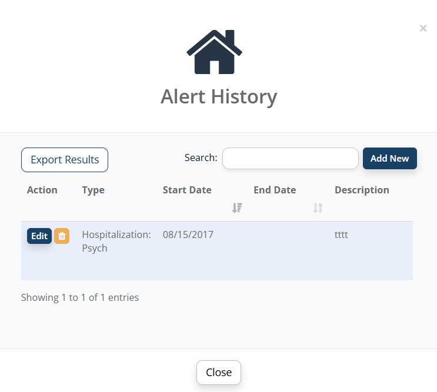 |

| Add/Edit Alert (CoBRIS Screenshot) |
| --- |
| 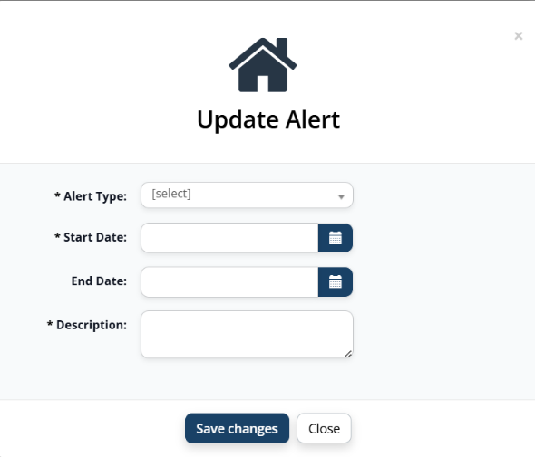 |

| Delete Alert Modal (Mockup) |
| --- |
| 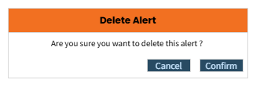 |

### Business Rules

| #   Rule Description |  |
| --- | --- |
| Alerts – General |  |
| 1. | If a client has an active alert: A banner will display in the Placement card on the Client Face Sheet with the Alert Type and Start Date. An icon will display next to the client’s name in the Client Search data grid. Hovering over the icon displays a tooltip with the alert details. |
| 2. | Each client can have more than one active alert. |
| Alerts – Data Grid |  |
| 1. | The data grid will load with all current alerts for the client. This includes alerts with no End Date or an End Date in the future. The view can be toggled to show historical data, which displays all non-deleted alerts for the client. |
| 2. | The following actions display for all records, depending on the logged in user’s permissions: [Edit]: Opens the Edit Alert modal. [Delete]: Opens the Delete Alert modal. |
| Add/Edit Alert |  |
| 1. | Alert Types are configurable for each organization. |
| 2. | Alert Type dropdown is disabled when editing an alert. |
| 3. | Start Date must occur before the End Date. |

### Element Descriptions

| Element Name | Description/ Attributes | Element Type | Editable | Required | Core |
| --- | --- | --- | --- | --- | --- |
| Alert History |  | Data Grid |  |  | Y |
| Header Text | Text: “Client Alerts” | Header | N/A | N/A | Y |
| Current/Historical Toggle Button | Button Text: “Current” “Historical” See business rules. | Toggle Button | N/A | N/A | Y |
| Add Alert Button | Text: “Add Alert” | Button | N/A | N/A | Y |
| Export Results Button | Text: “Export Results” | Button | N/A | N/A | Y |
| Type Column | Column Header: “Type”Column Value: “{Type}” | Text Column | N | N/A | Y |
| Start Date Column | Column Header: “Start Date”Column Value: “{Start Date}” | Date Column | N | N/A | Y |
| End Date Column | Column Header: “End Date”Column Value: “{End Date}” | Date Column | N | N/A | Y |
| Description Column | Column Header: “Description”Column Value: “{Description}” | Text Column | N | N/A | Y |
| Actions Column | Column Header: “Actions”Button(s): [Edit] [Delete] See business rules. | Button Column | N/A | N/A | Y |
| Go Back Button | Text: “Go Back” | Button | N/A | N/A | Y |
| Add/Edit Alert Modal | [Add Alert] or [Edit] | Modal |  |  | Y |
| Header Text | Text: “Update Alert” | Header | N/A | N/A | Y |
| Alert Type | Label: “Alert Type”Dropdown Values: Select Alert Type (Default) See business rules. | Dropdown | Y | Y | Y |
| Start Date | Label: “Start Date” See business rules. | Date Picker | Y | Y | Y |
| End Date | Label: “End Date” See business rules. | Date Picker | Y | N | Y |
| Description | Label: “Description” | Multi-Line Textbox | Y | Y | Y |
| Cancel Button | Text: “Cancel” | Button | N/A | N/A | Y |
| Save Changes Button | Text: “Save Changes” | Button | N/A | N/A | Y |
| Delete Alert Modal |  | Modal |  |  | Y |
| Header Text | Text: “Delete Alert” | Header | N/A | N/A | Y |
| Confirmation Message | Text: “Are you sure you want to delete this alert?” | Label | N/A | N/A | Y |
| Cancel Button | Text: “Cancel” | Button | N/A | N/A | Y |
| Confirm Button | Text: “Confirm” | Button | N/A | N/A | Y |

### Security

| Permission Type | Permission Name | Description |
| --- | --- | --- |
| Action | ViewClientPlacementInformation | Ability to view client placement information |
| Access | AccessClientAlerts | Access to the Client Alerts menu option and data grid |
| Action | CreateClientAlert | Ability to create a client alert |
| Action | ViewClientAlert | Ability to view a client alert |
| Action | EditClientAlert | Ability to edit a client alert |
| Action | DeleteClientAlert | Ability to delete a client alert |

# 14. Client Characteristics
The Client Characteristics module displays behavioral, medical, and developmental attributes of clients as received from the ECAP API. These read-only attributes support placement matching by aligning client needs with provider capabilities. Traits such as aggression, substance use, disabilities, and social behaviors are presented in alphabetical order for clarity. Integrated with the Client Face Sheet, this module enhances visibility into client profiles and informs service planning and placement decisions across programs.
Relevant Requirement(s):
4.120 - The system will have the ability to track child attributes necessary for matching criteria (tied to provider attributes).

## Navigation
Main Menu > Client Search > Client Face Sheet > Characteristics
## User Interfaces

| Client Characteristics (Mockup) |
| --- |
| 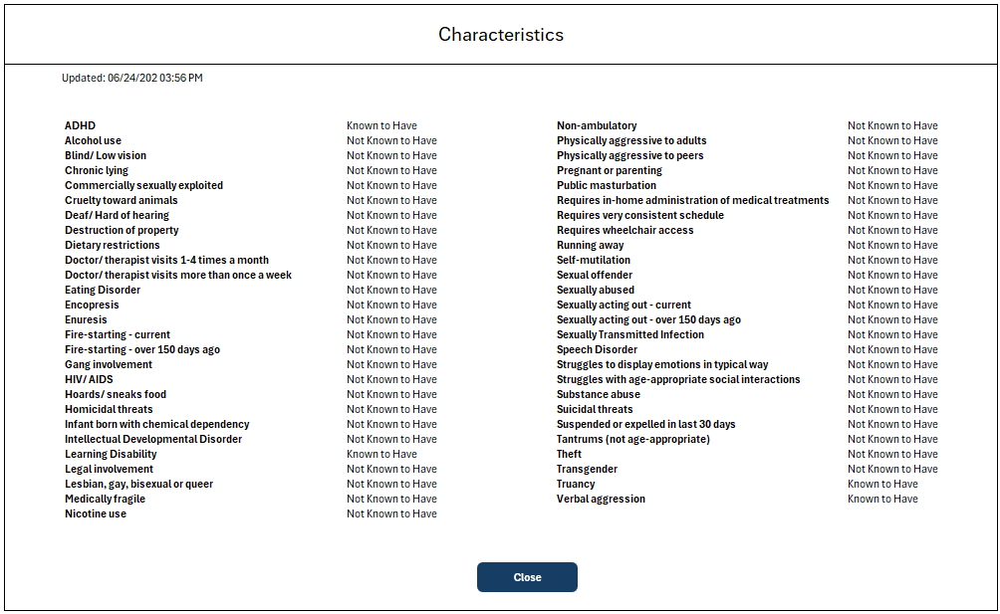 |

## Business Rules

| # | Rule Description |
| --- | --- |
| Characteristics |  |
| 1. | Displays client characteristic information from one or more assessment attributes as read-only from the ECAP API. |
| 2. | Known values received from the ECAP API: Alcohol use Blind/Low Vision Chronic lying Commercially sexually exploited Cruelty towards animals Deaf/Hard of hearing Destruction of property Dietary restrictions Doctor/Therapist visits 1-4 times a month Eating disorder Encopresis Enuresis Fire-starting-current Fire-starting-over 150 days ago Gang involvement HIV/AIDS Hoards/sneaks food Homicidal threats Infant born with chemical dependency Intellectual Developmental Disorder Learning disability Legal involvement Lesbian, gay, bisexual or queer Medically fragile Nicotine use Non-ambulatory Physically aggressive to adults Physically aggressive to peers Pregnant or parenting Public masturbation Requires in-home administration of medical treatments Requires very consistent schedule Requires wheelchair access Running away Self-mutilation Sexual offender Sexually abused Sexually acting out - current Sexually acting out – over 150 days ago Sexually Transmitted Infection Speech disorder Struggles to display emotions in typical way Struggles with age-appropriate social interactions Substance abuse Suicidal threats Suspended or expelled in last 30 days Tantrums (not age-appropriate) Theft Transgender Truancy Verbal aggression |
| 3. | Attributes display in alphabetical order. |

## Element Descriptions

| Element Name | Description/ Attributes | Element Type | Editable | Required | Core |
| --- | --- | --- | --- | --- | --- |
| Characteristics |  | Screen |  |  | Y |
| Characteristics Header | Text: “Client Characteristics” | Header | N/A | N/A | Y |
| ECAP Attributes (multiple) | Label: “{ECAP Display Name}”Value: “{ECAP Display Value}” See business rules. | Label and Value List | N/A | N/A | Y |

## Security

| Permission Type | Permission Name | Description |
| --- | --- | --- |
| Action | ViewClient | Ability to view a client’s face sheet |
| Access | AccessClientCharacteristics | Access to client characteristic data |

# 15. Client Worker Assignment
The Client Worker Assignment module manages the assignment of staff to individual clients, enabling tracking of worker roles, assignment periods, and organizational affiliations. It supports multiple concurrent or historical assignments, with validations on start and end dates to ensure data integrity. Dropdowns are filtered by user roles, and permissions govern access to view, edit, or delete assignments. Integrated with the Client Face Sheet, this module ensures visibility into staffing history and supports accountability and continuity of care across programs.
Relevant requirement(s):
4.145 - The system will support the assignment of one or more workers by type relating to Client Management.
## Navigation
Main Menu > Client Search > Client Face Sheet > Client Workers
## User Interfaces

| Client Workers Tile(Mockup) |
| --- |
| 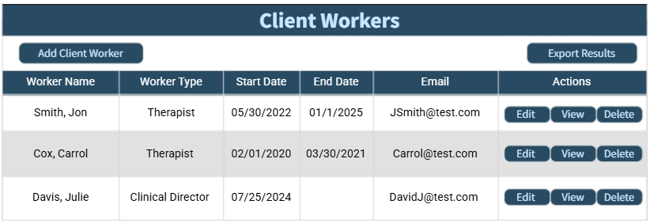 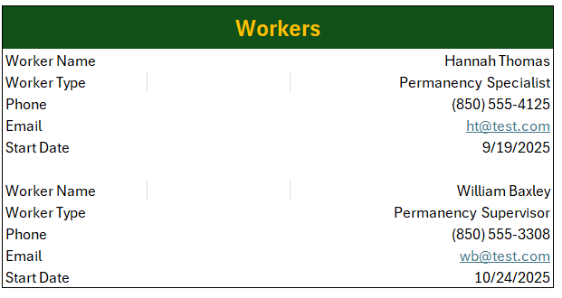 |

| Client Workers Data Grid (Mockup) |
| --- |
|  |

| Add/Edit Client Worker (Mockup) |
| --- |
| 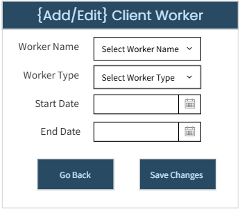 |

| Delete Client Worker Assignment Modal (Mockup) |
| --- |
| 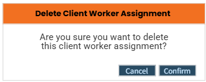 |

## Business Rules

| # | Rule Description |
| --- | --- |
| Client Worker – Tile |  |
| 1. | Clicking on the “Workers” header will open the Client Worker Assignment Data Grid. |
| 2. | The face sheet tile will display all current workers for the case.  This includes workers who have no End Date or an End Date in the future. |
| Client Worker – General |  |
| 1. | The data grid will load with all current workers assigned to the client sorted by Start Date descending. This includes workers who have no End Date or an End Date in the future. The view can be toggled to show historical data, which displays all non-deleted worker assignments to the client. |
| 2. | The following actions display for all records, depending on the logged in user’s permissions: [Edit]: Opens the Edit Client Worker modal. [Delete]: Opens the Delete Client Worker Assignment modal. |
| Add/Edit Client Worker |  |
| 1. | The Worker Name dropdown will filter by user role in the following format: “{Worker Last Name}, {Worker First Name}”. |
| 2. | The Worker Name dropdown is disabled in Edit mode. |
| 3. | End Date must be greater than or equal to the Start Date. |
| 4. | Worker Type dropdown options are configurable. |
| 5. | When a Worker is added to a Client, the worker receives a notification. |

## Element Descriptions

| Element Name | Description/ Attributes | Element Type | Editable | Required | Core |
| --- | --- | --- | --- | --- | --- |
| Client Workers |  | Face Sheet Component Tile |  |  | Y |
| Header Text | Text: “Client Workers” | Header | N/A | N/A | Y |
| Worker Name | Label: “Worker Name” Value: “{Worker Name}” | Label and Value | N | N/A | Y |
| Worker Type | Label: “Worker Type” Value: “{Worker Type}” | Label and Value | N | N/A | Y |
| Phone | Label: “Phone” Value: “{Phone}” | Label and Value | N | N/A | Y |
| Email | Label: “Email” Value: “{Email}” | Label and Value | N | N/A | Y |
| Start Date | Label: “Start Date” Value: “{Start Date}” | Label and Value | N | N/A | Y |
| Client Workers Data Grid |  | Data Grid |  |  | Y |
| Client Workers Header | Text: “Client Workers” | Header | N/A | N/A | Y |
| Current/Historical Toggle Button | Button Text: “Current” “Historical” | Toggle Button | N/A | N/A | Y |
| Add Client Worker Button | Text: “Add Client Worker” | Button | N/A | N/A | Y |
| Export Results Button | Text: “Export Results” | Button | N/A | N/A | Y |
| Worker Name Column | Column Header: “Worker Name”Column Value: “{Worker Last Name}, {First Name}” | Text Column | N | N/A | Y |
| Worker Type Column | Column Header: “Worker Type”Column Value: “{Worker Type}” | Text Column | N | N/A | Y |
| Start Date Column | Column Header: “Start Date”Column Value: “{Start Date}” | Date Column | N | N/A | Y |
| End Date Column | Column Header: “End Date”Column Value: “{End Date}” | Date Column | N | N/A | Y |
| Email Column | Row Header: “Email”Value: “{Worker Email}” | Text Column | N | N/A | Y |
| Actions Column | Column Header: “Actions”Button Values: [Edit] [Delete] | Button Column | N/A | N/A | Y |
| Add/Edit Client Worker Info Modal |  | Modal |  |  | Y |
| Add/Edit Client Worker Info Header | Text: “{Add/Edit} Client Worker” | Header | N/A | N/A | Y |
| Worker Name | Label: “Worker Name”Dropdown Values: Select Worker Name (Default) (Alphabetical list of names) See business rules. | Dropdown | Y | Y | Y |
| Worker Type | Label: “Worker Type”Dropdown Values: Select Worker Type (Default) See business rules. | Dropdown | Y | Y | Y |
| Start Date | Label: “Start Date” | Date Picker | Y | Y | Y |
| End Date | Label: “End Date” | Date Picker | Y | N | Y |
| Cancel Button | Text: “Cancel” | Button | N/A | N/A | Y |
| Save Changes Button | Text: “Save Changes” | Button | N/A | N/A | Y |
| Delete Client Worker Assignment Modal |  | Modal |  |  | Y |
| Header Text | Text: “Delete Client Worker Assignment” | Header | N/A | N/A | Y |
| Confirmation Message | Text: “Are you sure you want to delete this worker assignment?” | Label | N/A | N/A | Y |
| Cancel Button | Text: “Cancel” | Button | N/A | N/A | Y |
| Confirm Button | Text: “Confirm” | Button | N/A | N/A | Y |

## Security

| Permission Type | Permission Name | Description |
| --- | --- | --- |
| Action | ViewClient | Ability to view a client’s face sheet |
| Access | AccessClientWorkerAssignment | Access to the Client Worker Assignment menu option and data grid |
| Action | CreateClientWorkerAssignment | Ability to assign a worker to a client |
| Action | EditClientWorkerAssignment | Ability to modify a client worker assignment |
| Action | DeleteClientWorkerAssignment | Ability to remove a worker assignment record from the client |

# 16. Adoption
The Adoption module manages the end-to-end documentation of a client’s adoption process, encompassing recruitment, matching, staffing, placement, and finalization activities. It aggregates data from multiple submodules—such as Recruitment Events, Matched Events, Home Studies, and Selection Staffing—to provide a centralized view of adoption progress. Key milestones like recruitment dates, staffing outcomes, and adoptive placements are displayed in read-only format, with actionable links to underlying records. This module ensures compliance with adoption protocols, supports informed decision-making, and integrates seamlessly with the Client Face Sheet and Document Management systems.
Relevant requirement(s):
4.125 - The system will have the ability to document client adoption related events (e.g., recruitment, placement, etc.)
## 16.1 Adoption Overview
The Adoption Overview module consolidates key data points from all adoption-related activities to provide a comprehensive snapshot of a client’s adoption journey. It displays read-only values such as recruitment dates, staffing outcomes, and placement milestones, sourced from underlying modules like Recruitment Events, Selection Staffing, and Adoptive Placement History.
### Navigation
Main Menu > Client Search > Client Face Sheet > Adoption
### User Interfaces

| Adoption Overview Tile (Mockup) |
| --- |
| 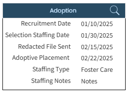 |

### Business Rules

| # | Rule Description |
| --- | --- |
| Adoption Overview – General Tile |  |
| 1. | The overview screen displays read-only labels and values that are updated by accessing the screens from the Action Menu. |
| 2. | If no value exists, the value will display as blank |
| 3. | Action Menu Items and Navigation: Recruitment Events: Opens the Recruitment Events History data grid. Matched Events: Opens the Matched Events History data grid. Home Studies: Opens the Home Studies History data grid. Selection Staffing: Opens the Selection Staffing History data grid. Presentation Staffing: Opens the Presentation Staffing History data grid. Staffing: Opens the Staffing History data grid. Adoption Checklist (Non-Core): Opens the Adoption Checklist screen. Adoption Placement: Opens the Adoption Placement History data grid. View Adoption Documents: Navigates to the client’s Documents screen with the main Adoption folder open. |

### Element Descriptions

| Element Name | Description/ Attributes | Element Type | Editable | Required | Core |
| --- | --- | --- | --- | --- | --- |
| Adoption |  | Face Sheet Component Tile |  |  | Y |
| Header Text | Text: “Adoption” | Header | N/A | N/A | Y |
| Action Menu | Icon: Action Menu Icon See business rules. | Action Menu | N/A | N/A | N |
| Recruitment Date | Label: “Recruitment Date”Value: “{Recruitment Date}” | Label and Value | N/A | N/A | Y |
| Selection Staffing Date | Label: “Selection Staffing Date”Value: “{Selection Staffing Date}” | Label and Value | N/A | N/A | Y |
| Redacted File Sent | Label: “Redacted File Sent”Value: “{Redacted File Sent}” | Label and Value | N/A | N/A | Y |
| Adoptive Placement | Label: “Adoptive Placement”Value: “{Adoptive Placement}” | Label and Value | N/A | N/A | y |
| Staffing Type | Label: “Staffing Type”Value: “{Staffing Type}” | Label and Value | N/A | N/A | Y |
| Staffing Notes | Label: “Staffing Notes”Value: “{Staffing Notes}” | Label and Value | N/A | N/A | Y |

### Security

| Permission Type | Permission Name | Description |
| --- | --- | --- |
| Action | ViewClient | Ability to view a client’s face sheet |
| Access | AccessClientAdoption | Access to Client Adoption module |
| Access | AccessClientAdoptionRecruitmentEvents | Access to the adoption recruitment events menu option and data grid |
| Access | AccessClientAdoptionMatchedEvents | Access to the adoption matched events menu option and data grid |
| Access | AccessClientAdoptionHomeStudies | Access to the adoption home studies menu option and data grid |
| Access | AccessClientAdoptionSelectionStaffing | Access to the adoption Selection Staffing menu option and data grid |
| Access | AccessClientAdoptionPresentationStaffing | Access to the adoption presentation staffing menu option and data grid |
| Access | AccessClientAdoptionStaffing | Access to the adoption staffing menu option and data grid |
| Access | AccessClientAdoptionChecklist | Access to the adoption checklist |
| Access | AccessClientDocuments | Access to the Client Documents screen from the Client Face Sheet |

## 16.2 Recruitment Events
Recruitment events are put on to recruit potential adoptive parents where the children eligible for adoption are in attendance.
The Recruitment Events module tracks outreach efforts aimed at identifying potential adoptive families for children in care. It records key details such as event type (e.g., broadcast, match event), recruitment strategy (general or targeted), and broadcast timelines. The module links children to events based on case associations and supports documentation of broadcast notes and participant involvement. Integrated with the Adoption module, it ensures visibility into recruitment activities and supports compliance with organizational and state-level adoption protocols.
### Navigation
Main Menu > Client Search > Client Face Sheet > Adoption > Recruitment Events
### User Interfaces

| Recruitment Events History Data Grid (Mockup) |
| --- |
| 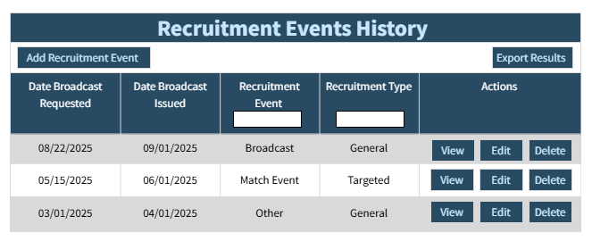 |

| {Add/Edit} Recruitment Event (Mockup) |
| --- |
| 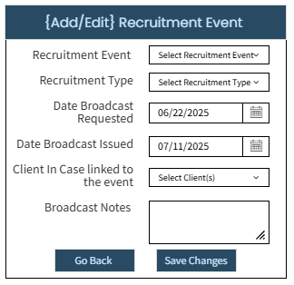 |

| Delete Modal (Mockup) |
| --- |
| 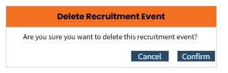 |

### Business Rules

| # | Rule Description |
| --- | --- |
| Recruitment Events – Data Grid |  |
| 1. | The data grid will load sorted by Broadcast Issued date descending. |
| 2. | The following actions display for all records, depending on the logged in user’s permissions: [View]: Opens the View Recruitment Event modal with read-only labels and values from the Add/Edit Recruitment screen. [Edit]: Opens the Edit Recruitment Event screen. [Delete]: Opens the Delete Recruitment Event modal. |
| Add/Edit Recruitment Event |  |
| 1. | Date Broadcast Requested must occur on or before the Date Broadcast Issued. |
| 2. | The “Client in Case Linked to the Event” multi-selection will be pre-populated with all children (including current client) that are involved in the same case. The current client is selected by default and must continue to be selected in order for the record to appear on the face sheet. Selecting other clients will populate on their individual face sheets as well. |

### Element Descriptions

| Element Name | Description/ Attributes | Element Type | Editable | Required | Core |
| --- | --- | --- | --- | --- | --- |
| Recruitment Events History Data Grid |  | Data Grid |  |  | Y |
| Header Text | Text: “Recruitment Events History” | Header | N/A | N/A | Y |
| Add Recruitment Event Button | Text: “Add Recruitment Event” | Button | N/A | N/A | Y |
| Export Results Button | Text: “Export Results” | Button | N/A | N/A | Y |
| Date Broadcast Requested Column | Column Header: “Date Broadcast Requested”Column Value: “{Date Broadcast Requested}” | Date Column | N | N/A | Y |
| Date Broadcast Issued Column | Column Header: “Date Broadcast Issued”Column Value: “{Date Broadcast Issued}” | Date Column | N | N/A | Y |
| Recruitment Event Column | Column Header: “Recruitment Event”Column Value: “{Recruitment Event}” | Text Column with Textbox Filter | N | N/A | Y |
| Recruitment Type Column | Column Header: “Recruitment Type”Column Value: “{Recruitment Type}” | Text Column with Dropdown Filter | N | N/A | Y |
| Actions Column | Column Header: “Actions”Buttons: [View] [Edit] [Delete] | Button Column | N/A | N/A | Y |
| Add/Edit Recruitment Event |  | Form Screen |  |  | Y |
| Header Text | Text: “{Add/Edit} Recruitment Event” | Header | N/A | N/A | Y |
| Recruitment Event | Label: “Recruitment Event”Dropdown Values: Select Recruitment Event (Default) Broadcast Match Event Other TARE | Dropdown | Y | Y | Y |
| Recruitment Type | Label: “Recruitment Type”Dropdown Values: Select Recruitment Type (Default) General Targeted | Dropdown | Y | N | Y |
| Date Broadcast Requested | Label: “Date Broadcast Requested” | Date Picker | Y | Y | Y |
| Date Broadcast Issued | Label: “Date Broadcast Issued” | Date Picker | Y | N | Y |
| Client in Case Linked to the Event | Label: “Client in Case Linked to the Event” See business rules. | Multi-Selection | Y | Y | Y |
| Broadcast Notes | Label: “Broadcast Notes” | Multi-Line Textbox | Y | N | Y |
| Go Back Button | Text: “Go Back” | Button | N/A | N/A | Y |
| Save Changes Button | Text: “Save Changes” | Button | N/A | N/A | Y |
| Delete Recruitment Event Modal |  | Modal |  |  | Y |
| Header Text | Text: “Delete Recruitment Event” | Header | N/A | N/A | Y |
| Confirmation Message | Text: “Are you sure you want to delete this recruitment event?” | Label | N/A | N/A | Y |
| Cancel Button | Text: “Cancel” | Button | N/A | N/A | Y |
| Confirm Button | Text: “Confirm” | Button | N/A | N/A | Y |

### Security

| Permission Type | Permission Name | Description |
| --- | --- | --- |
| Access | AccessClientAdoption | Access to Client Adoption module |
| Access | AccessClientAdoptionRecruitmentEvents | Access to the adoption recruitment events menu option and data grid |
| Action | ViewClientAdoptionRecruitmentEvents | Ability to view adoption recruitment events |
| Action | ManageClientAdoptionRecruitmentEvents | Ability to create, edit, and delete adoption recruitment events |
| Access | AccessCaseParticipants | Access to the Case Participants menu option and data grid |

## 16.3 Matched Events
Matched events are adoption events where prospective adoptive parents and children in foster care who are legally free for adoption meet and interact, often through engaging activities, with the goal of forming a connection that could lead to adoption.
The Matched Events module facilitates documentation of adoption events where prospective adoptive families and children interact in structured settings designed to foster connections. It captures event types (e.g., in-person, webinar, paper), dates, locations, and participating clients. This module supports transparency and tracking of engagement efforts, helping caseworkers evaluate potential matches.
### Navigation
Main Menu > Client Search > Client Face Sheet > Adoption > Matched Events
### User Interfaces

| Matched Events History Data Grid (Mockup) |
| --- |
| 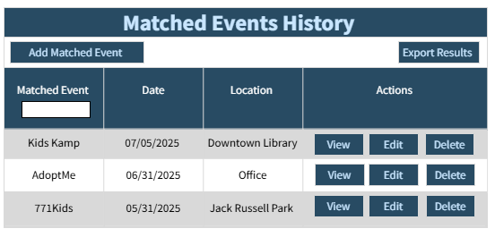 |

| {Add/Edit} Matched Event (Mockup) |
| --- |
| 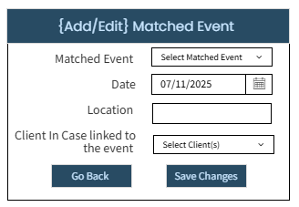 |

| Delete Matched Event Modal (Mockup) |
| --- |
| 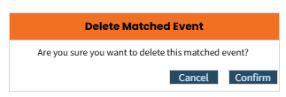 |

### Business Rules

| # | Rule Description |
| --- | --- |
| Matched Events History – Data Grid |  |
| 1. | The data grid will load sorted by Date descending. |
| 2. | The following actions display for all records, depending on the logged in user’s permissions: [Edit]: Opens the Matched Event modal. [Delete]: Opens the Delete Matched Event modal. |
| Add/Edit Matched Events |  |
| 1. | The “Client in Case Linked to the Event” multi-selection will be pre-populated with all children (including current client) that are involved in the same case. The current client is selected by default and must continue to be selected in order for the record to appear on the face sheet. Selecting other clients will populate on their individual face sheets as well. |

### Element Descriptions

| Element Name | Description/ Attributes | Element Type | Editable | Required | Core |
| --- | --- | --- | --- | --- | --- |
| Matched Events History Data Grid |  | Data Grid |  |  | Y |
| Header Text | Text: “Matched Events History” | Header | N/A | N/A | Y |
| Add Matched Event Button | Text: “Add Matched Event” | Button | N/A | N/A | Y |
| Export Results Button | Text: “Export Results” | Button | N/A | N/A | Y |
| Matched Event Column | Column Header: “Matched Event”Column Value: “{Matched Event}” | Text Column with Dropdown Filter | N | N/A | Y |
| Date Column | Column Header: “Date”Column Value: “{Date}” | Date Column | N | N/A | Y |
| Location Column | Column Header: “Location”Column Value: “{Location}” | Text Column | N | N/A | Y |
| Actions Column | Column Header: “Actions”Buttons: [Edit] [Delete] See business rules. | Button Column | N/A | N/A | Y |
| Add/Edit Matched Event Modal |  | Modal |  |  | Y |
| Header Text | Text: “{Add/Edit} Matched Event” | Header | N/A | N/A | Y |
| Matched Event | Label: “Matched Event”Dropdown Values: Select Matched Event (Default) In Person Other Paper Webinar | Dropdown | Y | Y | Y |
| Date | Label: “Date” | Date Picker | Y | Y | Y |
| Location | Label: “Location” | Textbox | Y | N | Y |
| Client in Case Linked to the Event | Label: “Client in Case Linked to the Event” See business rules. | Multi-Selection | Y | Y | Y |
| Cancel Button | Text: “Cancel” | Button | N/A | N/A | Y |
| Save Changes Button | Text: “Save Changes” | Button | N/A | N/A | Y |
| Delete Matched Event Modal |  | Modal |  |  | Y |
| Header Text | Text: “Delete Matched Event” | Header | N/A | N/A | Y |
| Confirmation Message | Text: “Are you sure you want to delete this matched event?” | Label | N/A | N/A | Y |
| Cancel Button | Text: “Cancel” | Button | N/A | N/A | Y |
| Confirm Button | Text: “Confirm” | Button | N/A | N/A | Y |

### Security

| Permission Type | Permission Name | Description |
| --- | --- | --- |
| Access | AccessClientAdoption | Access to Client Adoption module |
| Access | AccessClientAdoptionMatchedEvents | Access to the adoption matched events menu option and data grid |
| Action | ManageClientAdoptionMatchedEvents | Ability to create, edit, and delete adoption matched events |
| Access | AccessCaseParticipants | Access to the Case Participants menu option and data grid |

## 16.4 Adoption Home Studies
The Home Studies module documents the evaluation process of prospective adoptive or foster homes to determine their suitability for placement. It captures critical information such as study type (e.g., adoptive, foster, kinship), assessment dates, evaluator details, findings, and approval status. This module supports compliance with regulatory standards and ensures that placement decisions are informed by thorough, documented assessments.
### Navigation
Main Menu > Client Search > Client Face Sheet > Adoption > Home Studies
### User Interfaces

| Home Studies History (Mockup) |
| --- |
| 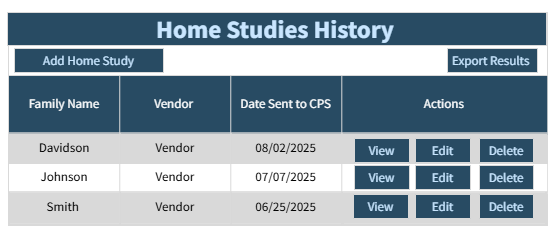 |

| {Add/Edit} Home Study (Mockup) |
| --- |
| 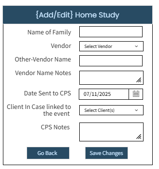 |

| Delete Home Study Modal (Mockup) |
| --- |
| 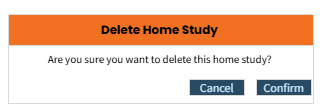 |

### Business Rules

| # | Rule Description |
| --- | --- |
| Home Studies History – Data Grid |  |
| 1. | The following actions display for all records, depending on the logged in user’s permissions: [View]: Opens the View Adoption Home Study modal with read-only labels and values from the Add/Edit Home Study screen. [Edit]: Opens the Edit Adoption Home Study screen. [Delete]: Opens the Delete Adoption Home Study modal. |
| Add/Edit Home Studies |  |
| 1. | Select Agency dropdown will populate according to the user’s organization. |
| 2. | The “Other - Agency Name” textbox displays and becomes required when “Other” is selected in the Agency dropdown. |
| 3. | The “Client in Case Linked to the Event” multi-selection will be pre-populated with all children (including current client) that are involved in the same case. The current client is selected by default and must continue to be selected in order for the record to appear on the face sheet. Selecting other clients will populate on their individual face sheets as well. |

### Element Descriptions

| Element Name | Description/ Attributes | Element Type | Editable | Required | Core |
| --- | --- | --- | --- | --- | --- |
| Home Studies History Data Grid |  | Data Grid |  |  | Y |
| Header Text | Text: “Adoption Home Studies History” | Header | N/A | N/A | Y |
| Add Home Study Button | Text: “Add Home Study” | Button | N/A | N/A | Y |
| Export Results Button | Text: “Export Results” | Button | N/A | N/A | Y |
| Family Name Column | Column Header: “Family Name”Column Value: “{Family Name}” | Text Column | N | N/A | Y |
| Agency Column | Column Header: “Agency”Column Value: “{Home Study Agency}” | Text Column | N | N/A | Y |
| Date Sent to CPS Column | Column Header: “Date Sent to CPS”Column Value: “{Date Sent to CPS}” | Date Column | N | N/A | Y |
| Actions Column | Column Header: “Actions”Buttons: [View] [Edit] [Delete] See business rules. | Button Column | N/A | N/A | Y |
| Add/Edit Home Studies |  | Form Screen |  |  | Y |
| Header Text | Text: “{Add/Edit} Adoption Home Study” | Header | N/A | N/A | Y |
| Name of Family | Label: “Name of Family” | Textbox | Y | Y | Y |
| Agency | Label: “Agency”Dropdown Values: Select Agency (Default) See business rules. | Dropdown | Y | Y | Y |
| Enter Other - Agency Name | Label: “Other - Agency Name” | Textbox | Y | N | Y |
| Agency Name Notes | Label: “Agency Name Notes” | Multi-Line Textbox | Y | N | Y |
| Date Sent to CPS | Label: “Date Sent to CPS” | Date Picker | Y | N | Y |
| Client in Case Linked to the Event | Label: “Client in Case Linked to the Event” See business rules. | Multi-Selection | Y | Y | Y |
| CPS Notes | Label: “CPS Notes” | Multi-Line Textbox | Y | N | Y |
| Go Back Button | Text: “Go Back” | Button | N/A | N/A | Y |
| Save Changes Button | Text: “Save Changes” | Button | N/A | N/A | Y |
| Delete Home Study Modal |  | Modal |  |  | Y |
| Header Text | Text: “Delete Adoption Home Study” | Header | N/A | N/A | Y |
| Confirmation Message | Text: “Are you sure you want to delete this home study?” | Label | N/A | N/A | Y |
| Cancel Button | Text: “Cancel” | Button | N/A | N/A | Y |
| Confirm Button | Text: “Confirm” | Button | N/A | N/A | Y |

### Security

| Permission Type | Permission Name | Description |
| --- | --- | --- |
| Access | AccessClientAdoption | Access to Client Adoption module |
| Access | AccessClientAdoptionHomeStudies | Access to the adoption home studies menu option and data grid |
| Action | ViewClientAdoptionHomeStudies | Ability to view adoption home study details |
| Action | ManageClientAdoptionHomeStudies | Ability to create, edit, and delete adoption home studies |
| Access | AccessCaseParticipants | Access to the Case Participants menu option and data grid |

## 16.5 Selection Staffing
Adoption selection staffing is a formal meeting held to choose the most suitable adoptive family for a client from a pool of potential candidates.
### Navigation
Main Menu > Client Search > Client Face Sheet > Adoption > Selection Staffing
### User Interfaces

| Selection Staffing History (Mockup) |
| --- |
| 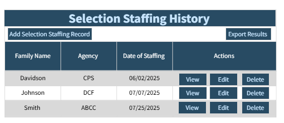 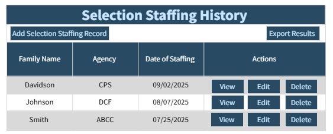 |

| {Add/Edit} Selection Staffing (Mockup) |
| --- |
| 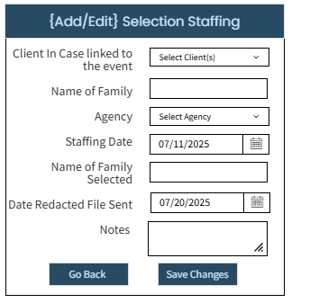 |

| Delete Modal (Mockup) |
| --- |
| 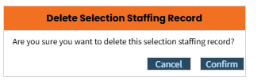 |

### Business Rules

| # | Rule Description |
| --- | --- |
| Selection Staffing History |  |
| 1. | The data grid will load sorted by Staffing Date descending. |
| 2. | The following actions display for all records, depending on the logged in user’s permissions: [View]: Opens the View Selection Staffing modal with read-only labels and values from the Add/Edit Selection Staffing screen. [Edit]: Opens the Edit Selection Staffing screen. [Delete]: Opens the Delete Selection Staffing modal. |
| Add/Edit Selection Staffing |  |
| 1. | The “Client in Case Linked to the Event” multi-selection will be pre-populated with all children (including current client) that are involved in the same case. The current client is selected by default and must continue to be selected in order for the record to appear on the face sheet. Selecting other clients will populate on their individual face sheets as well. |
| 2. | Agency dropdown values will populate according to the user’s organization. |

### Element Descriptions

| Element Name | Description/ Attributes | Element Type | Editable | Required | Core |
| --- | --- | --- | --- | --- | --- |
| Selection Staffing History Data Grid |  | Data Grid |  |  | Y |
| Header Text | Text: “Selection Staffing History” | Header | N/A | N/A | Y |
| Add Selection Staffing Button | Text: “Add Selection Staffing” | Button | N/A | N/A | Y |
| Export Results Button | Text: “Export Results” | Button | N/A | N/A | Y |
| Family Name Column | Column Header: “Family Name”Column Value: “{Family Name}” | Text Column | N | N/A | Y |
| Agency Column | Column Header: “Agency”Column Value: “{Agency}” See business rules. | Text Column | N | N/A | Y |
| Staffing Date Column | Column Header: “Staffing Date”Column Value: “{Staffing Date}” | Date Column | N | N/A | Y |
| Actions Column | Column Header: “Actions”Buttons: [View] [Edit] [Delete] See business rules. | Button Column | N/A | N/A | Y |
| Add/Edit Selection Staffing |  | Form Screen |  |  | Y |
| Header Text | Text: “{Add/Edit} Selection Staffing” | Header | N/A | N/A | Y |
| Client in Case Linked to the Event | Label: “Client in Case Linked to the Event” See business rules. | Multi-Selection | Y | Y | Y |
| Name of Family | Label: “Name of Family” | Textbox | Y | Y | Y |
| Agency | Label: “Agency”Dropdown Values: Select Agency (Default) See business rules. | Dropdown | Y | Y | Y |
| Staffing Date | Label: “Staffing Date” | Date Picker | Y | Y | Y |
| Redacted File Sent Date | Label: “Redacted File Sent Date" | Date Picker | Y | N | Y |
| Notes | Label: “Notes” | Multi-Line Textbox | Y | N | Y |
| Go Back Button | Text: “Go Back” | Button | N/A | N/A | Y |
| Save Changes Button | Text: “Save Changes” | Button | N/A | N/A | Y |
| Delete Selection Staffing Record Modal |  | Modal |  |  | Y |
| Header Text | Text: “Delete Selection Staffing Record” | Header | N/A | N/A | Y |
| Confirmation Message | Text: “Are you sure you want to delete this selection staffing record?” | Label | N/A | N/A | Y |
| Cancel Button | Text: “Cancel” | Button | N/A | N/A | Y |
| Confirm Button | Text: “Confirm” | Button | N/A | N/A | Y |

### Security

| Permission Type | Permission Name | Description |
| --- | --- | --- |
| Access | AccessClientAdoption | Access to Client Adoption module |
| Access | AccessClientAdoptionSelectionStaffing | Access to the adoption Selection Staffing menu option and data grid |
| Action | ViewClientAdoptionSelectionStaffing | Ability to view adoption selection staffing |
| Action | ManageClientAdoptionSelectionStaffing | Ability to create, edit, and delete adoption selection staffing |
| Access | AccessCaseParticipants | Access to the Case Participants menu option and data grid |

## 16.6 Presentation Staffing
The Presentation Staffing module supports the formal review and discussion of a client’s case in preparation for potential placement, adoption, or service transitions. It captures structured details such as staffing type, meeting participants, presentation materials, and outcomes or recommendations. This module ensures that all relevant stakeholders are informed and aligned before key decisions are made.
### Navigation
Main Menu > Client Search > Client Face Sheet > Adoption > Presentation Staffing
### User Interfaces

| Presentation Staffing History Data Grid (Mockup) |
| --- |
| 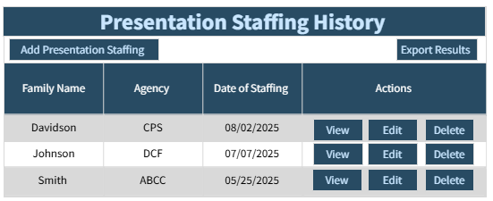 |

| {Add/Edit} Presentation Staffing (Mockup) |
| --- |
| 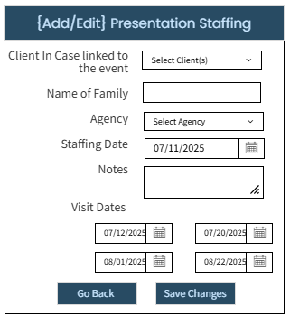 |

| Delete Modal (Mockup) |
| --- |
| 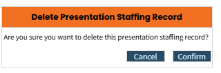 |

### Business Rules

| # | Rule Description |
| --- | --- |
| Presentation Staffing History |  |
| 1. | The data grid will load sorted by Staffing Date descending. |
| 2. | The following actions display for all records, depending on the logged in user’s permissions: [View]: Opens the View Presentation Staffing modal with read-only values and labels from the Add/Edit Presentation Staffing screen. [Edit]: Opens the Edit Presentation Staffing screen. [Delete]: Opens the Delete Presentation Staffing modal. |
| Add/Edit Presentation Staffing |  |
| 1. | The “Client in Case Linked to the Event” multi-selection will be pre-populated with any children that are involved in the same case as the selected client. |
| 2. | Agency dropdown will populate according to the user’s organization. |
| 3. | Four date pickers display for “Visit Dates”. At least one is required. |

### Element Descriptions

| Element Name | Description/ Attributes | Element Type | Editable | Required | Core |
| --- | --- | --- | --- | --- | --- |
| Presentation Staffing History Data Grid |  | Data Grid |  |  | Y |
| Header Text | Text: “Presentation Staffing History” | Header | N/A | N/A | Y |
| Add Presentation Staffing Button | Text: “Add Presentation Staffing” | Button | N/A | N/A | Y |
| Export Results Button | Text: “Export Results” | Button | N/A | N/A | Y |
| Family Name Column | Column Header: “Family Name”Column Value: “{Family Name}” | Text Column | N | N/A | Y |
| Agency Column | Column Header: “Agency”Column Value: “{Presentation Staffing Agency” | Text Column | N | N/A | Y |
| Staffing Date Column | Column Header: “Staffing Date”Column Value: “{Staffing Date}” | Date Column | N | N/A | Y |
| Actions Column | Column Header: “Actions”Buttons: [View] [Edit] [Delete] See business rules. | Button Column | N/A | N/A | Y |
| Add/Edit Presentation Staffing |  | Form Screen |  |  | Y |
| Header Text | Text: “{Add/Edit} Presentation Staffing” | Header | N/A | N/A | Y |
| Client in Case Linked to the Event | Label: “Client in Case Linked to the Event” See business rules. | Multi-Selection | Y | Y | Y |
| Name of Family | Label: “Name of Family” | Textbox | Y | Y | Y |
| Agency | Label: “Agency”Dropdown Values: Select Agency (Default) See business rules. | Dropdown | Y | Y | Y |
| Staffing Date | Label: “Staffing Date” | Date Picker | Y | Y | Y |
| Notes | Label: “Notes” | Multi-Line Textbox | Y | N | Y |
| Visit Dates | Label: “Visit Dates” See business rules. | Date Pickers (4) | Y | N | Y |
| Go Back Button | Text: “Go Back” | Button | N/A | N/A | Y |
| Save Changes Button | Text: “Save Changes” | Button | N/A | N/A | Y |
| Delete Presentation Staffing Record Modal |  | Modal |  |  | Y |
| Header Text | Text: “Delete Presentation Staffing Record” | Header | N/A | N/A | Y |
| Confirmation Message | Text: “Are you sure you want to delete this presentation staffing record?” | Label | N/A | N/A | Y |
| Cancel Button | Text: “Cancel” | Button | N/A | N/A | Y |
| Confirm Button | Text: “Confirm” | Button | N/A | N/A | Y |

### Security

| Permission Type | Permission Name | Description |
| --- | --- | --- |
| Access | AccessClientAdoption | Access to Client Adoption module |
| Access | AccessClientAdoptionPresentationStaffing | Access to the adoption presentation staffing menu option and data grid |
| Action | ViewClientAdoptionPresentationStaffing | Ability to view adoption presentation staffing |
| Action | ManageClientAdoptionPresentationStaffing | Ability to create, edit, and delete adoption presentation staffing |
| Access | AccessCaseParticipants | Access to the Case Participants menu option and data grid |

## 16.7 Staffing
The Staffing module facilitates the coordination and documentation of internal meetings and decision-making processes related to a client’s care, placement, or adoption. It captures key details such as staffing type (e.g., permanency, placement, adoption), participants, meeting dates, discussion notes, and outcomes. This module ensures that all relevant stakeholders are involved in critical decisions and that those decisions are recorded for accountability and future reference.
### Navigation
Main Menu > Client Search > Client Face Sheet > Adoption > Staffing
### User Interfaces

| Staffing History Data Grid (Mockup) |
| --- |
| 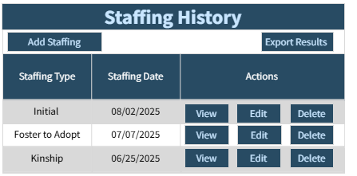 |

| {Add/Edit} Staffing (Mockup) |
| --- |
| 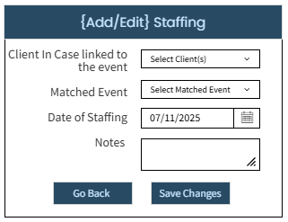 |

| Delete Modal (Mockup) |
| --- |
| 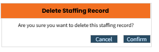 |

### Business Rules

| # | Rule Description |
| --- | --- |
| Staffing History Data Grid |  |
| 1. | The data grid will load sorted by Staffing Date descending. |
| 2. | The following actions display for all records, depending on the logged in user’s permissions: [View]: Opens the View Staffing modal with read-only values and labels from the Add/Edit Staffing modal. [Edit]: Opens the Edit Staffing modal. [Delete]: Opens the Delete Staffing modal. |
| Add/Edit Staffing |  |
| 1. | The “Client in Case Linked to the Event” multi-selection will be pre-populated with all children (including current client) that are involved in the same case. The current client is selected by default and must continue to be selected in order for the record to appear on the face sheet. Selecting other clients will populate on their individual face sheets as well. |

### Element Descriptions

| Element Name | Description/ Attributes | Element Type | Editable | Required | Core |
| --- | --- | --- | --- | --- | --- |
| Staffing History Data Grid |  | Data Grid |  |  | Y |
| Header Text | Text: “Staffing History” | Header | N/A | N/A | y |
| Add Staffing Button | Text: “Add Staffing” | Button | N/A | N/A | y |
| Export Results Button | Text: “Export Results” | Button | N/A | N/A | y |
| Staffing Type Column | Column Header: “Staffing Type”Column Value: “{Staffing Type }” | Text Column with Dropdown Filter | N | N/A | Y |
| Staffing Date Column | Column Header: “Staffing Date”Column Value: “{Staffing Date}” | Date Column | N | N/A | Y |
| Actions Column | Column Header: “Actions”Buttons: [View] [Edit] [Delete] See business rules. | Button Column | N/A | N/A | Y |
| Add/Edit Staffing Modal |  | Modal |  |  | Y |
| Header Text | Text: “{Add/Edit} Staffing” | Header | N/A | N/A | Y |
| Client in Case Linked to the Event | Label: “Client in Case Linked to the Event” See business rules. | Multi-Selection | Y | Y | Y |
| Staffing Type | Label: “Staffing Type”Dropdown Values: Select Staffing Type (Default) Adoption Case Update Conflict Resolution Discharge Educational Informational | Dropdown | Y | Y | Y |
| Staffing Date | Label: “Staffing Date” | Date Picker | Y | Y | Y |
| Notes | Label: “Notes” | Multi-Line Textbox | Y | N | Y |
| Cancel Button | Text: “Cancel” | Button | N/A | N/A | Y |
| Save Changes Button | Text: “Save Changes” | Button | N/A | N/A | Y |
| Delete Staffing Record Modal |  | Modal |  |  | Y |
| Header Text | Text: “Delete Staffing Record” | Header | N/A | N/A | Y |
| Confirmation Message | Text: “Are you sure you want to delete this staffing record?” | Label | N/A | N/A | Y |
| Cancel Button | Text: “Cancel” | Button | N/A | N/A | Y |
| Confirm Button | Text: “Confirm” | Button | N/A | N/A | Y |

### Security

| Permission Type | Permission Name | Description |
| --- | --- | --- |
| Access | AccessClientAdoption | Access to Client Adoption module |
| Access | AccessClientAdoptionStaffing | Access to the adoption staffing menu option and data grid |
| Action | ViewClientAdoptionStaffing | Ability to view adoption staffing |
| Action | ManageClientAdoptionStaffing | Ability to create, edit, and delete adoption staffing |
| Access | AccessCaseParticipants | Access to the Case Participants menu option and data grid |

## 16.8 Adoption Checklist
The Adoption Checklist module provides a structured, step-by-step framework for tracking the completion of key tasks and requirements throughout the adoption process. It includes items such as home study completion, matched family documentation, staffing approvals, legal filings, and placement finalization. Each checklist item is timestamped and linked to relevant records, helping caseworkers ensure compliance with agency and state adoption protocols. The module promotes accountability and transparency by offering a clear visual status of progress and outstanding actions.
### Navigation
Main Menu > Client Search > Client Face Sheet > Adoption > Adoption Checklist
### User Interfaces

| Adoption Checklist (Mockup) |
| --- |
| 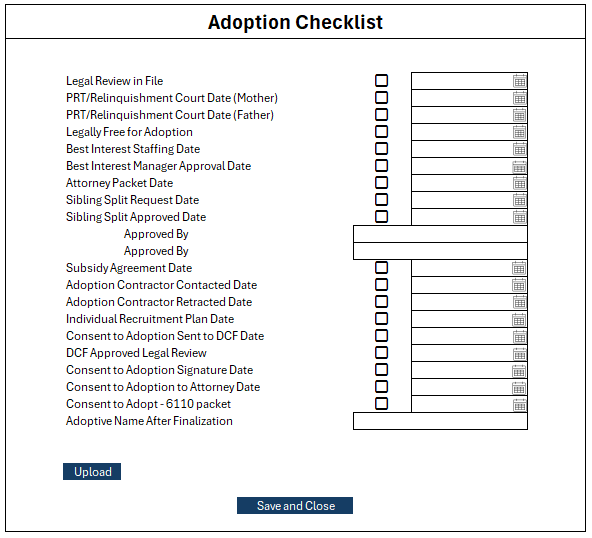 |

### Business Rules

| # | Rule Description |
| --- | --- |
| Adoption Checklist |  |
| 1. | If an entry checkbox is selected, Date field is required for all entries that are checked. |
| 2. | If the Sibling Split Approved Date is checked, the Approved By fields are required. |
| 3. | Documents uploaded from this screen will be displayed in the Adoption folder in the Document Tree. |
| 4. | The Upload button opens the standard document upload modal. |
| 5. | When the Submit button is clicked, the checklist is saved as a PDF in the Adoption tree and is then reset. User is navigated back to the Adoption Overview. |

### Element Descriptions

| Element Name | Description/ Attributes | Element Type | Editable | Required | Core |
| --- | --- | --- | --- | --- | --- |
| Adoption Checklist |  | Modal |  |  | N |
| Header Text | Text: “Adoption Checklist” | Header | N/A | N/A | N |
| Legal Review in File | Label: “Legal Review in File” | Checkbox and Date Picker | Y | N | N |
| PRT/Relinquishment Court Date (Mother) | Label: “PRT/Relinquishment Court Date (Mother)” | Checkbox and Date Picker | Y | N | N |
| PRT/Relinquishment Court Date (Father) | Label: “PRT/Relinquishment Court Date (Father)” | Checkbox and Date Picker | Y | N | N |
| Legally Free for Adoption | Label: “Legally Free for Adoption” | Checkbox and Date Picker | Y | N | N |
| Best Interest Staffing Date | Label: “Best Interest Staffing Date” | Checkbox and Date Picker | Y | N | N |
| Best Interest Manager Approval Date | Label: “Best Interest Manager Approval Date” | Checkbox and Date Picker | Y | N | N |
| Attorney Packet Date | Label: “Attorney Packet Date” | Checkbox and Date Picker | Y | N | N |
| Sibling Split Request Date | Label: “Sibling Split Request Date” | Checkbox and Date Picker | Y | N | N |
| Sibling Split Approved Date | Label: “Sibling Split Approved Date” See business rules. | Checkbox and Date Picker | Y | N | N |
| (Sibling Split) Approved By 1 | Label: “Approved By” See business rules. | Textbox | Y | N | N |
| (Sibling Split) Approved By 2 | Label: “Approved By” See business rules. | Textbox | Y | N | N |
| Subsidy Agreement Date | Label: “Subsidy Agreement Date” | Checkbox and Date Picker | Y | N | N |
| Adoption Contractor Contacted Date | Label: “Adoption Contractor Contacted Date” | Checkbox and Date Picker | Y | N | N |
| Adoption Contractor Retracted Date | Label: “Adoption Contractor Retracted Date” | Checkbox and Date Picker | Y | N | N |
| Individual Recruitment Plan Date | Label: “Individual Recruitment Plan Date” | Checkbox and Date Picker | Y | N | N |
| Consent to Adoption Sent to DCF Date | Label: “Consent to Adoption Sent to DCF Date” | Checkbox and Date Picker | Y | N | N |
| DCF Approved Legal Review | Label: “DCF Approved Legal Review” | Checkbox and Date Picker | Y | N | N |
| Consent to Adoption Signature Date | Label: “Consent to Adoption Signature Date” | Checkbox and Date Picker | Y | N | N |
| Consent to Adoption to Attorney Date | Label: “Consent to Adoption to Attorney Date” | Checkbox and Date Picker | Y | N | N |
| Consent to Adopt - 6110 packet | Label: “Consent to Adopt - 6110 packet” | Checkbox and Date Picker | Y | N | N |
| Adoptive Name After Finalization | Label: “Adoptive Name After Finalization” | Textbox | Y | Y | N |
| Upload Button | Text: “Upload” See business rules. | Button | Y | N/A | N |
| Document List | Header: “Document”Values: “{Document Name}”Icons: Eyeball (opens the document) Trashcan (deletes the uploaded document) | List | N/A | N/A | Y |
| Submit Button | Text: “Submit” See business rules. | Button | N/A | N/A | N |
| CancelButton | Text: “Cancel” | Button | N/A | N/A | N |
| Save and Close Button | Text: “Save Changes” | Button | N/A | N/A | N |

### Security

| Permission Type | Permission Name | Description |
| --- | --- | --- |
| Access | AccessClientAdoption | Access to Client Adoption module |
| Access | AccessClientAdoptionChecklist | Access to the adoption checklist |
| Action | ManageClientAdoptionChecklist | Ability to edit client adoption checklist |

## 16.9 Adoptive Placement History
The Adoptive Placement History module tracks a client’s adoption placement information.  This module is used for tracking only and does not create a placement record.  This module helps caseworkers monitor successful and non-successful adoption placements. Integrated with other modules like Recruitment Events and Home Studies, it provides a holistic view of the client’s adoption experience.
### Navigation
Main Menu > Client Search > Client Face Sheet > Adoption > Adoptive Placement History
### User Interfaces

| Adoptive Placement History Data Grid (Mockup) |
| --- |
| 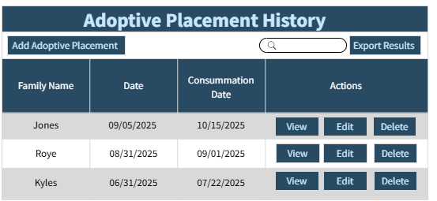 |

| {Add/Edit} Adoptive Placement (Mockup) |
| --- |
| 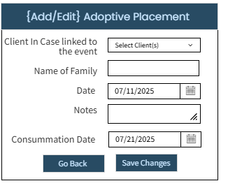 |

| Delete Modal (Mockup) |
| --- |
| 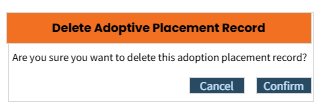 |

### Business Rules

| # | Rule Description |
| --- | --- |
| Adoptive Placement History – Data Grid |  |
| 1. | The data grid will load sorted by Consummation Date descending. |
| 2. | The following actions display for all records, depending on the logged in user’s permissions: [View]: Opens the View Adoptive Placement History modal with read-only labels and values from the Add/Edit Adoptive Placement History screen. [Edit]: Opens the Edit Adoptive Placement modal. [Delete]: Opens the Delete Adoptive Placement modal. |
| Add/Edit Adoptive Placement |  |
| 1. | The “Client in Case Linked to the Event” multi-selection will be pre-populated with all children (including current client) that are involved in the same case. The current client is selected by default and must continue to be selected in order for the record to appear on the face sheet. Selecting other clients will populate on their individual face sheets as well. |

### Element Descriptions

| Element Name | Description/ Attributes | Element Type | Editable | Required | Core |
| --- | --- | --- | --- | --- | --- |
| Adoptive Placement History Data Grid |  | Data Grid |  |  | Y |
| Header Text | Text: “Adoptive Placement History” | Header | N/A | N/A | Y |
| Add Adoptive Placement Button | Text: “Add Adoptive Placement” | Button | N/A | N/A | Y |
| Export Results Button | Text: “Export Results” | Button | N/A | N/A | Y |
| Family Name Column | Column Header: “Family Name”Column Value: “{Family Last Name}” | Text Column | N | N/A | Y |
| Placement Date Column | Column Header: “Placement Date”Column Value: “{Placement Date}” | Date Column | N | N/A | Y |
| Consummation Date Column | Column Header: “Consummation Date”Column Value: “{Consummation Date}” | Date Column | N | N/A | Y |
| Actions Column | Column Header: “Actions”Buttons: [View] [Edit] [Delete] See business rules. | Button Column | N/A | N/A | Y |
| {Add/Edit} Adoptive Placement Modal |  | Modal |  |  | Y |
| Header Text | Text: “{Add/Edit} Adoptive Placement” | Header | N/A | N/A | Y |
| Client in Case Linked to the Event | Label: “Client in Case Linked to the Event” See business rules. | Multi-Selection | Y | Y | Y |
| Name of Family | Label: “Name of Family” | Textbox | Y | Y | Y |
| Placement Date | Label: “Placement Date” | Date Picker | Y | Y | Y |
| Consummation Date | Label: “Consummation Date” | Date Picker | Y | N | Y |
| Notes | Label: “Notes” | Multi-Line Textbox | Y | N | Y |
| Cancel Button | Text: “Cancel” | Button | N/A | N/A | Y |
| Save Changes Button | Text: “Save Changes” | Button | N/A | N/A | Y |
| Delete Adoptive Placement Modal |  | Modal |  |  | Y |
| Header Text | Text: “Delete Adoptive Placement Record” | Header | N/A | N/A | Y |
| Confirmation Message | Text: “Are you sure you want to delete this adoptive placement record?” | Label | N/A | N/A | Y |
| Cancel Button | Text: “Cancel” | Button | N/A | N/A | Y |
| Confirm Button | Text: “Confirm” | Button | N/A | N/A | Y |

### Security

| Permission Type | Permission Name | Description |
| --- | --- | --- |
| Access | AccessClientAdoption | Access to Client Adoption module |
| Access | AccessClientAdoptionPlacements | Access to the adoption Adoptive Placement History menu option and data grid |
| Action | ViewClientAdoptionPlacement | Ability to view an adoption placement record |
| Action | ManageClientAdoptionPlacement | Ability to create, edit, and delete an adoption placement record |

# 17. Case Participants
The Client Face Sheet will contain the Case Participants component from the Case Face Sheet. Refer to the Case Management FDS – Section: Case Participants.
# 18. Client Notes
The Client Notes module provides a flexible and secure space for caseworkers to document observations, updates, and interactions related to a client’s care. Notes can be categorized by type (e.g., contact logs, behavioral observations, service updates) and tagged with relevant dates and authorship details. This module supports continuity and collaboration by allowing authorized users to view historical notes and contribute new entries. Structured formatting and search capabilities help users quickly locate specific information.
The Notes capability is a general system capability and configurable.
Relevant requirement(s):
4.075 - The Client Management Functional Area will have a Notes feature.
## Navigation
Main Menu > Client Search > Client Face Sheet > Client Notes
## User Interfaces

| Case Notes Data Grid Tile(Mockup) |
| --- |
| 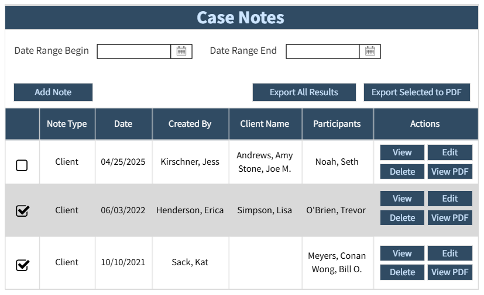 |

| Add/Edit Note (Mockup) |
| --- |
| 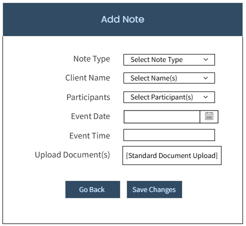 |

| Delete Note Modal (Mockup) |
| --- |
| 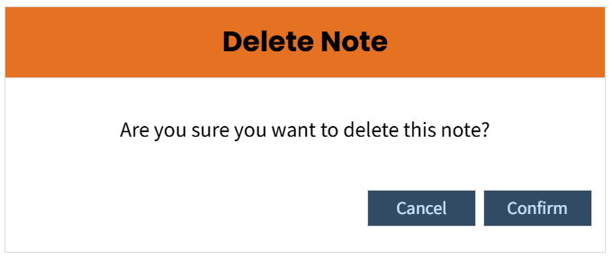 |

## Business Rules

| # | Rule Description |
| --- | --- |
| Notes – General Tile |  |
| 1. | Client Note types are configurable by organization. |
| 2. | All Client Note types will have the following core fields: Note Type Client Name Participants Event Date and Time Completed by Date Completed By |
| 3. | Document uploads can be attached to notes. |
| 4. | The Completed by dropdown will display all active users associated to the logged in user’s organization. |
| 5. | The Client Name dropdown will display all clients on the same case as the client that the note is being created for. |
| 6. | The Participants dropdown will display all case participants on the same case as the client that the note is being created for. |
| Notes – Data Grid |  |
| 1. | The data grid will load with Client Notes sorted by Event Date descending. |
| 2. | The following actions display for all records, depending on the logged in user’s permissions: [View]: Opens the View Note modal with read-only labels and values from the Add/Edit Note screen. [View PDF]: Generates a PDF with the contents of the note. [Edit]: Opens the Edit Note screen. This displays only for the creator of the note and their supervisor. [Delete]: Opens the Delete Note modal. |
| 3. | The data grid can be filtered by Date Range or column headers as defined in the Element Descriptions below. |
| 4. | The “Select” column will allow the user to select one or more notes. The [Export Selected to PDF] button combines selected notes into one PDF document. The [Export All Results] button exports all records that fit the current filters (not limited to visible records). |
| 5. | Client Name and Participants column can display multiple values in the following format: {Last Name 1}, {First Name 1} {Middle Name/Initial 1}          {Last Name 2}, {First Name 2} {Middle Name/Initial 2} |
| Add/Edit Notes |  |
| 1. | The [Add Note] button opens a screen with a dropdown of Note Types specific to the logged in user. The form will populate according to the note type that is selected. |
| 2. | The “Select Note Type” dropdown is disabled in Edit mode. |
| 3. | Only the person who created the note and their supervisor can edit a note. |

## Element Descriptions

| Element Name | Description/ Attributes | Element Type | Editable | Required | Core |
| --- | --- | --- | --- | --- | --- |
| Client Notes |  | Face Sheet ComponentData Grid Tile | N/A | N/A | Y |
| Notes Header | Text: “Client Notes” | Header | N/A | N/A | Y |
| Date Range Begin | Label: “Date Range Begin” | Date Picker | Y | N | Y |
| Date Range End | Label: “Date Range End” | Date Picker | Y | N | Y |
| Add Note Button | Text: “Add Note” | Button | N/A | N/A | Y |
| Export All Results Button | Text: “Export All Results” | Button | N/A | N/A | Y |
| Export Selected to PDF | Text: “Export Selected to PDF” | Button | N/A | N/A | Y |
| Select Column | Text: N/A See business rules. | Checkbox | Y | N | Y |
| Type Column | Column Header: “Note Type” Column Value: “{Note Type}” | Text Column with Dropdown Filter | N | N | Y |
| Date Column | Column Header: “Date”Column Value: “{Date}” | Date Column | N | N/A | Y |
| Completed By Column | Column Header: “Completed By”Column Value: “{Last Name}, {First Name}” | Text Column | N | N/A | Y |
| Client Name Column | Column Header: “Client Name”Column Value: See business rules. | Text Column with Textbox Filter | N | N/A | Y |
| Participants Column | Column Header: “Participants”Column Value: See business rules. | Text Column | N | N/A | Y |
| Actions Column | Column Header: “Actions”Button Values: [View] [Edit] [View PDF] [Delete] | Button Column | N | N/A | Y |
| Add/Edit Note | Core components only for all client notes. | Screen |  |  | Y |
| Header Text | Text: “{Add/Edit} Note” | Header | N/A | N/A | Y |
| Note Type | Label: “Note Type”Dropdown Values: Select Note Type (Default) See business rules. | Dropdown | Y | Y | Y |
| Client Name | Label: “Client Name”Dropdown Values: Select Name(s) (Default) “{Last Name}, {First Name}” See business rules. | Multi-Selection | Y | N | Y |
| Participants | Label: “Participants”Dropdown Values: Select Participant(s) (Default) {Last Name}, {First Name}, {Middle Name/Initial} See business rules. | Multi-Selection | Y | Y | Y |
| Event Date | Label: “Event Date” | Date Picker | Y | Y | Y |
| Event Time | Label: “Event Time” | Time Picker | Y | N | Y |
| Completed By | Label: “Completed  By”Dropdown Values: Select Completed By (Default) See business rules. | Dropdown | Y | Y | Y |
| Completed Date | Label: “Completed Date” | Date Picker | Y | Y | Y |
| Document Upload | Label: “Upload Document(s)” | Standard Document Upload | Y | N | Y |
| Go Back Button | Text: “Go Back” | Button | N/A | N/A | Y |
| Save Changes Button | Text: “Save Changes” | Button | N/A | N/A | Y |
| Delete Note Modal |  | Modal |  |  | Y |
| Delete Note Header | Text: “Delete Note” | Header | N/A | N/A | Y |
| Confirmation Text | Text: “Are you sure you want to delete this note?” | Label | N/A | N/A | Y |
| Cancel Button | Text: “Cancel” | Button | N/A | N/A | Y |
| Confirm Button | Text: “Confirm” | Button | N/A | N/A | Y |

## Security

| Permission Type | Permission Name | Description |
| --- | --- | --- |
| Action | ViewClient | Ability to view a client’s face sheet |
| Access | AccessClientNotes | Access to the client notes menu option and data grid |
| Action | CreateClientNotes | Ability to view “Add Note” button and create a new provider note |
| Action | ViewClientNotes | Ability to view individual client notes and export to PDF |
| Action | EditClientNotes | Ability to edit client notes added by logged in user |
| Action | DeleteClientNotes | Ability to delete client notes |

# 19. Assessments
This section details managing client-related assessments, such as the CPOS, NCFAS, and Safety Plans.
The Assessments module enables caseworkers to administer, track, and manage standardized evaluations that inform service planning and client support. It includes tools for completing instruments such as the eCANS (Texas-specific Child and Adolescent Needs and Strengths), along with other behavioral, developmental, and psychosocial assessments. The module supports workflows for submitting, reviewing, and approving assessments, ensuring that results are integrated into the client’s overall care plan. Structured input fields, scoring logic, and approval routing help maintain consistency and compliance.
Relevant Requirement(s):
- 4.080 - The system will have the ability to configure various assessments needed as related to Client Management (e.g., CPOS, Safety Plan, NCFAS).
## Navigation
Main Menu > Client Search > Client Face Sheet > Assessments
## User Interfaces

| Assessments Data Grid Tile (Mockup) |
| --- |
| 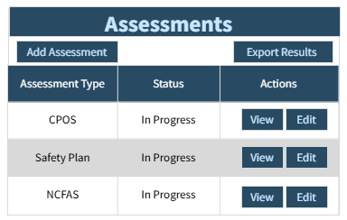 |

| Assessment History Data Grid (Mockup) |
| --- |
| 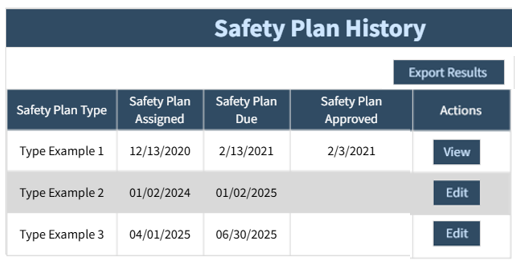 |

| Generate Assessment (Mockup) |
| --- |
| 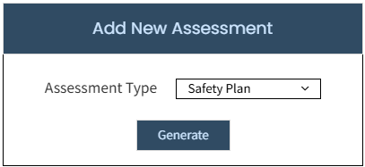 |

| Add/Edit {Assessment Type} (Mockup) Example Type: Safety Plan |
| --- |
| 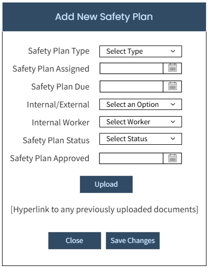 |

## Business Rules

| # | Rule Description |
| --- | --- |
| Assessments – General Tile |  |
| 1. | The data grid will originally load with all “In Progress” assessments sorted by Assessment Type ascending. The view can be toggled to show historical data, which includes all assessment records including ones that are “Approved” and “Completed”. |
| 2. | Assessment form fields are configured through Configurations > Forms and associated to clients through Configurations > Notes/Assessments. |
| 3. | The following actions display for all records, depending on the logged in user’s permissions and the status of the assessment: [View]: Displays only for “Approved” and “Completed” assessments. Opens the assessment form in  PDF [Edit]: Displays only for “In Progress” assessments. Opens the Edit Assessment screen (SurveyJS). [Delete]: Opens the Delete Assessment modal. |
| 4. | Assessments may be submitted for approval (defined in the Data Services/Task Dashboard FDS). |
| Add Assessment |  |
| 1. | Assessment Type will determine which form displays when the [Generate] button is clicked. |
| 2. | The following Actions can be taken on the Add New Assessment screen: [Upload]: Opens the Upload Modal. Uploaded documents will display as a hyperlink that will open the upload in a new window [Close]: Closes the Assessment without saving any data [Save Changes]: Saves the Assessment and closes the screen [Submit]: Saves the assessment and changes the status to “Completed” |

## Element Descriptions

| Element Name | Description/ Attributes | Element Type | Editable | Required | Core |
| --- | --- | --- | --- | --- | --- |
| Assessments |  | Face Sheet Component Data Grid Tile |  |  | Y |
| Header Text | Text: “Assessments” | Header | N/A | N/A | Y |
| Current/Historical Toggle Button | Button Text: “Current” “Historical” | Toggle Button | N/A | N/A | Y |
| Add Assessment Button | Text: “Add Assessment” | Button | N/A | N/A | Y |
| Export Results Button | Text: “Export Results” | Button | N/A | N/A | Y |
| Assessment Type Column | Column Header: “Assessment Type”Column Value: “{Assessment Type}” | Text Column with Textbox Filter | N | N/A | Y |
| Status Column | Column Header: “Status”Column Value: “{Status}” | Text Column with Dropdown Filter | N | N/A | Y |
| Actions | Column Header: “Actions” Button(s): [View] [Edit] [Delete] See business rules. | Button Column | N/A | N/A | Y |
| Add Assessment |  | Form Screen |  |  | Y |
| Add New | Header Text: “Add Assessment” | Header | N/A | N/A | Y |
| Assessment Type | Text: “Assessment Type” Dropdown Values: Select Type (Default) See business rules. | Dropdown | Y | Y | Y |
| Generate | Text: “Generate” | Button | N/A | N/A | Y |
| Assessment Form |  | SurveyJS Form |  |  |  |
| Upload Button | Text: “Upload” | Button | N/A | N/A | Y |

| Document List | Header: “Document”Value: “{Document Name}”Icons: Eyeball (opens the document) Trashcan (deletes the uploaded document) | List | N/A | N/A | Y |
| --- | --- | --- | --- | --- | --- |

| Close Button | Text: “Close” | Button | N/A | N/A | Y |
| --- | --- | --- | --- | --- | --- |
| Save Changes Button | Text: “Save Changes” | Button | N/A | N/A | Y |
| Submit Button | Text: “Submit” | Button | N/A | N/A | Y |
| Delete Assessment |  | Modal |  |  | Y |
| Header Text | Text: “Delete {Assessment Name} Record” | Header | N/A | N/A | Y |
| Confirmation Message | Text: “Are you sure you want to delete this assessment?” | Label | N/A | N/A | Y |
| Cancel Button | Text: “Cancel” | Button | N/A | N/A | Y |
| Confirm Button | Text: “Confirm” | Button | N/A | N/A | Y |

## Security

| Permission Type | Permission Name | Description |
| --- | --- | --- |
| Action | ViewClient | Ability to view a client's face sheet |
| Access | AccessClientAssessments | Access to the Assessments menu option on the client face sheet |
| Action | CreateClientAssessment | Ability to create a client assessment |
| Action | ViewClientAssessment | Ability to view a client assessment |
| Action | EditClientAssessment | Ability to edit a client assessment |
| Action | DeleteClientAssessment | Ability to delete a client assessment record |

# 20. Assessment: eCANS (Non-Core)
The eCANS assessment is completed outside of TFI One that recommends a service package. Currently it is a Texas-only assessment.
The eCANS (Electronic Child and Adolescent Needs and Strengths) module supports the administration and tracking of behavioral health assessments for clients, specifically tailored for jurisdictions like Texas. It enables caseworkers to complete standardized evaluations that measure a client’s emotional, behavioral, and social functioning. The module includes workflows for submitting assessments, routing them for supervisory approval, and integrating results into service planning. eCANS data informs individualized care strategies and helps monitor progress over time.
Relevant Requirement(s):
- 4.080 - The system will have the ability to configure various assessments needed as related to Client Management (e.g., CPOS, Safety Plan, NCFAS).
- 4.065 - The system will support data inputs and/or file attachments related to CANS.
## Navigation
Main Menu > Client Search > Client Face Sheet > Assessments
## User Interfaces

| eCANS Face Sheet Card (Mockup) |
| --- |
| 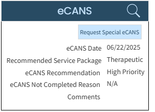 |

| Special eCANS Request Form (Mockup) |
| --- |
| 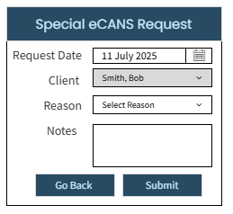 |

| View eCANS History Data Grid (Mockup) |
| --- |
| 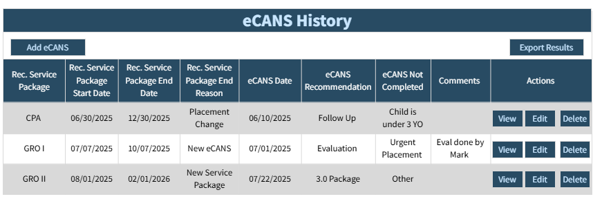 |

| End Current Recommended Service Package (Mockup) |
| --- |
| 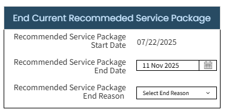 |

| Add New eCANS Recommended Service Package (Mockup) |
| --- |
| 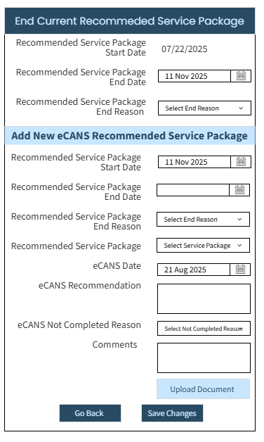 |

| Delete Modal (Mockup) |
| --- |
| 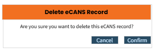 |

## Business Rules

| # | Rule Description |
| --- | --- |
| eCANS – General |  |
| 1. | The Request Special eCANS button is disabled if the client has an eCANS request that is not closed or completed. |
| 2. | The Action menu will display the following option(s), depending on the logged in user’s permissions: View eCANS History: Opens the eCANS History data grid. |
| 3. | Service packages cannot have overlapping dates. |
| eCANS History Data Grid |  |
| 1. | The following actions display for all records, depending on the logged in user’s permissions: [View]: Opens the View eCANS modal with read-only labels and values from the Add/Edit eCANS screen. [Edit]: Opens the Edit eCANS modal. Displays only for the user who created the eCANS assessment. [Delete]: Opens the Delete eCANS Record modal. |
| Special eCANS Request |  |
| 1. | The Special eCANS Request feature allows for manually requesting an eCANS assessment that did not meet any of the automatic triggers to be queued in the eCANS Dashboard. |
| 2. | The Request Date is automatically set to the current date. |
| 3. | The Client dropdown is automatically set to the current client. |
| 4. | If “Other” is selected as Reason, the Notes field becomes required. |
| Add/Edit eCANS |  |
| 1. | If there is an open eCANS/Recommended service package (no end date selected), clicking [Add eCANS] button will open the Add/Edit form with the End Current Recommended Service Package subsection at the top. |
| 2. | Users must select end date and end reason for current recommended service package before adding a new eCANS assessment. |
| 3. | The Upload Document Modal button will open a modal with the standard document uploader (See General FDS). |

## Element Descriptions

| Element Name | Description/ Attributes | Element Type | Editable | Required | Core |
| --- | --- | --- | --- | --- | --- |
| eCANS |  | Face Sheet Card |  |  | N |
| Header Text | Text: “eCANS” | Header | N/A | N/A | N |
| Request Special eCANS Button | Text: “Request Special eCANS” See business rules. | Button | N/A | N/A | N |
| Action Menu | Icon: Magnifying GlassMenu Values: View eCANS History | Action Menu | N/A | N/A | N |
| eCANS Date | Label: “eCANS Date”Value: “{eCANS Date}” | Label and Value | N/A | N/A | N |
| Recommended Service Package | Label: “Recommended Service Package”Value: “{Recommended Service Package}” | Label and Value | N/A | N/A | N |
| eCANS Recommendation | Label: “eCANS Recommendation”Value: “{eCANS Recommendation}” | Label and Value | N/A | N/A | N |
| eCANS Not Completed Reason | Label: “eCANS Not Completed Reason”Value: “{eCANS Not Completed Reason}” | Label and Value | N/A | N/A | N |
| Comments | Label: “Comments”Value: “{Comments}” | Label and Value | N/A | N/A | N |
| Special eCANS Request Modal |  | Modal |  |  | N |
| Header Text | Text: “Special eCANS Request” | Header | N/A | N/A | N |
| Request Date | Label: “Request Date” See business rules. | Date Picker | Y | Y | N |
| Client | Label: “Client” See business rules. | Dropdown | N | Y | N |
| Reason | Label: “Reason”Dropdown Values: Select Reason (Default) Court Ordered Other Status Change | Dropdown | Y | Y | N |
| Notes | Label: “Notes” See business rules. | Multi-Line Textbox | Y | N | N |
| Cancel Button | Text: “Cancel” | Button | N/A | N/A | N |
| Submit Button | Text: “Submit” | Button | N/A | N/A | N |
| View eCANS History |  | Data Grid |  |  | N |
| Header Text | Text: “eCANS History” | Header | N/A | N/A | N |
| Add eCANS Button | Text: “Add eCANS” | Button | N/A | N/A | N |
| Export Results Button | Text: “Export Results” | Button | N/A | N/A | N |
| Rec. Service Package Column | Column Header: “Rec. Service Package”Column Value: “{Rec. Service Package}” | Text Column | N | N/A | N |
| Rec. Service Package Start Date Column | Column Header: “Rec. Service Package Start Date”Column Value: “{Rec. Service Package Start Date}” | Date Column | N | N/A | N |
| Rec. Service Package End Date Column | Column Header: “Rec. Service Package End Date”Column Value: “{Rec. Service Package End Date}” | Date Column | N | N/A | N |
| Rec. Service Package End Reason Column | Column Header: “Rec. Service Package End Reason”Column Value: “{Rec. Service Package End Reason}” | Text Column | N | N/A | N |
| eCANS Date Column | Column Header: “eCANS Date”Column Value: “{eCANS Date}” | Date Column | N | N/A | N |
| eCANS Recommendation Column | Column Header: “eCANS Recommendation”Column Value: “{eCANS Recommendation}” | Text Column | N | N/A | N |
| eCANS Not Completed Column | Column Header: “eCANS Not Completed”Column Value: “{eCANS Not Completed}” | Text Column | N | N/A | N |
| Comments Column | Column Header: “Comments”Column Value: “{Comments}” | Text Column | N | N/A | N |
| Actions Column | Column Header: “Actions”Button(s): [View] [Edit] [Delete] | Button Column | N/A | N/A | N |
| Go Back Button | Text: “Go Back” | Button | N/A | N/A | N |
| Add/Edit eCANS |  | Form Screen |  |  | N |
| End Current Recommended Service Package | See business rules. | Form Section |  |  | N |
| Header Text | Text: “End Current Recommended Service Package” | Header | N/A | N/A | N |
| Recommended Service Package Start Date | Label: “Recommended Service Package Start Date”Value: “{Recommended Service Package Start Date}” | Label and Value | N | N/A | N |
| Recommended Service Package End Date | Label: “Recommended Service Package End Date” | Date Picker | Y | Y | N |
| Recommended Service Package End Reason | Label: “Recommended Service Package End Reason”Dropdown Values: Select End Reason (Default) Circumstances do not require CANS assessment, but new service package needed New CANS 3.0 completed as part of routine review schedule Placement Change request due to child’s behaviors, needs or circumstances changing | Dropdown | Y | Y | N |
| Add/Edit eCANS |  | Modal |  |  | N |
| Header Text | See business rules. | Header | N/A | N/A | N |
| Recommended Service Package Start Date | Label: “Recommended Service Package Start Date” | Date Picker | Y | Y | N |
| Recommended Service Package End Date | Label: “Recommended Service Package End Date” | Date Picker | Y | N | N |
| Recommended Service Package End Reason | Label: “Recommended Service Package End Reason”Dropdown Values: Select End Reason (Default) Circumstances do not require CANS assessment, but new service package needed New CANS 3.0 completed as part of routine review schedule Placement Change request due to child’s behaviors, needs or circumstances changing | Dropdown | Y | N | N |
| Recommended Service Package | Label: “Recommended Service Package”Dropdown Values: Select Service Package (Default) CPA – Basic Foster Family Home Support CPA – Complex Medical Needs or Medically Fragile Support CPA – CPB Child in Foster Home with Parent CPA – Human Trafficking Victim/Survivor Support CPA – IDD/Autism Spectrum Disorder Support CPA – Mental and Behavioral Health Support CPA – Sexual Aggression/Sex Offender Support CPA – Short-Term Assessment Support CPA – Substance Use Support CPA – Treatment Foster Family Care Support GRO I – Basic Child Care Operation GRO I – Complex Medical Needs Treatment GRO I – CPB Child in GRO with Parent GRO I – Emergency Emotional Support & Assessment Center GRO I – Human Trafficking Victim/Survivor Treatment GRO I – IDD and Autism Spectrum Disorder Treatment GRO I – Mental and Behavioral Health Treatment GRO I – Sexual Aggression and Sex Offender Treatment GRO I – Substance Use Treatment GRO I – Youth & Young Adults Who Are Pregnant and Parenting GRO II – Aggression and Defiant Disorder Stabilization GRO II – Complex Medical Stabilization GRO II – Complex Mental Health Stabilization GRO II – Human Trafficking Victim/Survivor Stabilization GRO II – Sexual Aggression and Sex Offender Stabilization GRO II – Substance Use Stabilization | Dropdown | Y | N | N |
| eCANS Date | Label: “eCANS Date” | Date Picker | Y | N | N |
| eCANS Recommendation | Label: “eCANS Recommendation” | Multi-Line Textbox | Y | N | N |
| eCANS Not Completed Reason | Label: “eCANS Not Completed Reason”Dropdown Values: Select Not Completed Reason (Default) Child is under 3 YO Initial Removal no CANS has been completed Other Urgent Placement | Dropdown | Y | N | N |
| Comments | Label: “Comments” | Multi-Line Textbox | Y | N | N |
| Upload Document Button | Text: “Upload Document” See business rules. | Button | N/A | N/A | N |
| Go Back Button | Text: “Cancel” | Button | N/A | N/A | N |
| Save Changes Button | Text: “Save Changes” | Button | N/A | N/A | N |
| Upload Document Modal |  | Modal |  |  | N |
|  | See General FDS. |  |  |  |  |
| Delete eCANS Record |  | Modal |  |  | N |
| Header Text | Text: “Delete eCANS Record” | Header | N/A | N/A | N |
| Confirmation Message | Text: “Are you sure you want to delete this eCANS record?” | Label | N/A | N/A | N |
| Cancel Button | Text: “Cancel” | Button | N/A | N/A | N |
| Confirm Button | Text: “Confirm” | Button | N/A | N/A | N |

## Security

| Permission Type | Permission Name | Description |
| --- | --- | --- |
| Action | ViewClient | Ability to view a client’s face sheet |
| Access | AccessClientAssessments | Access to the Assessments menu option on the client face sheet |
| Access | AccessClientECANS | Access to Client eCANS module |
| Action | CreateClientECANSSpecialRequest | Ability to create Special eCANS Request |
| Action | CreateClientECANS | Ability to create a new eCANS record |
| Action | ViewClientECANS | Ability to view an eCANS record |
| Action | EditClientECANS | Ability to edit an eCANS record |
| Action | DeleteClientECANS | Ability to delete an eCANS record |

# 21. Independent Living
The Independent Living module supports the tracking and planning of services that prepare youth for adulthood and self-sufficiency. It captures key readiness indicators such as housing plans, financial literacy, employment status, educational progress, and participation in programs like PAL (Preparation for Adult Living). Caseworkers use this module to assess a client’s strengths and gaps, document milestones, and coordinate services that promote independence. The interface is designed for clarity and progress monitoring, with structured fields and timelines. It will also link to the client’s Documents – Independent Living folder to upload supporting documentation.
Relevant requirement(s):
4.085 - The system will have the ability to document Independent Living details.
## Navigation
Main Menu > Client Search > Client Face Sheet > Independent Living
## User Interfaces

| Independent Living Tile(Mockup) |
| --- |
| 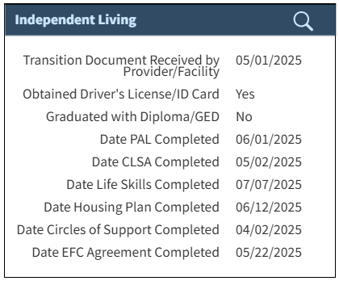 |

| Edit Independent Living (Mockup) |
| --- |
| 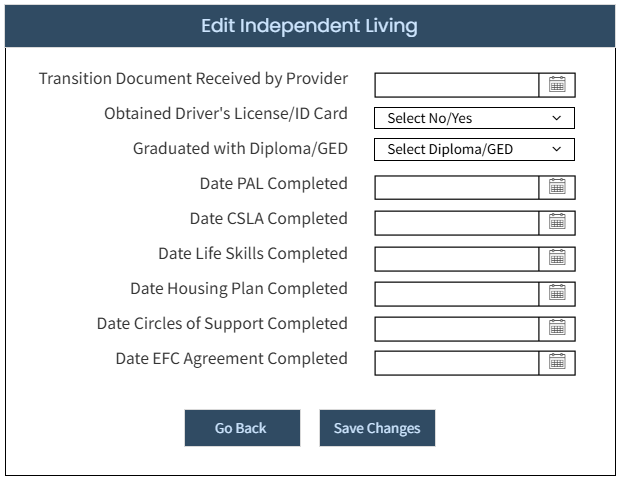 |

## Business Rules

| # | Rule Description |
| --- | --- |
| Independent Living – General Tile |  |
| 1. | The Independent Living screen will load as a read-only. |
| 2. | The Action Menu will display the following options, depending on the logged in user’s permissions: Edit Independent Living: Opens the Edit Independent Living screen. View Independent Living Documents: Opens the client’s Documents screen with the Independent Living folder open. |
| Edit Independent Living |  |
| 1. | The Edit Independent Living screen opens with all fields editable. A history of changes is not retained. |

## Element Descriptions

| Element Name | Description/ Attributes | Element Type | Editable | Required | Core |
| --- | --- | --- | --- | --- | --- |
| Independent Living Tile |  | Face Sheet Component Tile |  |  | Y |
| Header Text | Text: “Independent Living” | Header | N/A | N/A | Y |
| Action Menu | Icon: Magnifying GlassDropdown Value: Edit Independent Living View Independent Living Documents | Action Menu | N/A | N/A | Y |
| Transition Document Received by Provider Facility | Label: “Transition Document Received by Provider/Facility”Value: “{Date Transition Document Received by Provider/Facility}” | Label and Value | N/A | N/A | Y |
| Obtained Driver’s License/ID Card | Label: "Obtained Driver’s License/ID Card”Value: “{Obtained Driver’s License/ID Card}” | Label and Value | N/A | N/A | Y |
| Graduated with Diploma/GED | Label: “Graduated with Diploma/GED”Value: “{Graduated with Diploma/GED}” | Label and Value | N/A | N/A | Y |
| Date PAL Completed | Label: “Date PAL Completed”Value: “{Date PAL Completed}” | Label and Value | N/A | N/A | Y |
| Date CLSA Completed | Label: “Date CLSA Completed”Value: “{Date CLSA Completed}” | Label and Value | N/A | N/A | Y |
| Date Life Skills Completed | Label: “Date Life Skills Completed”Value: “{Date Life Skills Completed}” | Label and Value | N/A | N/A | Y |
| Date Housing Plan Completed | Label: “Date Housing Plan Completed”Value: “{Date Housing Plan Completed}” | Label and Value | N/A | N/A | Y |
| Date Circles of Support Completed | Label: “Date Circles of Support Completed”Value: “{Date Circles of Support Completed}” | Label and Value | N/A | N/A | Y |
| Date EFC Agreement Completed | Label: “Date EFC Agreement Completed”Value: “{Date EFC Agreement Completed}” | Label and Value | N/A | N/A | Y |
| Edit Independent Living Form |  | Form Screen |  |  | Y |
| Header Text | Text: “Edit Independent Living” | Header | N/A | N/A | Y |
| Transition Document Received by Provider | Label: “Transition Document Received by Provider/Facility” | Date Picker | Y | N | Y |
| Obtained Driver’s License/ID Card | Label: “Obtained Driver’s License/ID Card”Dropdown Values: Select Option (Default) No Yes | Dropdown | Y | N | Y |
| Graduated with Diploma/GED | Label: “Graduated with Diploma/GED”Dropdown Values: Select Option (Default) No Yes | Dropdown | Y | N | Y |
| Date PAL Completed | Label: “Date PAL Completed” | Date Picker | Y | N | Y |
| Date CLSA Completed | Label: “Date CLSA Completed” | Date Picker | Y | N | Y |
| Date Life Skills Completed | Label: “Date Life Skills Completed” | Date Picker | Y | N | Y |
| Date Housing Plan Completed | Label: “Date Housing Plan Completed” | Date Picker | Y | N | Y |
| Date Circles of Support Completed | Label: Date Circles of Support Completed” | Date Picker | Y | N | Y |
| Date EFC Agreement Completed | Label: “Date EFC Agreement Completed” | Date Picker | Y | N | Y |
| Go Back Button | Text: “Go Back” | Button | N/A | N/A | Y |
| Save Changes Button | Text: “Save Changes” | Button | N/A | N/A | Y |

## Security

| Permission Type | Permission Name | Description |
| --- | --- | --- |
| Action | ViewClient | Ability to view a client’s face sheet |
| Access | AccessClientIndependentLiving | Access to the Independent Living module on the client face sheet |
| Action | EditClientIndependentLivingRecord | Ability to edit an independent living record |
| Access | AccessClientDocuments | Access to the Client Documents screen from the Client Face Sheet |

# 22. Legal
The Legal module provides a comprehensive framework for managing a client’s legal information throughout their involvement with the system. It includes key components such as Current Legal Status, which offers a snapshot of custody and jurisdictional details, and Legal Actions and Outcomes, which tracks court proceedings, filings, and rulings. Together, these submodules help caseworkers monitor legal progress, ensure compliance with mandates, and inform placement and service decisions.
Relevant Requirement(s):
4.100 - The system will have the ability to manage legal status, legal action, legal outcome data, court documents, and legal case notes.
## 22.1 Current Legal Status
The Current Legal Status module provides a snapshot of a client’s present standing within the legal system. It captures essential details such as custody status, legal authority, jurisdiction, and any active court orders or legal restrictions. This module helps caseworkers quickly assess the client’s legal context, which is critical for placement decisions, service eligibility, and compliance with court mandates.
### Navigation
Main Menu > Client Search > Client Face Sheet > Legal
### User Interfaces

| Legal Tile (Mockup) |
| --- |
| 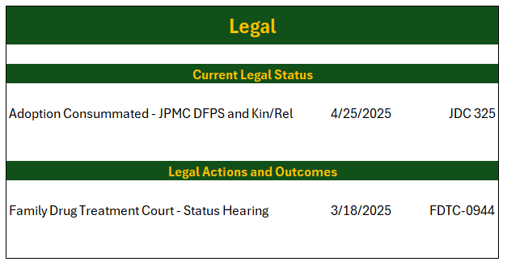 |

### 

| Current Legal Status Data Grid (Mockup) |
| --- |
| 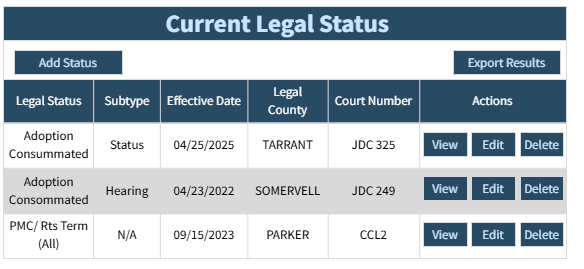 |

| Add/Edit Current Legal Status (Mockup) |
| --- |
| 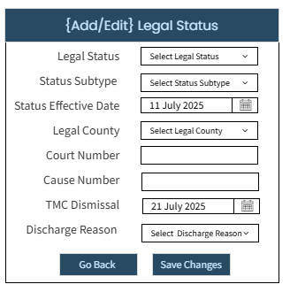 |

| Delete Current Legal Status (Mockup) |
| --- |
| 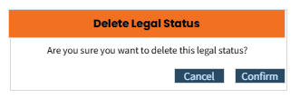 |

### Business Rules

| # | Rule Description |
| --- | --- |
| Legal - Tile |  |
| 1. | Clicking on the “Current Legal Status” header will open the Current Legal Status Data Grid. Clicking on the “Legal Actions and Outcomes” header will open the Legal Actions and Outcomes Data Grid. |
| 2. | The face sheet tile will load with all active current legal statuses and legal actions and outcomes. |
| Current Legal Status – Data Grid |  |
| 1. | The data grid will load with all legal status records sorted by Status Effective Date descending. |
| 2. | The following actions display for all records, depending on the logged in user’s permissions: [View]: Opens the View Legal Status modal with read-only labels and values from the Add/Edit Legal Status screen. [Edit]: Opens the Edit Legal Status screen. [Delete]: Opens the Delete Legal Status modal. |
| Add/Edit Legal Status |  |
| 1. | Legal Status, Legal Subtype, and Legal County dropdown values will populate according to the user’s organization. |
| 2. | Discharge Reasons dropdown values will populate according to the user’s organization. |
| 3. | Status Dates can overlap. |
| Configurations |  |
| 1. | Legal Status (Texas) Adoption Consummated CVS Not Obtained Care, Custody, & Control Child Emancipated FPS Resp Terminated Other Legal Basis for Resp PMC/ Rts Last Father PMC/ Rts Not Term PMC/ Rts Term (All) PMC/ Rts Term (Mother) Poss Conservatorship TMC |
| 2. | Status Subtype (Texas) N/A JPMC DFPS and Parent JTMC DFPS and Rel/Kin JTMC DFPS and Parent JPMC DFPS and Kin/Rel |

### Element Descriptions

| Element Name | Description/ Attributes | Element Type | Editable | Required | Core |
| --- | --- | --- | --- | --- | --- |
| Legal |  | Face Sheet Component Tile |  |  | Y |
| Header Text | Text: “Legal” | Header | N/A | N/A | Y |
| Sub header Text | Text: “Current Legal Status” | Sub header | N/A | N/A | Y |
| Legal Status-Subtype | Value: “{Legal Status – Subtype}” | Value | N | N/A | Y |
| Effective Date | Value: “{Effective Date}” | Value | N | N/A | Y |
| Court Number | Value: “{Court Number}” | Value | N | N/A | Y |
| Sub header Text | Text: “Legal Actions and Outcomes” | Sub header | N/A | N/A | Y |
| Legal Action-Subtype | Value: “{Legal Action – Subtype}” | Value | N | N/A | Y |
| Effective Date | Value: “{Effective Date}” | Value | N | N/A | Y |
| Court Number | Value: “{Court Number}” | Value | N | N/A | Y |
| Current Legal Status |  | Data Grid |  |  | Y |
| Header Text | Text: “Current Legal Status” | Header | N/A | N/A | Y |
| Add Status Button | Text: “Add Status” | Button | N/A | N/A | Y |
| Export Results Button | Text: “Export Results” | Button | N/A | N/A | Y |
| Legal Status Column | Column Header: “Legal Status”Column Value: “{Legal Status}” | Text Column with Dropdown Filter | N | N/A | Y |
| Subtype Column | Column Header: “Subtype”Column Value: “{Subtype}” | Text Column | N | N/A | Y |
| Effective Date Column | Column Header: “Effective Date”Column Value: “{Effective Date}” | Date Column | N | N/A | Y |
| Legal County Column | Column Header: “Legal County”Column Value: “{Legal County}” | Text Column | N | N/A | Y |
| Court Number Column | Column Header: “Court Number”Column Value: “{Court Number}” | Alphanumeric Column | N | N/A | Y |
| Actions Column | Column Header: “Actions”Button(s): [View] [Edit] [Delete] | Button Column | N/A | N/A | Y |
| Add/Edit Current Legal Status |  | Modal |  |  | Y |
| Header Text | Text: “{Add/Edit} Legal Status” | Header | N/A | N/A | Y |
| Legal Status | Label: “Legal Status”Dropdown Values: Select Legal Status (Default) See business rules. | Dropdown | Y | Y | Y |
| Status Subtype | Label: “Status Subtype”Dropdown Values: Select Status Subtype (Default) See business rules. | Dropdown | Y | N | Y |
| Status Effective Date | Label: “Status Effective Date” | Date Picker | Y | Y | Y |
| Legal County | Label: “Legal County”Dropdown Values: Select Legal County (Default) See business rules. | Dropdown | Y | N | Y |
| Court Number | Label: “Court Number” | Textbox | Y | N | Y |
| Cause Number | Label: “Cause Number” | Textbox | Y | N | Y |
| TMC Dismissal | Label: “TMC Dismissal” | Date Picker | Y | N | Y |
| Discharge Reason | Label: “Discharge Reason” Dropdown Values: Select Discharge Reason (Default) See business rules. | Dropdown | Y | N | Y |
| Cancel Button | Text: “Cancel” | Button | N/A | N/A | Y |
| Save Changes Button | Text: “Save Changes” | Button | N/A | N/A | Y |
| Delete Legal Status Modal |  | Modal |  |  | Y |
| Header Text | Text: “Delete Legal Status” | Header | N/A | N/A | Y |
| Confirmation Message | Text: “Are you sure you want to delete this legal status? “ | Label | N/A | N/A | Y |
| Cancel Button | Text: “Cancel” | Button | N/A | N/A | Y |
| Confirm Button | Text: “Confirm” | Button | N/A | N/A | Y |

### Security

| Permission Type | Permission Name | Description |
| --- | --- | --- |
| Action | ViewClient | Ability to view a client’s face sheet |
| Access | AccessClientLegal | Access to the Legal menu option on the client face sheet |
| Access | AccessClientLegalCurrentStatus | Access to Current Legal Status data grid |
| Action | CreateClientLegalStatus | Ability to add a legal status |
| Action | ViewClientLegalStatus | Ability to view the details of a legal status |
| Action | EditClientLegalStatus | Ability to modify a legal status |
| Action | DeleteClientLegalStatus | Ability to delete a legal status |

## 22.2 Legal Actions and Outcomes
The Legal Actions and Outcomes module provides a structured way to document and track a client’s involvement in legal proceedings. It captures key details such as court dates, legal actions taken (e.g., hearings, filings, rulings), and the resulting outcomes or decisions. This module supports case planning by offering visibility into a client’s legal status and history, which may impact placement, service eligibility, or permanency planning. Users can view timelines of legal events and link them to relevant case records.
### Navigation
Main Menu > Client Search > Client Face Sheet > Legal
### User Interfaces

| Legal Actions and Outcomes Data Grid (Mockup) |
| --- |
| 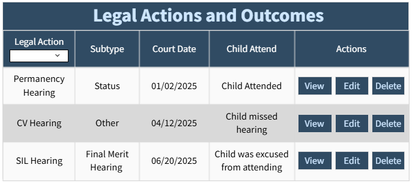 |

| [Add/Edit] Legal Action and Outcome (Mockup) |
| --- |
| 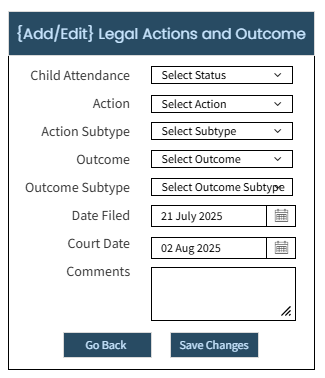 |

| Delete Legal Action and Outcome (Mockup) |
| --- |
| 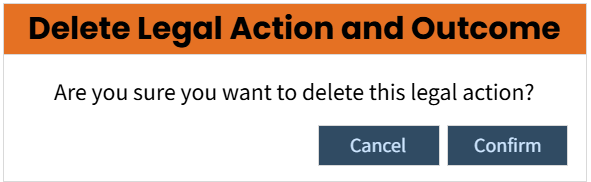 |

### Business Rules

| # | Rule Description |
| --- | --- |
| Legal Actions and Outcomes – General |  |
| 1. | The data grid will load with all legal action and outcome records sorted by Court Date descending. |
| 2. | The following actions display for all records, depending on the logged in user’s permissions: [View]: Opens the View Legal Action modal with read-only labels and values from the Add/Edit Legal Action screen. [Edit]: Opens the Edit Legal Action and Outcome screen. [Delete]: Opens the Delete Legal Action and Outcome modal. |
| View Legal Action and Outcome |  |
| 1. | Action, Action Subtype, Outcome, and Outcome Subtype dropdown values will populate according to the user’s organization. |

### Element Descriptions

| Element Name | Description/ Attributes | Element Type | Editable | Required | Core |
| --- | --- | --- | --- | --- | --- |
| Legal Actions and Outcomes |  | Data Grid |  |  | Y |
| Header Text | Text: “Legal Actions and Outcomes” | Header | N/A | N/A | Y |
| Add Legal Action and Outcome Button | Text: “Add Legal Action and Outcome” | Button | N/A | N/A | Y |
| Legal Action Column | Column Header: “Legal Action”Column Value: “{Legal Action}” | Text Column with Dropdown Filter | N | N/A | Y |
| Subtype Column | Column Header: “Subtype”Column Value: “{Subtype}” | Text Column | N | N/A | Y |
| Court Date Column | Column Header: “Court Date”Column Value: “{Court Date}” | Date Column | N | N/A | Y |
| Child Attend Column | Column Header: “Child Attend”Column Value: “{Child Attend}” | Text Column | N | N/A | Y |
| Actions Column | Column Header: “Actions”Buttons: [View] [Edit] [Delete] | Button Column | N/A | N/A | Y |
| Add/Edit Legal Action and Outcome |  | Modal |  |  | Y |
| Header Text | Text: “{Add/Edit} Legal Action and Outcome” | Header | N/A | N/A | Y |
| Child Attendance | Label: “Child Attendance”Dropdown Values: Select Status (Default) Child Attended Child missed hearing (Child was not excused by the judge and did not attend) Child was excused from attending | Dropdown | Y | Y | Y |
| Action | Label: “Action”Dropdown Values: Select Action (Default) See business rules. | Dropdown | Y | Y | Y |
| Action Subtype | Label: “Action Subtype”Dropdown Values: Select Subtype (Default) See business rules. | Dropdown | Y | Y | Y |
| Outcome | Label: “Outcome”Dropdown Values: Select Outcome (Default) See business rules. | Dropdown | Y | Y | Y |
| Outcome Subtype | Label: “Outcome Subtype”Dropdown Values: Select Outcome Subtype (Default) See business rules. | Dropdown | Y | N | Y |
| Date Filed | Label: “Date Filed” | Date Picker | Y | N | Y |
| Court Date | Label: “Court Date” | Date Picker | Y | Y | Y |
| Comments | Label: “Comments” | Multi-Line Textbox | Y | N | Y |
| Cancel Button | Text: “Cancel” | Button | N/A | N/A | Y |
| Save Changes Button | Text: “Save Changes” | Button | N/A | N/A | Y |
| Delete Legal Action and Outcome |  | Modal | N/A | N/A |  |
| Header Text | Text: “Delete Legal Action and Outcome” | Header | N/A | N/A | Y |
| Confirmation message | Text: “Are you sure you want to delete this legal action?” | Label | N/A | N/A | Y |
| Cancel Button | Text: “Cancel” | Button | N/A | N/A | Y |
| Confirm Button | Text: “Confirm” | Button | N/A | N/A | Y |

### Security

| Permission Type | Permission Name | Description |
| --- | --- | --- |
| Action | ViewClient | Ability to view a client’s face sheet |
| Access | AccessClientLegal | Access to the Legal menu option on the client face sheet |
| Access | AccessClientLegalActionOutcome | Access to Legal Actions and Outcomes data grid |
| Action | CreateClientLegalActionOutcome | Ability to add a legal action and outcome record |
| Action | ViewClientLegalActionOutcome | Ability to view the details of a legal action and outcome record |
| Action | EditClientLegalActionOutcome | Ability to modify a legal action and outcome record |
| Action | DeleteClientLegalActionOutcome | Ability to delete a legal action and outcome record |

# 23. Medical File
The Medical File module provides a comprehensive view of a client’s health-related information, supporting caseworkers and healthcare coordinators in managing medical needs effectively. It consolidates critical data such as diagnostic history, medical appointments, allergies, medications, insurance coverage, and immunization records. Each submodule is designed to ensure accurate documentation and continuity of care, with structured input fields and validation rules. The Medical File serves as a central resource for understanding a client’s medical background and planning appropriate services. Role-based access controls ensure that sensitive health data is securely managed and only accessible to authorized personnel.
Relevant requirement(s):
4.105 - The system will have the ability to document medical information (e.g., insurance, allergy, chronic conditions, medications, documents, restrictions, appointments).
## 23.1 Medical File Screen
The Medical File Screen serves as the central hub for accessing and managing a client’s health-related information. It consolidates key medical data including diagnostic history, appointments, allergies, medications, insurance details, and immunization records. Designed for clarity and efficiency, the screen provides quick navigation to submodules like Diagnostic History and Medical Appointments, enabling caseworkers and healthcare coordinators to maintain a complete and up-to-date medical profile.
### Navigation
Main Menu > Client Search > Client Face Sheet > Medical File
### User Interfaces

| Medical File Tile (Mockup) |
| --- |
| 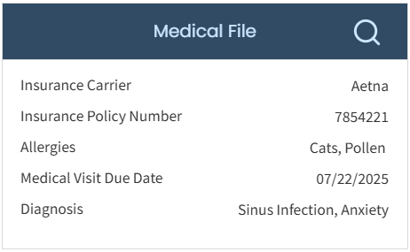 |

### Business Rules

| # | Rule Description |
| --- | --- |
| Medical File – General Tile |  |
| 1. | The Medical File screen will load as a read-only resource of current medical-related information. |
| 2. | The Action Menu will display the following options, depending on the logged in user’s permissions: Insurance Information: Opens the View Insurance data grid. Allergy Information: Opens the Allergy Information data grid. Medical Appointments: Opens the Medical Appointments data grid. Diagnostic History: Opens the Diagnostic History data grid. |
| 3. | The Insurance fields (Carrier and Policy Number) will only display one policy even if the client has multiple active policies. The policy displayed is determined by the most recent start date regardless of whether the end date is blank or in the future. |
| 4. | The Allergies field displays a comma-separated list of all the client’s allergies (Allergy Name only). |
| 5. | A Medical Visit Due Date is populated when a completed Medical Appointment is added with a future “Next Appointment Date” value. If multiple “Next Appointment Date” values exist, the earliest date will display. |
| 6. | The Diagnosis field displays a comma-separated list of all the client’s diagnoses that have no end date or an end date in the future. |

### Element Descriptions

| Element Name | Description/ Attributes | Element Type | Editable | Required | Core |
| --- | --- | --- | --- | --- | --- |
| Medical File Screen |  | Face Sheet Component Tile |  |  | Y |
| Header | Text: “Medical File” | Header | N/A | N/A | Y |
| Action Menu | Icon: Magnifying GlassDropdown Options: Insurance Information Allergy Information Medical Appointments Diagnostic History | Action Menu | N/A | N/A | Y |
| Insurance Carrier | Label: “Insurance Carrier”Value: “{Insurance Carrier} See business rules. | Label and Value | N | N/A | Y |
| Insurance Policy Number | Label: “Insurance Policy Number”Value: “{Policy Number} See business rules. | Label and Value | N | N/A | Y |
| Allergy Information | Label: “Allergies” See business rules. | Label and Value | N | N/A | Y |
| Medical Visit Due Date | Label: “Medical Visit Due Date”Value: “{Due Date}” See business rules. | Label and Value | N | N/A | Y |
| Diagnosis | Label: “Diagnosis” See business rules. | Label and Value | N | N/A | Y |

### Security

| Permission Type | Permission Name | Description |
| --- | --- | --- |
| Action | ViewClient | Ability to view a client’s face sheet |
| Access | AccessClientHealthMed | Access to the Health/Medical menu option on the client face sheet |
| Access | AccessClientHealthMedInsurance | Access to the medical file Insurance Information menu option and data grid |
| Access | AccessClientHealthMedAllergies | Access to the medical file Allergy Information menu option and data grid |
| Access | AccessClientHealthMedAppointments | Access to the medical file Medical Appointments menu option and data grid |
| Access | AccessClientHealthMedDiagnostics | Access to the medical file Diagnostic History menu option and data grid |

## 23.2 Medical File – Insurance Information
The Insurance Information module within the Medical File captures and maintains a client’s health insurance details to support medical service coordination and billing. It includes fields for insurance provider, policy number, coverage type, effective dates, and contact information. This module ensures that caseworkers and healthcare coordinators have quick access to current insurance data, helping to avoid service disruptions and streamline referrals.
### Navigation
Main Menu > Client Search > Client Face Sheet > Medical File > Insurance Information
### User Interfaces

| View Insurance Data Grid (Mockup) |
| --- |
| 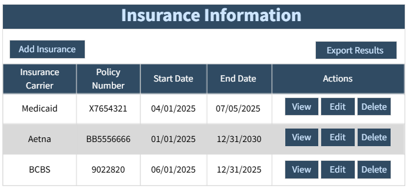 |

| {Add/Edit} Insurance (Mockup) |
| --- |
| 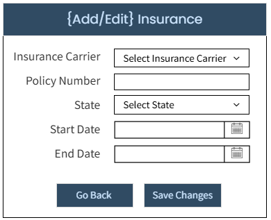 |

| Delete Insurance Modal (Mockup) |
| --- |
| 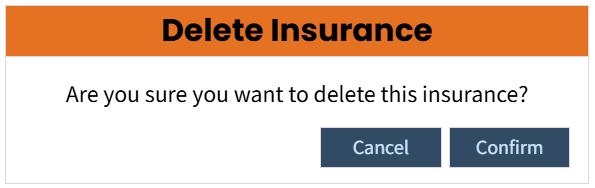 |

### Business Rules

| # | Rule Description |
| --- | --- |
| Insurance – General |  |
| 1. | A client can have multiple active insurance policies. |
| 2. | Future insurance policies are accepted. |
| 3. | The following actions display for all records, depending on the logged in user’s permissions: [Edit]: Opens the Edit Insurance modal. [Delete]: Opens the Delete Insurance modal. |
| Add/Edit Insurance Information |  |
| 1. | Insurance Policy Number can consist of alphanumeric values and special characters. |
| 2. | Start Date must occur before the End Date. |
| 3. | Insurance Carried dropdown values will populate according to the user’s organization. |

### Element Descriptions

| Element Name | Description/ Attributes | Element Type | Editable | Required | Core |
| --- | --- | --- | --- | --- | --- |
| View Insurance Data Grid |  | Data Grid |  |  | Y |
| View Insurance | Text: “Insurance Information” | Header | N/A | N/A | Y |
| Add Insurance Button | Text: “Add Insurance” | Button | N/A | N/A | Y |
| Export Results Button | Text: “Export Results” | Button | N/A | N/A | Y |
| Insurance Carrier Column | Column Header: “Insurance Carrier”Column Value: “{Insurance Carrier}” | Text Column | N | N/A | Y |
| Number Column | Column Header: “Policy Number”Column Value: “{Policy Number}” | Text Column | N | N/A | Y |
| State Column | Column Header: “State”Column Value: “{State}” | Text Column | N | N/A | Y |
| Start Date Column | Column Header: “Start Date”Column Value: “{Start Date}” | Date Column | N | N/A | Y |
| End Date Column | Column Header: “End Date”Column Value: “{End Date}” | Date Column | N | N/A | Y |
| Actions Column | Column Header: “Actions”Button(s): [Edit] [Delete] | Button Column | N/A | N/A | Y |
| Add/Edit Insurance Information Modal |  | Modal |  |  | Y |
| Header Text | Text: “{Add/Edit} Insurance Information” | Header | N/A | N/A | Y |
| Insurance Carrier | Label: “Insurance Carrier”Dropdown Options: Select Insurance Carrier (Default) See business rules. | Dropdown | Y | Y | Y |
| Number | Label: “Policy Number” | Textbox | Y | N | Y |
| State | Label: “State”Dropdown Values: Select State (Default) Alphabetical List of States | Dropdown | Y | N | Y |
| Start Date | Label: “Start Date” | Date Picker | Y | Y | Y |
| End Date | Label: “End Date” | Date Picker | Y | N | Y |
| Cancel Button | Text: “Cancel” | Button | N/A | N/A | Y |
| Save Changes Button | Text: “Save Changes” | Button | N/A | N/A | Y |
| Delete Insurance Modal |  | Modal |  |  | Y |
| Header Text | Text: “Delete Insurance” | Header | N/A | N/A | Y |
| Confirmation Message | Text: “Are you sure you want to delete this insurance?” | Label | N/A | N/A | Y |
| Cancel Button | Text: “Cancel” | Button | N/A | N/A | Y |
| Confirm Button | Text: “Confirm” | Button | N/A | N/A | Y |

### Security

| Permission Type | Permission Name | Description |
| --- | --- | --- |
| Access | AccessClientHealthMed | Access to the Health/Medical menu option on the client face sheet |
| Access | AccessClientHealthMedInsurance | Access to the medical file Insurance Information menu option and data grid |
| Action | ManageClientHealthMedInsurance | Ability to create, edit, and delete client medical insurance |

## 23.3 Medical File – Allergy Information
The Allergy Information module provides a dedicated space for documenting a client’s known allergies, including food, medication, environmental, and other sensitivities. Each record includes the allergy type, severity, reaction details, and any required precautions or treatments. This information is critical for ensuring client safety during medical appointments, placements, and service delivery. The module supports updates and historical tracking, allowing caseworkers and healthcare coordinators to maintain accurate and current allergy profiles.
### Navigation
Main Menu > Client Search > Client Face Sheet > Medical File > Allergy Information
### User Interfaces

| View Allergy Data Grid (Mockup) |
| --- |
| 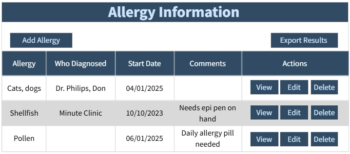 |

| {Add/Edit} Allergy Info (Mockup) |
| --- |
| 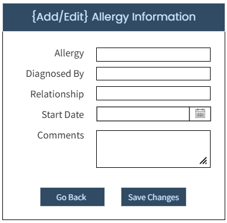 |

| Delete Allergy Modal (Mockup) |
| --- |
| 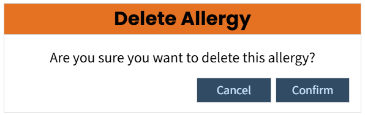 |

### Business Rules

| # | Rule Description |
| --- | --- |
| Allergy Information – General and Data Grid |  |
| 1. | The following actions display for all records, depending on the logged in user’s permissions: [Edit]: Opens the Edit Allergy modal. [Delete]: Opens the Delete Allergy modal. |
| Add/Edit Allergy Information |  |
| 1. | Start Date cannot be in the future. |

### Element Descriptions

| Element Name | Description/ Attributes | Element Type | Editable | Required | Core |
| --- | --- | --- | --- | --- | --- |
| Allergy Information Data Grid |  | Data Grid |  |  | Y |
| Allergy Information | Text: “Allergy Information” | Header | N/A | N/A | Y |
| Add Allergy Button | Text: “Add Allergy” | Button | N/A | N/A | Y |
| Export Results Button | Text: “Export Results” | Button | N/A | N/A | Y |
| Allergy Column | Column Header: “Allergy”Column Value: “{Allergy Name}” | Text Column with Textbox Filter | N | N/A | Y |
| Diagnosed By Column | Column Header: “Diagnosed By”Column Value: “{Diagnosed By}” | Text Column | N | N/A | Y |
| Start Date Column | Column Header: “Start Date”Column Value: “{Allergy Start Date}” | Date Column | N | N/A | Y |
| Comments Column | Column Header: “Comments”Column Value: “{Allergy Comments}” | Text Column | N | N/A | Y |
| Actions Column | Column Header: “Actions”Button(s): [Edit] [Delete] | Button Column | N/A | N/A | y |
| Add/Edit Allergy Information Modal |  | Modal |  |  | Y |
| Header Text | Text: “{Add/Edit} Allergy Information” | Header | N/A | N/A | Y |
| Allergy | Label: “Allergy” | Textbox | Y | Y | Y |
| Diagnosed By | Label: “Diagnosed By” | Textbox | Y | N | Y |
| Start Date | Label: “Start Date” | Date Picker | Y | Y | Y |
| Comments | Label: “Comments” | Multi-Line Textbox | Y | N | Y |
| Cancel Button | Text: “Cancel” | Button | N/A | N/A | Y |
| Save Changes Button | Text: “Save Changes” | Button | N/A | N/A | Y |
| Delete Allergy Modal |  | Modal |  |  | Y |
| Header Text | Text: “Delete Allergy” | Header | N/A | N/A | Y |
| Confirmation Message | Text: “Are you sure you want to delete this allergy?” | Label | N/A | N/A | Y |
| Cancel Button | Text: “Cancel” | Button | N/A | N/A | Y |
| Confirm Button | Text: “Confirm” | Button | N/A | N/A | Y |

### Security

| Permission Type | Permission Name | Description |
| --- | --- | --- |
| Access | AccessClientHealthMed | Access to the Health/Medical menu option on the client face sheet |
| Access | AccessClientHealthMedAllergies | Access to the medical file Allergy Information menu option and data grid |
| Action | ManageClientHealthMedAllergies | Ability to create, edit, and delete client allergies |

## 23.4 Medical File – Medical Appointments
The Medical Appointments module provides a centralized interface for tracking a client’s scheduled and completed medical visits. It captures essential details such as appointment dates, provider names, visit types (e.g., routine check-up, specialist consultation), and outcomes or follow-up actions. This module supports continuity of care by ensuring that medical needs are documented and monitored over time. Caseworkers and healthcare coordinators can use it to identify missed appointments, upcoming visits, and recurring health concerns.
### Security

| Permission Type | Permission Name | Description |
| --- | --- | --- |
| Access | AccessClientHealthMed | Access to the Health/Medical menu option on the client face sheet |
| Access | AccessClientHealthMedAllergies | Access to the medical file Allergy Information menu option and data grid |
| Action | ManageClientHealthMedAllergies | Ability to create, edit, and delete client allergies |

### Navigation
Main Menu > Client Search > Client Face Sheet > Medical File > Medical Appointments
### User Interfaces

| Medical Appointments History Data Grid (Mockup) |
| --- |
| 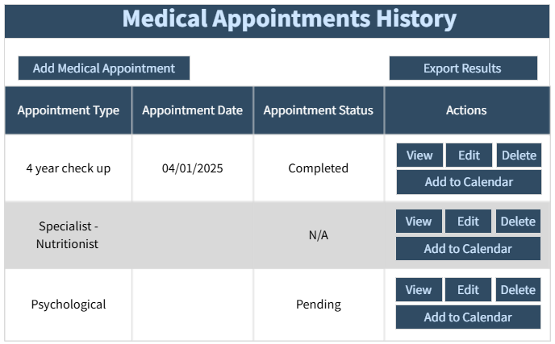 |

| Add/Edit Medical Appointment (Mockup) |
| --- |
| 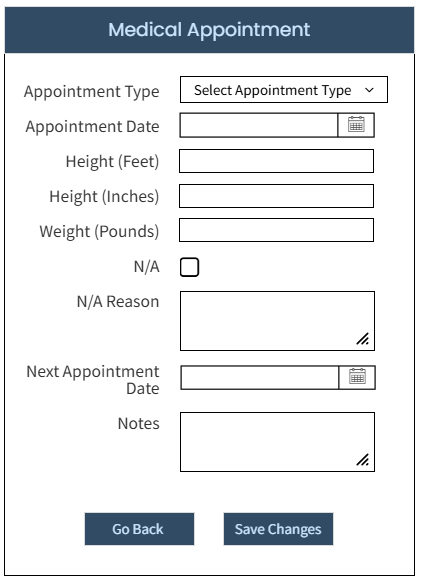 |

| Delete Medical Appointment Modal (Mockup) |
| --- |
| 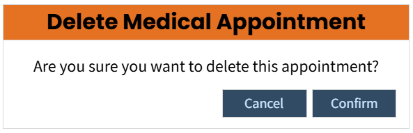 |

### Business Rules

| # | Rule Description |
| --- | --- |
| Medical Appointments – General |  |
| 1. | The data grid will load with all medical appointment records sorted by Appointment Date descending. |
| 2. | The following actions display for all records, depending on the logged in user’s permissions: [View]: Opens the View Medical Appointment modal with read-only labels and values from the Add/Edit Medical Appointment screen. [Edit]: Opens the Edit Medical Appointment screen. [Delete]: Opens the Delete Medical Appointment modal. [Add to Calendar]: Allows user to add appointment to external calendars. |
| Add/Edit Medical Appointment |  |
| 1. | Appointment Type dropdown values will populate according to the user’s organization. |
| 2. | Appointment Date must be today’s date or prior. |
| 3. | Appointment Status will automatically set based on form inputs: Status is set to Completed when an Appointment Date is entered. Status is set to Pending when no Appointment Date is entered and the N/A checkbox is not checked. Status is set to N/A when no Appointment Date is entered and the N/A checkbox is checked. |
| 4. | If the N/A Checkbox is selected: Appointment Date field becomes disabled N/A Reason field displays |
| 4. | If a Next Appointment Date is added, the date must be in the future and occur after the Appointment Date. |
| 5. | Height input contains two textboxes (feet, inches) and only accepts positive integers. |
| 6. | Weight input uses pounds and only accepts positive integers. |

### Element Descriptions

| Element Name | Description/ Attributes | Element Type | Editable | Required | Core |
| --- | --- | --- | --- | --- | --- |
| Medical Appointments Data Grid |  | Data Grid |  |  | Y |
| Header Text | Text: “Medical Appointments History” | Header | N/A | N/A | Y |
| Add Medical Appointment Button | Text: “Add Medical Appointment” | Button | N/A | N/A | Y |
| Export Results Button | Text: “Export Results” | Button | N/A | N/A | Y |
| Appointment Type Column | Column Header: “Appointment Type”Column Value: “{Appointment Type}” | Text Column with Dropdown Filer | N | N/A | Y |
| Appointment Date Column | Column Header: “Appointment Date”Column Value: “{Appointment Date}” | Date Column | N | N/A | Y |
| Appointment Status | Column Header: “Appointment Status”Column Value: “{Appointment Status}” | Text Column with Dropdown Filter | N | N/A | Y |
| Notes Column | Column Header: “Notes”Column Value: “{Notes}” | Text Column | N | N/A | Y |
| Actions Column | Column Header: “Actions”Button(s): [View] [Edit] [Delete] [Add to Calendar] See business rules. | Button Column | N/A | N/A | Y |
| Add/Edit Medical Appointment |  | Form |  |  | Y |
| Header Text | Text: “{Add/Edit} Medical Appointment” | Header | N/A | N/A | Y |
| Appointment Type | Label: “Appointment Type”Dropdown Values: Select Appointment Type (Default) See business rules. | Dropdown | Y | Y | Y |
| Appointment Date | Label: “Appointment Date” See business rules. | Date Picker | Y | N | Y |
| Height (ft) | Label: “Height (Feet)” | Textbox | Y | Y | Y |
| Height (in) | Label: “Height (Inches)” | Textbox | Y | Y | Y |
| Weight | Label: “Weight (Pounds)” | Textbox | Y | N | Y |
| N/A | Label: “N/A” See business rules. | Checkbox | Y | N | Y |
| N/A Reason | Label: “N/A Reason” See business rules. | Multi-Line Textbox | Y | N | Y |
| Next Appointment Date | Label: “Next Appointment Date” | Date Picker | Y | N | Y |
| Notes | Label: “Notes” | Multi-Line Textbox | Y | N | Y |
| Go Back Button | Text: “Go Back” | Button | N/A | N/A | Y |
| Save Changes Button | Text: “Save Changes” | Button | N/A | N/A | Y |
| Delete Medical Appointment |  | Modal |  |  | Y |
| Header Text | Text: “Delete Medical Appointment” | Header | N/A | N/A | Y |
| Confirmation Message | Text: “Are you sure you want to delete this appointment?” | Label | N/A | N/A | Y |
| Cancel Button | Text: “Cancel” | Button | N/A | N/A | Y |
| Confirm Button | Text: “Confirm” | Button | N/A | N/A | Y |

### Security

| Permission Type | Permission Name | Description |
| --- | --- | --- |
| Access | AccessClientHealthMed | Access to the Health/Medical menu option on the client face sheet |
| Access | AccessClientHealthMedAppointments | Access to the medical file Medical Appointments menu option and data grid |
| Action | ViewClientHealthMedAppointments | Ability to view client medical appointment details |
| Action | ManageClientHealthMedAppointments | Ability to create, edit, and delete client medical appointments |

## 23.5 Medical File – Diagnostic History
The Diagnostic History module within the Medical File tracks a client’s documented medical and psychological diagnoses over time. It allows caseworkers and healthcare professionals to view and manage diagnostic records, including diagnosis type, date of identification, provider details, and treatment notes. This historical view supports continuity of care, informs service planning, and ensures that critical health information is readily accessible.
### Navigation
Main Menu > Client Search > Client Face Sheet > Medical File > Diagnostic History
### User Interfaces

| Diagnostic History Data Grid (Mockup) |
| --- |
| 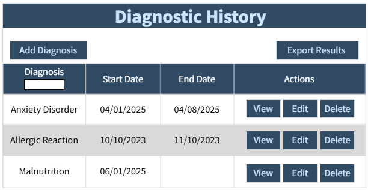 |

| Add/Edit Diagnosis (Mockup) |
| --- |
| 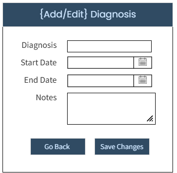 |

| Delete Diagnosis (Mockup) |
| --- |
| 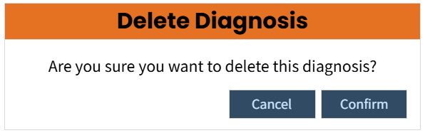 |

### Business Rules

| # | Rule Description |
| --- | --- |
| Diagnostic History – General and Data Grid |  |
| 1. | A client can have multiple active diagnoses. |
| 2. | The following actions display for all records, depending on the logged in user’s permissions: [Edit]: Opens the Edit Diagnosis modal. [Delete]: Opens the Delete Diagnosis modal. |
| Add/Edit Diagnosis |  |
| 1. | Start Date must occur before the End Date. |
| 2. | Start Date cannot be in the future. |

### Element Descriptions

| Element Name | Description/ Attributes | Element Type | Editable | Required | Core |
| --- | --- | --- | --- | --- | --- |
| Diagnostic History |  | Data Grid |  |  | Y |
| Header Text | Text: “Diagnostic History” | Header | N/A | N/A | y |
| Add Diagnosis Button | Text: “Add Diagnosis” | Button | N/A | N/A | Y |
| Export Results Button | Text: “Export Results” | Button | N/A | N/A | Y |
| Diagnosis Column | Column Header: “Diagnosis”Column Value: “{Diagnosis}” | Text Column with Textbox Filter | N | N/A | Y |
| Start Date Column | Column Header: “Start Date”Column Value: “{Diagnosis Start Date}” | Date Column | N | N/A | Y |
| End Date Column | Column Header: “End Date”Column Value: “{Diagnosis End Date}” | Date Column | N | N/A | Y |
| Notes Column | Column Header: “Notes” | Text Column | N | N/A | Y |
| Actions Column | Column Header: “Actions”Button(s): [Edit] [Delete] | Button Column | N/A | N/A | Y |
| Add/Edit Diagnosis Modal |  | Modal |  |  | Y |
| Header Text | Text: “{Add/Edit} Diagnosis” | Header | N/A | N/A | Y |
| Diagnosis | Label: “Diagnosis” | Textbox | Y | Y | Y |
| Start Date | Label: “Start Date” | Date Picker | Y | Y | Y |
| End Date | Label: “End Date” | Date Picker | Y | N | Y |
| Notes | Label: “Notes” | Multi-Line Textbox | Y | N | Y |
| Cancel Button | Text: “Cancel” | Button | N/A | N/A | Y |
| Save Changes Button | Text: “Save Changes” | Button | N/A | N/A | Y |
| Delete Diagnosis Modal |  | Modal |  |  | Y |
| Header Text | Text: “Delete Diagnosis” | Header | N/A | N/A | Y |
| Confirmation Message | Text: “Are you sure you want to delete this diagnosis” | Label | N/A | N/A | Y |
| Cancel Button | Text: “Cancel” | Button | N/A | N/A | Y |
| Confirm Button | Text: “Confirm” | Button | N/A | N/A | Y |

### Security

| Permission Type | Permission Name | Description |
| --- | --- | --- |
| Access | AccessClientHealthMed | Access to the Health/Medical menu option on the client face sheet |
| Access | AccessClientHealthMedDiagnostics | Access to the medical file Diagnostic History menu option and data grid |
| Action | ManageClientHealthMedDiagnostics | Ability to create, edit, and delete client diagnotics |

# 24. Education
The Education module provides a comprehensive framework for managing a client’s academic journey. It consolidates key educational data including school enrollment, grade level, IEP status, attendance, and performance metrics. Submodules such as GED History, Grade Achieved History and Edit Education Information offer detailed tracking and editing capabilities to ensure records remain current and accurate. This module supports case planning by giving staff a clear view of a client’s academic progress and needs, particularly for programs like Independent Living and Transitional Services. An Action Menu option and data grid buttons allow easy access to specific Education folders on the client’s document tree.
## 24.1 Education Overview
The Education Overview screen serves as a centralized dashboard for viewing a client’s complete educational profile. It consolidates key academic data such as current school enrollment, grade level, IEP status, attendance records, and performance indicators. This high-level view helps caseworkers quickly assess a client’s educational progress and identify areas needing support or intervention. The module is designed for efficiency, offering quick access to related submodules like GED History, Grade Achieved History, and Edit Education Information.
### Navigation
Main Menu > Client Search > Client Face Sheet > Education
### User Interfaces

| Education Overview Tile(Mockup) |
| --- |
| 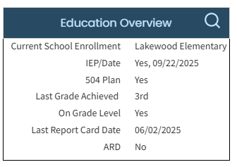 |

### Business Rules

| # | Rule Description |
| --- | --- |
| Education Overview – General Tile |  |
| 1. | The overview screen displays read-only labels and values that are updated by accessing the screens from the Action Menu. |
| 2. | If no value exists, the value will display “N/A”. |
| 3. | Action Menu Items and Navigation: Edit Education: Opens the Edit Education Information form screen. Grade Achieved History: Opens the Grade Achieved History data grid. GED History: Opens the GED History data grid. Enrollment History: Opens the Enrollment History data grid. Report Card History: Opens the Report Card History data grid. View Education Documents: Navigates to the client’s Documents screen with the main Education folder open. |

### Element Descriptions

| Element Name | Description/ Attributes | Element Type | Editable | Required | Core |
| --- | --- | --- | --- | --- | --- |
| Education Overview |  | Face Sheet Component Tile |  |  | Y |
| Education Overview Header | Text: “Education Overview” | Header | N/A | N/A | Y |
| Action Menu | Label: Magnifying glass icon See business rules. | Dropdown Menu | N/A | N/A | Y |
| Current School Enrollment | Label: “Current School Enrollment”Value: “{Current School Enrollment}” | Label and Value | N/A | N/A | Y |
| IEP/Date | Label: “IEP/Date” See business rules. | Label and Value | N/A | N/A | Y |
| 504 Plan | Label: “504 Plan”Value: “{504 Plan}” | Label and Value | N/A | N/A | Y |
| Last Grade Achieved | Label: “Last Grade Achieved”Value: “{Grade Level}” | Label and Value | N/A | N/A | Y |
| On Grade Level | Label: “On Grade Level”Value: “{On Grade Level}” | Label and Value | N/A | N/A | Y |
| Last Report Card Date | Label: “Last Report Card Date”Value: “{Last Report Card Date}” | Label and Value | N/A | N/A | Y |
| ARD | Label: “ARD” See business rules. | Label and Value | N/A | N/A | Y |

### Security

| Permission Type | Permission Name | Description |
| --- | --- | --- |
| Action | ViewClient | Ability to view a client’s face sheet |
| Access | AccessClientEducation | Access to the Education menu option on the client face sheet |
| Action | EditEducationRecord | Ability to modify a client’s education record |
| Access | AccessClientEducationGradeHistory | Access to the education Grade Achieved History menu option and data grid |
| Access | AccessClientEducationGedHistory | Access to the education GED History menu option and data grid |
| Access | AccessClientEducationEnrollment | Access to the education Enrollment History menu option and data grid |
| Access | AccessClientEducationReportCard | Access to the education Report Card History menu option and data grid |
| Access | AccessClientDocuments | Access to the Client Documents screen from the Client Face Sheet |

## 24.2 Edit Education Information
The Edit Education Information screen enables authorized users to update and maintain a client’s academic records within the system. It supports modifications to key data points such as school enrollment status, grade level, IEP participation, and educational milestones. This module plays a critical role in keeping educational profiles current, which informs service planning and compliance reporting. Role-based access controls ensure that only designated staff can make changes, preserving the integrity of sensitive educational data.
### Navigation
Main Menu > Client Search > Client Face Sheet > Education > Edit Education
### User Interfaces

| Edit Education Information Screen (Mockup) |
| --- |
| 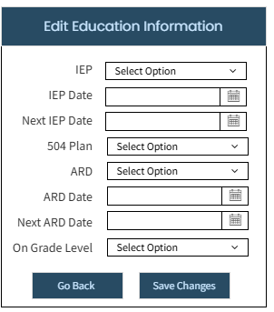 |

### Business Rules

| # | Rule Description |
| --- | --- |
| Edit Education – General |  |
| 1. | The value for IEP and the IEP date (if Yes was selected) display as the Education Overview “IEP/Date” value. |
| 2. | The value for ARD displays as the Education Overview “ARD” value. |
| 3. | The value for On Grade Level displays as the Education Overview “On Grade Level” value. |
| Add/Edit Education |  |
| 1. | The IEP dropdown selection determines the state of the IEP Date field: No Option Selected: IEP Date field is disabled Selection = “Yes”: IEP Date field is enabled Selection = “No”: IEP Date field does not display |
| 2. | IEP Date must occur before Next IEP Date. |
| 3. | ARD Date must occur before Next ARD Date. |

### Element Descriptions

| Element Name | Description/ Attributes | Element Type | Editable | Required | Core |
| --- | --- | --- | --- | --- | --- |
| Edit Education |  | Form Screen |  |  | Y |
| Edit Education Header | Text: “Edit Education Information” | Header | N/A | N/A | Y |
| IEP | Label: “IEP”Dropdown Values: Select Option (Default) No Yes See business rules. | Dropdown | Y | Y | Y |
| IEP Date | Label: “IEP Date” See business rules. | Date Picker | N | Y | Y |
| Next IEP Date | Label: “Next IEP Date” See business rules. | Date Picker | Y | N | Y |
| 504 Plan | Label: “504 Plan”Dropdown Values: Select Option (Default) No Unknown Yes | Dropdown | Y | N | Y |
| ARD | Label: “ARD”Dropdown Values: Select Option (Default) No Yes | Dropdown | Y | Y | Y |
| ARD Date | Label: “ARD Date” See business rules. | Date Picker | Y | N | Y |
| Next ARD Date | Label: “Next ARD Date” See business rules. | Date Picker | Y | N | Y |
| On Grade Level | Label: “On Grade Level”Dropdown Values: Select Option (Default) No Yes | Dropdown | Y | N | Y |
| Go Back Button | Text: “Go Back” | Button | N/A | N/A | Y |
| Save Changes Button | Text: “Save Changes” | Button | N/A | N/A | Y |

### Security

| Permission Type | Permission Name | Description |
| --- | --- | --- |
| Access | AccessClientEducation | Access to the Education menu option on the client face sheet |
| Action | EditEducationRecord | Ability to modify a client’s education record |

## 24.3 Grade Achieved History
The Grade Achieved History screen records a client’s academic achievement of various grade levels and educational settings. This historical view supports informed decision-making for programs like Independent Living, GED preparation, and IEP development. The module ensures data accuracy through structured input fields and enforces access controls to protect sensitive educational records.
### Navigation
Main Menu > Client Search > Client Face Sheet > Education > Grade Achieved History
### User Interfaces

| Grade Achieved History Modal (Mockup) |
| --- |
| 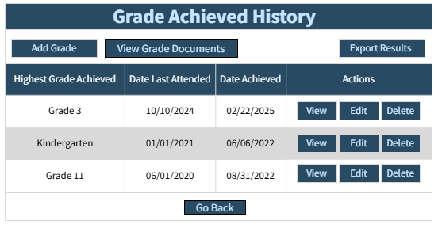 |

| Add/Edit Grade Information Modal (Mockup) |
| --- |
| 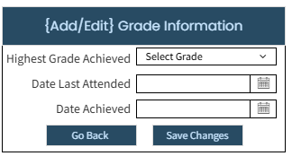 |

| Delete Grade Modal (Mockup) |
| --- |
| 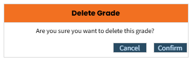 |

### Business Rules

| # | Rule Description |
| --- | --- |
| Grade Achieved – General |  |
| 1. | The most recent record displays as the Education Overview “Grade” value. |
| Grade Achieved – Data Grid |  |
| 1. | The “View Grade Documents” navigates to the client’s Documents screen with the Grades folder open. |
| 2. | The data grid will load with all grade records sorted by Date Achieved descending. |
| 3. | The following actions display for all records, depending on the logged in user’s permission: [Edit]: Opens the Edit Grade Information modal. [Delete]: Opens the Delete Grade modal. |
| Add/Edit Grade Information |  |
| 1. | Dates can be in the future. |

### Element Descriptions

| Element Name | Description/ Attributes | Element Type | Editable | Required | Core |
| --- | --- | --- | --- | --- | --- |
| Grade Achieved Data Grid |  | Data Grid |  |  | Y |
| Header Text | Text: “Grade Achieved History” | Header | N/A | N/A | Y |
| Add Grade Button | Text: “Add Grade” | Button | N/A | N/A | Y |
| View Grade Documents Button | Text: “View Grade Documents” See business rules. | Button | N/A | N/A | Y |
| Export Results Button | Text: “Export Results” | Button | N/A | N/A | Y |
| Highest Grade Achieved Column | Column Header: “Highest Grade Achieved”Column Value: “{Highest Grade Achieved}” | Text Column | N | N/A | Y |
| Date Last Attended Column | Column Header: “Date Last Attended”Column Value: “{Date Last Attended}” | Date Column | N | N/A | Y |
| Date Achieved Column | Column Header: “Date Achieved”Column Value: “{Date Achieved}” | Date Column | N | N/A | Y |
| Actions Column | Column Header: “Actions”Button(s): [Edit] [Delete] | Button Column | N | N/A | Y |
| Go Back Button | Text: “Go Back” | Button | N/A | N/A | Y |
| Add/Edit Grade Information Modal |  | Modal |  |  | Y |
| Header Text | Text: “{Add/Edit} Grade Information” | Header | N/A | N/A | Y |
| Highest Grade Achieved | Label: “Highest Grade Achieved”Dropdown Values: Select Grade (Default) Kindergarten Grade 1 Grade 2 Grade 3 Grade 4 Grade 5 Grade 6 Grade 7 Grade 8 Grade 9 Grade 10 Grade 11 Grade 12 GED Some College College Graduate | Dropdown | Y | Y | Y |
| Date Last Attended | Label: “Date Last Attended” | Date Picker | Y | Y | Y |
| Date Achieved | Label: “Date Achieved” | Date Picker | Y | Y | Y |
| Cancel Button | Text: “Cancel” | Button | N/A | N/A | Y |
| Save Changes Button | Text: “Save Changes” | Button | N/A | N/A | Y |
| Delete Grade Modal |  | Modal |  |  | Y |
| Header Text | Text: “Delete Grade” | Header | N/A | N/A | Y |
| Confirmation Text | Text: “Are you sure you want to delete this grade?” | Label | N/A | N/A | Y |
| Cancel Button | Text: “Cancel” | Button | N/A | N/A | Y |
| Confirm Button | Text: “Confirm” | Button | N/A | N/A | Y |

### Security

| Permission Type | Permission Name | Description |
| --- | --- | --- |
| Access | AccessClientEducation | Access to the Education menu option on the client face sheet |
| Access | AccessClientEducationGradeHistory | Access to the education Grade Achieved History menu option and data grid |
| Action | ManageClientEducationGradeHistory | Ability to create, edit, or delete a client’s grade information |
| Access | AccessClientDocuments | Access to the Client Documents screen from the Client Face Sheet |

## 24.4 GED History
The GED History screen tracks a client’s progress toward obtaining a General Educational Development (GED) certificate. It captures key milestones such as test preparation, scheduled exam dates, and completion status. Caseworkers can document attempts, scores, and outcomes for each subject area, providing a clear view of educational advancement. This module supports planning for Independent Living and post-secondary readiness by ensuring that educational goals are monitored and supported. Access is controlled through role-based permissions to protect sensitive academic records.
### Navigation
Main Menu > Client Search > Client Face Sheet > Education > GED History
### User Interfaces

| GED History Modal (Mockup) |
| --- |
| 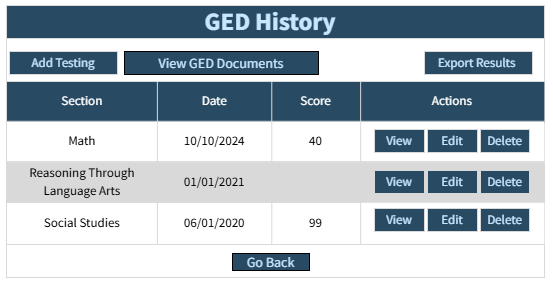 |

| Add GED Testing Information Modal (Mockup) |
| --- |
| 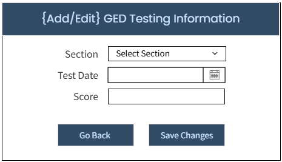 |

| Delete GED Testing Modal (Mockup) |
| --- |
| 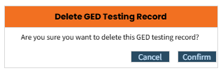 |

### Business Rules

| # | Rule Description |
| --- | --- |
| GED History – General |  |
| 1. | GED testing information does not display on the Education Overview screen. |
| GED History – Data Grid |  |
| 1. | The “View GED Documents” button navigates to the client’s Documents screen with the GED folder open. |
| 2. | The data grid will load with all GED testing records sorted by Date descending. |
| 3. | The following actions display for all records, depending on the logged in user’s permission: [Edit]: Opens the Edit GED Testing Information modal. [Delete]: Opens the Delete GED Testing Record modal. |
| Add/Edit GED Testing Information |  |
| 1. | The Score section accepts positive integers only. |
| 2. | Score cannot be entered if Date is in the future. |

### Element Descriptions

| Element Name | Description/ Attributes | Element Type | Editable | Required | Core |
| --- | --- | --- | --- | --- | --- |
| GED History Data Grid |  | Data Grid |  |  | Y |
| Header Text | Text: “GED History” | Header | N/A | N/A | Y |
| Add Testing Button | Text: “Add GED Testing” | Button | N/A | N/A | Y |
| View GED Documents Button | Text: “View GED Documents” See business rules. | Button | N/A | N/A | Y |
| Export Results Button | Text: “Export Results” | Button | N/A | N/A | Y |
| Section Column | Column Header: “Section”Column Value: “{Section}” | Text Column with Dropdown Filter | N | N/A | Y |
| Date Column | Column Header: “Date”Column Value: “{Date}” | Date Column | N | N/A | Y |
| Score Column | Column Header: “Score”Column Value: “{Score}” | Text Column | N | N/A | Y |
| Actions Column | Column Header: “Actions”Button(s): [Edit] [Delete] | Button Column | N | N/A | Y |
| Go Back Button | Text: “Go Back” | Button | N/A | N/A | Y |
| Add/Edit GED Testing Information Modal |  | Modal |  |  | Y |
| Header Text | Text: “{Add/Edit} GED Testing Information” | Header | N/A | N/A | Y |
| Section | Label: “Section”Dropdown Values: Select Section (Default) Math Reasoning Through Language Arts Science Social Studies | Dropdown | Y | Y | Y |
| Test Date | Label: “Test Date” | Date Picker | Y | Y | Y |
| Score | Label: “Score” See business rules. | Textbox | Y | N | Y |
| Cancel Button | Text: “Cancel” | Button | N/A | N/A | Y |
| Save Changes Button | Text: “Save Changes” | Button | N/A | N/A | Y |
| Delete GED Testing Modal |  | Modal |  |  | Y |
| Header Text | Text: “Delete GED Testing Record” | Header | N/A | N/A | Y |
| Confirmation Text | Text: “Are you sure you want to delete this GED testing record?” | Label | N/A | N/A | Y |
| Cancel Button | Text: “Cancel” | Button | N/A | N/A | Y |
| Confirm Button | Text: “Confirm” | Button | N/A | N/A | Y |

### Security

| Permission Type | Permission Name | Description |
| --- | --- | --- |
| Access | AccessClientEducation | Access to the Education menu option on the client face sheet |
| Access | AccessClientEducationGedHistory | Access to the education GED History menu option and data grid |
| Action | ManageClientEducationGedRecord | Ability to create, edit, or delete a client’s GED testing record |
| Access | AccessClientDocuments | Access to the Client Documents screen from the Client Face Sheet |

## 24.5 Enrollment History
The Enrollment History module provides a chronological view of all programs a client has been enrolled in across their time in care. It captures key details such as program type, enrollment start and end dates, and associated provider information. This module helps caseworkers and administrators track transitions between services, identify gaps in care, and ensure continuity across placements and programs. The interface supports filtering and sorting to quickly locate specific enrollment records.
### Navigation
Main Menu > Client Search > Client Face Sheet > Education > Enrollment History
### User Interfaces

| Enrollment History Data Grid (Mockup) |
| --- |
| 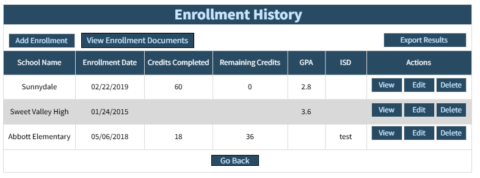 |

| Add/Edit Enrollment Information (Mockup) |
| --- |
| 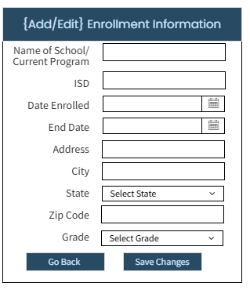 |

| Delete Enrollment Modal (Mockup) |
| --- |
| 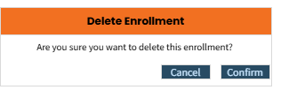 |

### Business Rules

| # | Rule Description |
| --- | --- |
| Enrollment History – General |  |
| 1. | The “Name of School/Current Program” of the record with the most recent Enrollment date displays as the Education Overview “Current School Enrollment” value. |
| Enrollment History – Data Grid |  |
| 1. | The “View Enrollment Documents” button navigates to the client’s Documents screen with the Enrollment folder open. |
| 2. | The data grid will load with all enrollment records sorted by Enrollment Date descending. |
| 3. | The following actions display for all records, depending on the logged in user’s permission: [View]: Opens the View Enrollment Information modal with read-only labels and values from the Add/Edit Enrollment screen. [Edit]: Opens the Edit Enrollment Information screen. [Delete]: Opens the Delete Enrollment modal. |
| Add/Edit Enrollment Information |  |
| 1. | Addresses must be validated upon add or edit. |
| 2. | Enrollment Date must occur before the End Date. |
| 3. | Enrollment records can have overlapping start and end dates. |

### Element Descriptions

| Element Name | Description/ Attributes | Element Type | Editable | Required | Core |
| --- | --- | --- | --- | --- | --- |
| Enrollment History Data Grid |  | Data Grid |  |  | Y |
| Header Text | Text: “Enrollment History” | Header | N/A | N/A | Y |
| Add Enrollment Button | Text: “Add Enrollment” | Button | N/A | N/A | Y |
| View Enrollment Documents Button | Text: “View Enrollment Documents” See business rules. | Button | N/A | N/A | Y |
| Export Results Button | Text: “Export Results” | Button | N/A | N/A | Y |
| School Name Column | Column Header: “School Name”Column Value: “{School Name}” | Text Column | N | N/A | Y |
| Enrollment Date Column | Column Header: “Enrollment Date”Column Value: “{Enrollment Date}” | Date Column | N | N/A | Y |
| Credits Completed Column | Column Header: “Credits Completed”Column Value: “{Credits Completed}” | Text Column | N | N/A | Y |
| Remaining Credits Column | Column Header: “Remaining Credits”Column Value: “{Remaining Credits}” | Text Column | N | N/A | Y |
| GPA Column | Column Header: “GPA”Column Value: “{GPA}” | Text Column | N | N/A | Y |
| ISD Column | Column Header: “ISD”Column Value: “{ISD}” | Text Column | N | N/A | Y |
| Actions Column | Column Header: “Actions”Button(s): [View] [Edit] [Delete] | Button Column | N | N/A | Y |
| Go Back Button | Text: “Go Back” | Button | N/A | N/A | Y |
| Add/Edit Enrollment Information |  | Form Screen |  |  | Y |
| Header Text | Text: “{Add/Edit} Enrollment Information” | Header | N/A | N/A | Y |
| Name of School/Current Program | Label: “Name of School/Current Program” | Textbox | Y | Y | Y |
| ISD | Label: “ISD” | Textbox | Y | N | Y |
| Enrollment Date | Label: “Enrollment Date” | Date Picker | Y | Y | Y |
| End Date | Label: “End Date” | Date Picker | Y | N | Y |
| Address Line 1 | Label: “Address Line 1” | Textbox | Y | N | Y |
| Address Line 2 | Label: “Address Line 2” | Textbox | Y | N | Y |
| City | Label: “City” | Textbox | Y | N | Y |
| State | Label: “State”Dropdown Values: Select State (Default) Alphabetical List of States | Dropdown | Y | N | Y |
| Zip Code | Label: “Zip Code” | Textbox | Y | N | Y |
| County | Label: “County”Dropdown Values: Select County (Default) Alphabetical List of Counties for the selected State |  |  |  |  |
| Grade | Label: “Grade”Dropdown Values: Select Grade (Default) Kindergarten Grade 1 Grade 2 Grade 3 Grade 4 Grade 5 Grade 6 Grade 7 Grade 8 Grade 9 Grade 10 Grade 11 Grade 12 GED Some College College Graduate | Dropdown | Y | N | Y |
| Go Back Button | Text: “Go Back” | Button | N/A | N/A | Y |
| Save Changes Button | Text: “Save Changes” | Button | N/A | N/A | Y |
| Delete Enrollment Modal |  | Modal |  |  | Y |
| Header Text | Text: “Delete Enrollment” | Header | N/A | N/A | Y |
| Confirmation Text | Text: “Are you sure you want to delete this enrollment?” | Label | N/A | N/A | Y |
| Cancel Button | Text: “Cancel” | Button | N/A | N/A | Y |
| Confirm Button | Text: “Confirm” | Button | N/A | N/A | Y |

### Security

| Permission Type | Permission Name | Description |
| --- | --- | --- |
| Access | AccessClientEducation | Access to the Education menu option on the client face sheet |
| Access | AccessClientEducationEnrollment | Access to the education Enrollment History menu option and data grid |
| Action | ViewClientEducationEnrollment | Ability to view a client’s enrollment record |
| Action | ManageClientEducationEnrollment | Ability to create, edit, or delete a client’s enrollment record |
| Access | AccessClientDocuments | Access to the Client Documents screen from the Client Face Sheet |

## 24.6 Report Card History
The Report Card History screen enables caseworkers to view and manage academic performance data for clients across multiple school terms. It provides a read-only grid that displays grades, subjects, and term dates, offering a snapshot of the client’s educational progress. Users can export report card data to PDF for documentation or sharing purposes. This module supports educational planning and helps identify trends or areas needing intervention. Access is controlled through role-based permissions to ensure sensitive academic records are protected.
### Navigation
Main Manu > Client Search > Client Face Sheet > Education > Report Card History
### User Interfaces

| Report Card History Data Grid (Mockup) |
| --- |
| 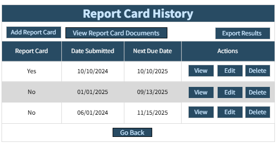 |

| Add/Edit Report Card Information (Mockup) |
| --- |
| 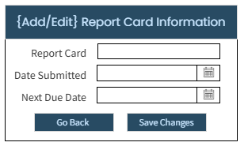 |

| Delete Report Card Modal (Mockup) |
| --- |
| 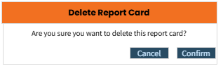 |

### Business Rules

| # | Rule Description |
| --- | --- |
| Report Card History – General |  |
| 1. | The most recent “Date Submitted” displays as the Education overview “Last Report Card Date” value. |
| Report Card History – Data Grid |  |
| 1. | The “View Report Card Documents” button navigates to the client’s Documents screen with the Report Card folder open. |
| 2. | The data grid will load with all Report Card records sorted by Date Submitted descending. |
| 3. | The following actions display for all records, depending on the logged in user’s permission: [Edit]: Opens the Edit Report Card Information modal. [Delete]: Opens the Delete Report Card modal. |
| Add/Edit Report Card |  |
| 1. | Report Card records can have overlapping date submitted and next due dates. |
| 2. | Date Submitted must occur before the Next Due Date. |

### Element Descriptions

| Element Name | Description/ Attributes | Element Type | Editable | Required | Core |
| --- | --- | --- | --- | --- | --- |
| Report Cards Data Grid |  | Data Grid |  |  | Y |
| Header Text | Text: “Report Card History” | Header | N/A | N/A | Y |
| Add Report Card Button | Text: “Add Report Card” | Button | N/A | N/A | Y |
| View Report Card Documents Button | Text: “View Report Card Documents” See business rules. | Button | N/A | N/A | Y |
| Export Results Button | Text: “Export Results” | Button | N/A | N/A | Y |
| Report Card Column | Column Header: “Report Card”Column Value: “{Report Card}” | Text Column | N | N/A | Y |
| Date Submitted Column | Column Header: “Date Submitted”Column Value: “{Date Submitted}” | Date Column | N | N/A | Y |
| Next Due Date Column | Column Header: “Next Due Date”Column Value: “{Next Due Date}” | Date Column | N | N/A | Y |
| Actions Column | Column Header: “Actions”Button(s): [Edit] [Delete] | Button Column | N | N/A | Y |
| Go Back Button | Text: “Go Back” | Button | N/A | N/A | Y |
| Add/Edit Report Card Information Modal |  | Modal |  |  | Y |
| Header Text | Text: “{Add/Edit} Report Card Information” | Header | N/A | N/A | Y |
| Report Card | Label: “Report Card” | Textbox | Y | Y | Y |
| Date Submitted | Label: “Date Submitted” | Date Picker | Y | Y | Y |
| Next Due Date | Label: “Next Due Date” | Date Picker | Y | N | Y |
| Cancel Button | Text: “Cancel” | Button | N/A | N/A | Y |
| Save Changes Button | Text: “Save Changes” | Button | N/A | N/A | Y |
| Delete Report Card Modal |  | Modal |  |  | Y |
| Header Text | Text: “Delete Report Card” | Header | N/A | N/A | Y |
| Confirmation Text | Text: “Are you sure you want to delete this report card?” | Label | N/A | N/A | Y |
| Cancel Button | Text: “Cancel” | Button | N/A | N/A | Y |
| Confirm Button | Text: “Confirm” | Button | N/A | N/A | Y |

### Security

| Permission Type | Permission Name | Description |
| --- | --- | --- |
| Access | AccessClientEducation | Access to the Education menu option on the client face sheet |
| Access | AccessClientEducationReportCard | Access to the education Report Card History menu option and data grid |
| Action | ManageClientEducationReportCard | Ability to create, edit, or delete a client’s report card record |
| Access | AccessClientDocuments | Access to the Client Documents screen from the Client Face Sheet |

# 25. Employment
The Employment screen provides a structured way to capture and manage a client’s work history and employment-related details. It supports tracking of job types, employment status, and eligibility for work programs. Users can input historical employment records, including start and end dates, employer information, and job roles. The module is designed to help caseworkers assess a client’s financial independence and readiness for services like Independent Living or Transitional programs. Role-based permissions ensure that only authorized users can view or edit employment data, maintaining confidentiality and data integrity.
Relevant Requirement(s):
4.070 - The system will support the ability to track educational enrollment and/or employment status.
## Navigation
Main Menu > Client Search > Client Face Sheet > Employment
## User Interfaces

| Employment History Data Grid Tile (Mockup) |
| --- |
| 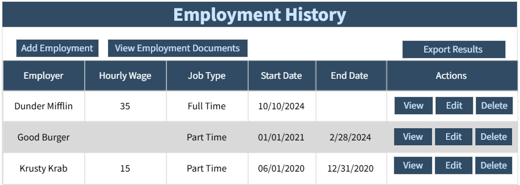 |

| Add/Edit Employment Information (Mockup) |
| --- |
| 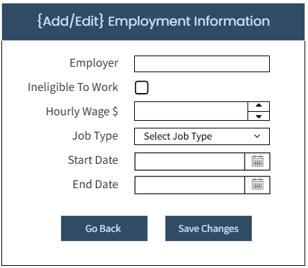 |

| Delete Employment Modal (Mockup) |
| --- |
| 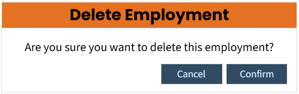 |

## Business Rules

| # | Rule Description |
| --- | --- |
| Employment History – Data Grid Tile |  |
| 1. | The “View Employment Documents” navigates to the client’s Documents screen with the Employment folder open. |
| 2. | The data grid will load with all employment records sorted by Start Date descending. |
| 3. | The following actions display for all records, depending on the logged in user’s permission: [Edit]: Opens the Edit Employment Information screen. [Delete]: Opens the Delete Employment modal. |
| ? | See comment above on section description for concerns about Ineligible to Work functionality |
| Add/Edit Employment |  |
| 1. | When the “Ineligible to Work” checkbox is selected, all other fields become disabled. |
| 2. | Employment records can have overlapping start and end dates. |
| 3. | Start Date must occur before the End Date. |

## Element Descriptions

| Element Name | Description/ Attributes | Element Type | Editable | Required | Core |
| --- | --- | --- | --- | --- | --- |
| Employment History Data Grid |  | Face Sheet Component Data Grid Tile |  |  | Y |
| Header Text | Text: “Employment History” | Header | N/A | N/A | Y |
| Add Employment Button | Text: “Add Employment” | Button | N/A | N/A | Y |
| View Employment Documents Button | Text: “View Employment Documents” See business rules. | Button | N/A | N/A | Y |
| Export Results Button | Text: “Export Results” | Button | N/A | N/A | Y |
| Employer Column | Column Header: “Employer”Column Value: “{Employer}” | Text Column | N | N/A | Y |
| Hourly Wage Column | Column Header: “Hourly Wage”Column Value: “{Hourly Wage}” | Currency Column | N | N/A | Y |
| Job Type Column | Column Header: “Job Type”Column Value: “{Full Time/Part Time}” | Text Column | N | N/A | Y |
| Start Date Column | Column Header: “Start Date”Column Value: “{Start Date}” | Date Column | N | N/A | Y |
| End Date Column | Column Header: “End Date”Column Value: “{End Date}” | Date Column | N | N/A | Y |
| Actions Column | Column Header: “Actions”Button(s): [Edit] [Delete] | Button Column | N/A | N/A | Y |
| Add/Edit Employment Information |  | Form Screen |  |  | Y |
| Header Text | Text: “{Add/Edit} Employment Information” | Header | N/A | N/A | Y |
| Employer | Label: “Employer” | Textbox | Y | Y | Y |
| Ineligible to Work | Label: “Ineligible to Work” See business rules. | Checkbox | Y | N | Y |
| Hourly Wage | Label: “Hourly Wage $” | Numeric Textbox | Y | N | Y |
| Job Type | Label: “Job Type”Dropdown Values: Select Job Type (Default) Full Time Part Time See business rules. | Dropdown | Y | Y | Y |
| Start Date | Label: “Start Date” | Date Picker | Y | Y | Y |
| End Date | Label: “End Date” | Date Picker | Y | N | Y |
| Go Back Button | Text: “Go Back” | Button | N/A | N/A | Y |
| Save Changes Button | Text: “Save Changes” | Button | N/A | N/A | Y |
| Delete Employment Modal |  | Modal |  |  | Y |
| Header Text | Text: “Delete Employment Record” | Header | N/A | N/A | Y |
| Confirmation Text | Text: “Are you sure you want to delete this employment record?” | Label | N/A | N/A | Y |
| Cancel Button | Text: “Cancel” | Button | N/A | N/A | Y |
| Confirm Button | Text: “Confirm” | Button | N/A | N/A | Y |

## Security

| Permission Type | Permission Name | Description |
| --- | --- | --- |
| Action | ViewClient | Ability to view a client’s face sheet |
| Access | AccessClientEmploymentHistory | Access to the client’s employment history menu option and data grid |
| Action | ViewClientEmploymentRecord | Ability to view a client’s employment record |
| Action | CreateClientEmploymentRecord | Ability to create a client’s employment record |
| Action | EditClientEmploymentRecord | Ability to modify a client’s employment record |
| Action | DeleteClientEmploymentRecord | Ability to remove a client’s employment record |

# 26. Siblings in Care
The Siblings in Care module enables users to track and manage sibling relationships among clients within the system. It provides a structured interface for viewing sibling groupings, placement statuses, and associated alerts. The module supports identification of siblings placed together or separately, facilitating case planning and compliance with placement policies. Data is presented in a read-only format to ensure consistency and integrity, with filtering options to assist in case reviews. This feature enhances visibility into family dynamics and supports informed decision-making in service delivery.
Relevant requirement(s):
4.055 - The system will support separated sibling associations.

## Navigation
Main Menu > Client Search > Client Face Sheet > Siblings in Care
## User Interfaces

| Siblings in Care Data Grid Tile(Mockup) |
| --- |
| 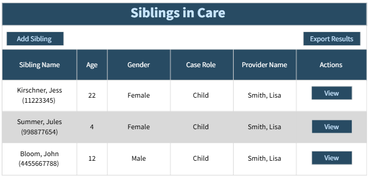 |

| Siblings in Care Data Grid with Separated Sibling Tile(Mockup) |
| --- |
| 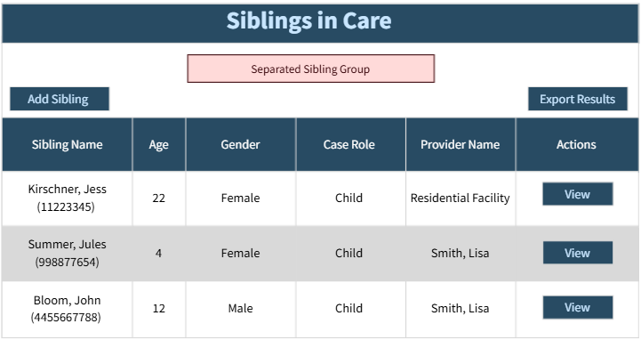 |

| Add Sibling Form (Mockup) |
| --- |
| 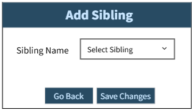 |

## Business Rules

| # | Rule Description |
| --- | --- |
| Separated Sibling – General and Data Grid Tile |  |
| 1. | The data grid will load all active sibling associations (clients with no end dates). Discharged children will only display if the IncludeDischargedChildren setting is set to true. |
| 2. | The following action(s) display for all records, depending on the logged in user’s assigned permissions: [View]: Opens the sibling’s client face sheet. |
| 3. | Active alerts for the sibling are indicated by an icon next to the sibling’s name. The icon displays a tooltip with the alert details. |
| 4. | If siblings are on the same case but in different placements, a red “Separated Sibling Group” banner displays above the data grid. |
| 5. | If a sibling association is created, the sibling’s face sheet will be populated with the current client’s record as a sibling. |
| 6. | Siblings added through the ‘Case Management – Case Participants’ module display automatically. |
| Add Sibling Form |  |
| 1. | The Select Sibling dropdown contains children who are active excluding the current child and the child’s current existing sibling relationships. |

## 26.1 

|  |  |  |  |  |  |
| --- | --- | --- | --- | --- | --- |

## Security

| Permission Type | Permission Name | Description |
| --- | --- | --- |
| Action | ViewClient | Ability to view a client’s face sheet |
| Access | AccessClientSiblingsInCare | Access to the Client Siblings in Care menu option and data grid |
| Action | CreateClientSiblingAssociations | Ability to add an existing client as a sibling |

## Element Descriptions

| Element Name | Description/ Attributes | Element Type | Editable | Required | Core |
| --- | --- | --- | --- | --- | --- |
| Siblings in Care Data Grid |  | Face Sheet Component Data Grid Tile |  |  | Y |
| Header Text | Text: “Siblings in Care” | Header | N/A | N/A | Y |
| Separated Sibling Banner | Text: “Separated Sibling Group” See business rules. | Banner | N/A | N/A | Y |
| Add Sibling Button | Text: “Add Sibling” | Button | N/A | N/A | Y |
| Export Results Button | Text: “Export Results” | Button | N/A | N/A | Y |
| Sibling Name Column | Column Header: “Sibling Name”Column Value: “{Sibling Last Name} {First Name} {(Child ID)}” | Text Column | N | N/A | Y |
| Age Column | Column Header: “Age”Column Value: “{Age}” | Numerical Column | N | N/A | Y |
| Gender Column | Column Header: “Gender”Column Value: “{Gender}” | Text Column | N | N/A | Y |
| Case Role Column | Column Header: “Case Role”Column Value: “{Case Role}” | Text Column | N | N/A | Y |
| Case Number Column | Column Header: “Case Number”Column Value: “{Case Number}” | Text Column | N | N/A | Y |
| Provider Name Column | Column Header: “Provider Name”Column Value: “{Provider Name}” | Text Column | N | N/A | Y |
| Actions Column | Column Header: “Actions” Button(s): [View] | Button Column | N/A | N/A | Y |
| Add Sibling Form |  | Modal |  |  | Y |
| Header Text | Text: “Add Sibling” | Header | N/A | N/A | Y |
| Sibling Name | Label: “Sibling Name” Dropdown Values: Select Sibling (Default) See business rules. | Dropdown | Y | Y | Y |
| Cancel Button | Text: “Cancel” | Button | N/A | N/A | Y |
| Save Changes Button | Text: “Save Changes” | Button | N/A | N/A | Y |

# 27. Incident Reports
The Incident Reports section provides a read-only interface for viewing historical incident data associated with clients. It presents a structured grid that displays key incident details and supports PDF export functionality for reporting or archival purposes. The module is designed for informational access only, with no editing or data entry capabilities. Users can filter and sort incidents based on predefined criteria to facilitate case reviews or audits. This feature ensures transparency and traceability of critical events while maintaining data integrity through restricted access.
Relevant requirement(s):
4.005 - The system will allow users to search for Incident Reports by various criteria.
## Navigation
Main Menu > Client Search > Client Face Sheet > Incident Reports
## User Interfaces

| Incident Reports Data Grid Tile (Mockup) |
| --- |
| 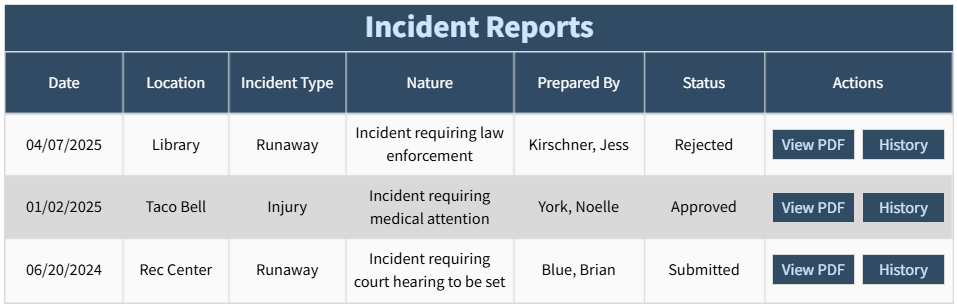 |

| Status History Data Grid (Mockup) |
| --- |
| 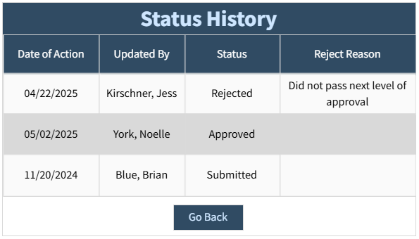 |

## Business Rules

| # | Rule Description |
| --- | --- |
| Incident Reports Data Grid Tile |  |
| 1. | Read-only screen with Incident Report Data. |
| 2. | Data grid displays Incident Reports sorted by Date descending. |
| 3. | The following actions display for all records, depending on the logged in user’s permissions: [View PDF]: Opens a PDF with all details from the Incident Report. [History]: Opens the Status History data grid. |
| 4. | Status Filter dropdown values: Awaiting Approval Approved Rejected |
| Status History Data Grid |  |
| 1. | Read-only screen with Incident Report Status History scoped to the individual Incident Report. |

## Element Descriptions

| Element Name | Description/ Attributes | Element Type | Editable | Required | Core |
| --- | --- | --- | --- | --- | --- |
| Incident Reports |  | Face Sheet Component Data Grid Tile |  |  | Y |
| Header Text | Text: “Incident Reports” | Header | N/A | N/A | Y |
| Export Results Button | Text: “Export Results” | Button | N/A | N/A | Y |
| Date Column | Column Header: “Date” Column Value: “{Incident Date}” | Date Column | N | N/A | Y |
| Location Column | Column Header: “Location”Column Value: “{Incident Location}” | Text Column | N | N/A | Y |
| Incident Type Column | Column Header: “Incident Type”Column Value: “{Incident Type}” | Text Column with Dropdown Filter | N | N/A | Y |
| Nature Column | Column Header: “Nature”Column Value: “{Nature of Incident}” | Text Column | N | N/A | Y |
| Completed By Column | Column Header: “Completed By”Column Value: “{Completed By Last Name}, {First Name}” | Text Column | N | N/A | Y |
| Status Column | Column Header: “Status”Column Value: “{Status}” | Text Column with Dropdown Filter | N | N/A | Y |
| Actions Column | Column Header: “Actions”Buttons: [View PDF] [History] | Button Column | N/A | N/A | Y |
| Status History Data Grid |  | Data Grid Modal |  |  | Y |
| Header Text | Text: “Status History” | Header | N/A | N/A | Y |
| Date of Action Column | Column Header: “Date of Action”Column Value: “{Date of Action}” | Date Column | N | N/A | Y |
| Updated By Column | Column Header: “Updated By”Column Value: “{Updated By Last Name}, {First Name}” | Text Column | N | N/A | Y |
| Status Column | Column Header: “Status”Column Value: “{Status}” | Text Column | N | N/A | Y |
| Reject Reason | Column Header: “Reject Reason”Column Value: “{Reject Reason}” | Text Column | N | N/A | Y |
| Go Back Button | Text: “Go Back” | Button | N/A | N/A | Y |

## Security

| Permission Type | Permission Name | Description |
| --- | --- | --- |
| Action | ViewClient | Ability to view a client's face sheet |
| Access | AccessClientIncidentReport | Access to the client incident report data grid |
