# Section II – High-Level Workflows/Data Flows
# 6. Workflow 1 – Intake
## Description
The Intake workflow describes the process of creating a new intake for any program enrollment when a client referral is received. It defines the process for initiating a client’s enrollment into TFI programs following a referral. It guides users through creating an intake record, entering required information, and associating clients with appropriate programs. The workflow supports multiple paths based on program type (e.g., Foster Care, Adoption, Behavioral Health), and includes logic for incomplete intakes and pending statuses. Integrated with ECAP via API, it ensures accurate client creation, triggers placement requests when applicable, and populates the Client Face Sheet with relevant data tiles for coordinated care.
## Actors

| Actors |  |
| --- | --- |
| 1. | IPD workers |

## Preconditions

| Preconditions |  |
| --- | --- |
| 1. | Client referral has been received. |

## Workflow Diagram
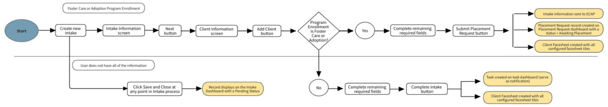
## Main Flow – Foster Care, Adoption, Residential, Family Preservation or Independent Living Program Enrollment

| Main Flow |  |
| --- | --- |
| 1. | Create new Intake. |
| 2. | Complete required fields on the Intake Information screen. |
| 3. | Create client and add Program Enrollment. If Foster Care, Adoption, Residential Treatment, Family Preservation or Independent Living proceed with step 4. If other, proceed with step 8. |
| 4. | Complete remaining required Intake fields. |
| 5. | Click "Submit Placement Request". |
| 6. | Intake information is sent to ECAP and Placement Request record is created on the Placement Request dashboard with a status = Awaiting Placement. |
| 7. | Client Facesheet is created with all configured facesheet tiles. |

## Alternate Flows

| Alternate Flow - Other Program Enrollment (Behavioral Health,) |  |
| --- | --- |
| 8. | Complete remaining required Intake fields. |
| 9. | Click "Complete Intake". |
| 10. | Client Facesheet is created with all configured facesheet tiles. |
| 11. | Task is created on the task dashboard (serve as notification). |

| Alternate Flow – User does not have all of the Intake information |  |
| --- | --- |
| 1. | Create new Intake. |
| 2. | Click "Save and Close" at any point in the Intake process. |
| 3. | Record displays on the Intake Dashboard with a Pending Status. |

## 6.1 Dashboard – User Interfaces

| Step 1: Intake Information (CoBRIS screenshot) |
| --- |
|  |

| Step 2: Client Information (Mockup) |
| --- |
| 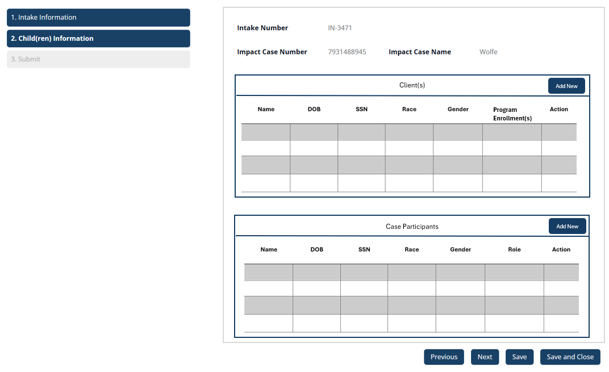 |

| Add/Edit Client (Mockup) |
| --- |
| 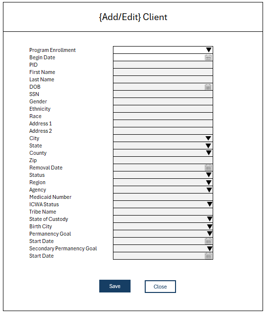 |

| Submit Intake (CoBRIS screenshot) |
| --- |
|  |

## 6.2 Dashboard – Business Rules

| # | Rule Description |
| --- | --- |
| Intake/Admission – General |  |
| 1. | The Program Enrollment selection will determine which cards to display on the Client Face Sheet and if the client needs a placement If a client has more than one program enrollment, the client face sheet will display each tile associated to the program enrollment.  Duplicate tiles will only display once. |
| 2. | Submit Placement Request will trigger the ECAP API call.  Refer to the General FDS – Section: Interfaces. |
| 3. | Intake/Admission is a three-step wizard. |
| Step 1: Intake Information |  |
| 1. | Intake Coordinator dropdown values will display workers based on their roles. |
| 2. | If an existing case number is entered, the case name will auto-populate. |
| 3. | If Case Number and Case Name are blank, the system will auto-generate a Case Name and Case Number following this format: “TFI-#####” Auto-generated Case Names and Case Numbers will be the same.  See example: Case Number: TFI-12345 Case Name: TFI-12345 |
| 4. | Case County dropdown values will display according to the logged-in user’s organization. |
| Step 2: Client and Case Participant Information |  |
| 1. | Intake Number will be auto-generated by the system. |
| 2. | This step displays two data grids: Clients and Case Participants. At least one client must be added before moving on to the next step. Clients are also considered case participants but will only display in the client table on this screen. |
| 3. | Clicking the [Add Client] button will open the Add/Edit Client screen. |
| 4. | Clicking the [Add Case Participant] button will open the Add/Edit Case Participant form. Refer to the Case Management FDS – Section: Case Participants for the business rules and element descriptions. |
| 5. | Clients Data Grid: The following actions display for all records, depending on the logged in user’s permissions: [View]: Opens the View Client modal with read-only labels and values from the Add/Edit Client screen. [Edit]: Opens the Edit Client screen. [Delete]: Opens the Remove Client from Intake modal. |
| 6. | Case Participants Data Grid: The following actions display for all records, depending on the logged in user’s permissions: [View]: Opens the View Case Participant modal with read-only labels and values from the Add/Edit Case participant screen. Refer to Case FDS. [Edit]: Opens the Edit Case Participant screen. Refer to Case FDS. [Delete]: Opens the Remove Case Participant from Intake modal. |
| Step 2: Add/Edit Client |  |
| 1. | All fields will be disabled except for the Program Enrollment field and Begin Date field. Once both of those fields have been completed, the remaining fields will become enabled. |
| 2. | Selecting different program enrollments can change form behaviors: Foster Care: Removal Date becomes required. Adoption: Removal Date becomes required. Kansas Residential: PRTF Client dropdown will display and is required. |
| 3. | Role will automatically be set to “Client” and the record will get added to the “Case Participants” section on the Client facesheet and Case facesheet. |
| 4. | Entering an existing PID will populate the form. |
| 5. | Client Agency dropdown values will be defined in the Configuration FDS. |
| 6. | Program Enrollments that signify the need for a placement: Foster Care Adoption Residential Treatment Family Preservation Independent Living Kansas Residential Kansas specific value – should only display for KS Orgs Program Enrollments that do not need a placement: Behavioral Health |
| Step 2: Add/Edit Case Participant |  |
| 1. | The Intake/Admission form will contain the Case Participants component. Refer to the Case Management FDS – Section: Case Participants. |
| Step 3: Submit Intake |  |
| 1. | [Submit Placement] will mark the Intake status as “Complete”.  Placement Request record will queue to the Placement Request dashboard.  Intake record will fall off the dashboard. [Complete Intake] will mark the Intake status as “Complete”.  Intake record will fall off the dashboard.  This action will be used for clients that are receiving services other than placement. It will only display if the only program enrollment selection is Behavioral Health across all clients. [Save and Close] will mark the Intake status as “Pending” and queue a record to the Intake dashboard. |

## 6.3 Dashboard – Element Descriptions

| Element Name | Description/ Attributes | Element Type | Editable | Required | Core |
| --- | --- | --- | --- | --- | --- |
| Intake Information (1) |  | Wizard Step |  |  | Y |
| Menu | Text: “1. Intake Information” | Menu | N/A | N/A | Y |
| Intake Coordinator | Label: “Intake Coordinator” Dropdown Values: Select Coordinator (Default) See business rules. | Dropdown | Y | Y | Y |
| Date of Call | Label: “Date of Call” | Date Picker | Y | Y | Y |
| Time of Call | Label: “Time of Call” | Textbox | Y | Y | Y |
| Date Call Ended | Label: “Date Call Ended” | Date Picker | Y | Y | Y |
| Time Call Ended | Label: “Time Call Ended” | Textbox | Y | Y | Y |
| Who Will Provide Transportation | Label: “Who Will Provide Transportation”Dropdown Values: Select (Default) Agency CPS TFI Shared No Visits | Dropdown | Y | N | Y |
| Case Number | Label: “Case Number” See business rules. | Textbox | Y | Y | Y |
| Case Name | Label: “Case Name” See business rules. | Textbox | Y | Y | Y |
| Case County | Label: “Case County”Dropdown Values: Select County (Default) See business rules. | Dropdown | Y | Y | Y |
| Next Button | Text: “Next” | Button | N/A | N/A | Y |
| Save Button | Text: “Save” | Button | N/A | N/A | Y |
| Save and Close | Text: “Save and Close” | Button | N/A | N/A | Y |
| Client and Case Participant Information Screen (2) |  | Wizard Step |  |  | Y |
| Menu | Text: “2. Client and Case Participant Information” | Menu | N/A | N/A | Y |
| Intake Number | Label: “Intake Number”Value: “{Intake Number}” See business rules. | Label and Value | N/A | N/A | Y |
| Case Number | Label: “Case Number”Value: “{Case Number}” | Label and Value | N/A | N/A | Y |
| Case Name | Label: “Case Name”Value: “{Case Name}” | Label and Value | N/A | N/A | Y |
| Client(s) Data Grid |  | Data Grid |  |  | Y |
| Header Text | Text: “Clients” | Header | N/A | N/A | Y |
| Add Client Button | Text: “Add Client” | Button | N/A | N/A | Y |
| Name Column | Column Header: “Name”Column Value: “{Client Last Name}, {First Name}” | Text Column | N | N/A | Y |
| DOB Column | Column Header: “DOB”Column Value: “{DOB}” | Date Column | N | N/A | Y |
| SSN Column | Column Header: “SSN”Column Value: “{SSN}” | Numerical Column | N | N/A | Y |
| Race Column | Column Header: “Race”Column Value: “{Race}” | Text Column | N | N/A | Y |
| Gender Column | Column Header: “Gender”Column Value: “{Gender}” | Text Column | N | N/A | Y |
| Program Enrollment(s) | Column Header: “Program Enrollment(s)”Column Value: “{Program Enrollment(s)}” | Text Column | N | N/A | Y |
| Actions Column | Column Header: “Actions”Buttons: [View] [Edit] [Delete] | Button Column | N/A | N/A | Y |
| Case Participants Data Grid |  | Data Grid |  |  | Y |
| Header Text | Text: “Case Participants” | Header | N/A | N/A | Y |
| Add Case Participant Button | Text: “Add Case Participant” | Button | N/A | N/A | Y |
| Name Column | Column Header: “Name”Column Value: “{Case Participant Last Name}, {First Name}” | Text Column | N | N/A | Y |
| DOB Column | Column Header: “DOB”Column Value: “{DOB}” | Date Column | N | N/A | Y |
| SSN Column | Column Header: “SSN”Column Value: “{SSN}” | Numerical Column | N | N/A | Y |
| Race Column | Column Header: “Race”Column Value: “{Race}” | Text Column | N | N/A | Y |
| Gender Column | Column Header: “Gender”Column Value: “{Gender}” | Text Column | N | N/A | Y |
| Role | Column Header: “Role”Column Value: “{Role}” | Text Column | N | N/A | Y |
| Actions Column | Column Header: “Actions”Buttons: [View] [Edit] [Delete] | Button Column | N/A | N/A | Y |
| Previous Button | Text: “Previous” | Button | N/A | N/A | Y |
| Next Button | Text: “Next” | Button | N/A | N/A | Y |
| Save Button | Text: “Save” | Button | N/A | N/A | Y |
| Save and Close Button | Text: “Save and Close” | Button | N/A | N/A | Y |
| Add/Edit Client |  | Form Screen |  |  | Y |
| Header Text | Text: “Add/Edit Client” | Header | N/A | N/A | Y |
| Program Enrollment | Label: “Program Enrollment”Dropdown Values: Select Program Enrollment (Default) See business rules. | Dropdown | Y | Y | Y |
| Begin Date | Label: “Begin Date” | Date Picker | Y | Y | Y |
| PRTF Client | Label: “PRTF Client” See business rules. | Dropdown | Y | Y | N |
| PID | Label: “PID” | Textbox | Y | N | Y |
| First Name | Label: “First Name” | Textbox | Y | Y | Y |
| Last Name | Label: “Last Name” | Textbox | Y | Y | Y |
| DOB | Label: “DOB” | Date Picker | Y | Y | Y |
| SSN | Label: “SSN” | Textbox | Y | N | Y |
| Gender | Label: “Gender”Dropdown Values: Select Gender (Default) See business rules. | Dropdown | Y | Y | Y |
| Ethnicity | Label: “Ethnicity”Dropdown Values: Select Ethnicity (Default) See business rules. | Dropdown | Y | Y | Y |
| Race | Label: “Race”Dropdown Values: Select Race (Default) See business rules. | Multi-selection | Y | Y | Y |
| Address Line 1 | Label: “Address Line 1” | Textbox | Y | N | Y |
| Address Line 2 | Label: “Address Line 2” | Textbox | Y | N | Y |
| City | Label: “City” | Textbox | Y | N | Y |
| State | Label: “State”Dropdown Values: Select State Alphabetical List of States | Dropdown | Y | N | Y |
| County | Label: “County”Dropdown Values: Select County (Default) (Alphabetical list of counties in selected state) | Dropdown | Y | N | Y |
| Zip Code | Label: “Zip Code” | Textbox | Y | N | Y |
| Removal Date | Label: “Removal Date” | Date Picker | Y | Y | Y |
| Status | Label: “Status”Dropdown Values: Select Status (Default) Active Closed | Dropdown | Y | N | Y |
| Region | Label: “Region”Dropdown Values: Select Region (Default) See business rules. | Dropdown | Y | Y | Y |
| Client Agency | Label: “Client Agency”Dropdown Values: Select Client Agency (Default) See business rules. | Dropdown | Y | Y | Y |
| Medicaid Number | Label: “Medicaid Number” | Textbox | Y | N | Y |
| ICWA Status | Label: “ICWA Status”Dropdown Values: Select ICWA Status (Default) Applicable Pending N/A | Dropdown | Y | Y | Y |
| Tribe Name | Label: “Tribe Name” | Textbox | Y | N | Y |
| State of Custody | Label: “State of Custody”Dropdown Values: Select State (Default) Alphabetical List of States | Dropdown | Y | Y | Y |
| Birth City | Label: “Birth City” | Textbox | Y | N | Y |
| Permanency Goal | Label: “Permanency Goal”Dropdown Values: Select Permanency Goal (Default) Adoption Guardianship OPPLA Permanent Placement with a Fit & Willing Relative Reunification | Dropdown | Y | N | Y |
| Start Date | Label: “Start Date” | Date Picker | Y | N | Y |
| Secondary Permanency Goal | Label: “Secondary Permanency Goal”Dropdown Values: Select Permanency Goal (Default) Adoption Guardianship OPPLA Permanent Placement with a Fit & Willing Relative Reunification | Dropdown | Y | N | Y |
| Start Date | Label: “Start Date” | Date Picker | Y | N | Y |
| Assigned Case Worker | Label: “Assigned Case Worker”Dropdown Values: Select Case Worker (Default) See business rules. | Dropdown | Y | N | Y |
| Go Back Button | Text: “Go Back” | Button | N/A | N/A | Y |
| Save Button | Text: “Save” | Button | N/A | N/A | Y |
| Remove Client from Intake Modal |  | Modal |  |  | Y |
| Modal Header | Text: “Remove Client” | Header | N/A | N/A | Y |
| Confirmation Message | Text: “Are you sure you want to remove this client?” | Label | N/A | N/A | Y |
| Cancel Button | Text: “Cancel” | Button | N/A | N/A | Y |
| Confirm Button | Text: “Confirm” | Button | N/A | N/A | Y |
| Remove Case Participant  from Intake Modal |  | Modal |  |  | Y |
| Modal Header | Text: “Remove Case Participant” | Header | N/A | N/A | Y |
| Confirmation Message | Text: “Are you sure you want to remove this case participant?” | Label | N/A | N/A | Y |
| Cancel Button | Text: “Cancel” | Button | N/A | N/A | Y |
| Confirm Button | Text: “Confirm” | Button | N/A | N/A | Y |
| Submit Intake (3) |  | Wizard Step |  |  | Y |
| Menu | Text: “3. Submit” | Menu | N/A | N/A | Y |
| Intake Notes | Label: “Intake Notes” | Multi-Line Textbox | Y | N | Y |
| Previous Button | Text: “Previous” | Button | N/A | N/A | Y |
| Submit Placement Request Button | Text: “Submit Placement Request” See business rules. | Button | N/A | N/A | Y |
| Complete Intake Button | Text: “Complete Intake” See business rules. | Button | N/A | N/A | Y |
| Save and Close | Text: “Save and Close” | Button | N/A | N/A | Y |

## 6.4 Dashboard – Security

| Permission Type | Permission Name | Description |
| --- | --- | --- |
| Access | AccessIntakeInformation | Access to the intake menu option and screen |
| Action | CreateClient | Ability to create a new client |
| Action | ViewClient | Ability to view a client's face sheet |
| Action | EditClient | Ability to modify client information |
| Action | DeleteIntakeClient | Ability to remove client from intake |
| Action | CreateIntakeForm | Ability to complete and submit intake form |
| Action | CreateCaseParticipant | Ability to create a case participant |
| Action | ViewCaseParticipant | Ability to view a case participant |
| Action | EditCaseParticipant | Ability to edit a case participant |
| Action | DeleteIntakeCaseParticipant | Ability to delete a case participant from intake |

# 7. Workflow 2 – Placement
## Description
The Placement workflow describes the process of assigning or reassigning a placement from the Placement Requests Dashboard. It outlines the steps for finalizing a client’s placement following referral and intake. It begins with reviewing placement requests on the dashboard and includes worker assignment, selection of service package/tier , and designation of placement types such as TEP or Kinship. The workflow supports negotiated rate entry and triggers updates to the Client Face Sheet upon finalization. Integrated with ECAP via API, this workflow ensures accurate placement tracking, supports financial and service planning, and maintains compliance with agency protocols.
## Actors

| Actors |  |
| --- | --- |
| 1. | IPD |

## Preconditions

| Preconditions |  |
| --- | --- |
| 1. | Placement has been finalized in ECAP and placement API has transferred the data to the TFI. |

## Workflow Diagram
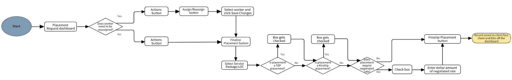
## Main Flow – Placement

| Main Flow |  |
| --- | --- |
| 1. | User navigates to the Placement Request dashboard. |
| 2. | Does worker need to be assigned or reassigned? If yes > proceed to step 3 If no > proceed to step 4 |
| 3. | Click [Actions] > [Assign/Reassign] > select worker and click [Save Changes]. |
| 4. | Click [Actions] > [Finalize Placement]. |
| 5. | Select the Service Package/Tier. |
| 6. | Is the placement a TEP placement? If yes > box gets checked If no > proceed to step 7 |
| 7. | Is the placement a Kinship placement? If yes > box gets checked If no > proceed to step 8 |
| 8. | Does the placement require a negotiated rate? If yes > check box and proceed to step 9 If no > proceed to step 10 |
| 9. | Enter the dollar amount of the negotiated rate. |
| 10. | Click [Finalize Placement]. |
| 11. | Placement record is saved to the client face sheet and record falls off the dashboard. |

## 7.1 Dashboard – User Interfaces

| Placement Request Dashboard (Mockup) |
| --- |
| 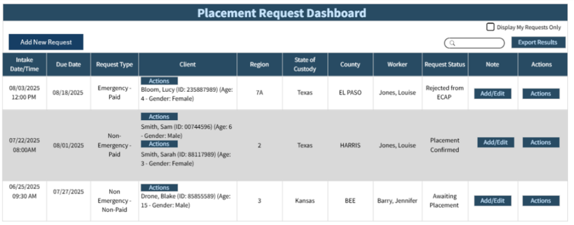 |

| Add New Placement Request (Mockup) |
| --- |
| 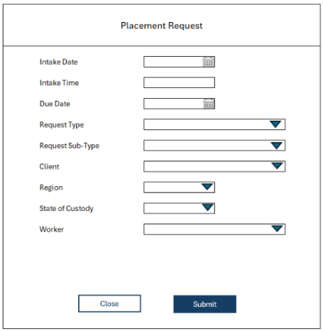 |

| Actions Menu Client Column (Mockup) |
| --- |
| 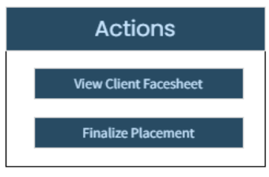 |

| Actions Menu Dashboard (Mockup) |
| --- |
| 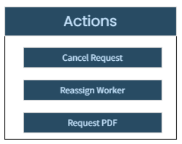 |

| Cancel Request Form (CoBRIS Screenshot) |
| --- |
| 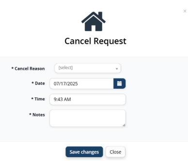 |

| Reassign Worker (CoBRIS Screenshot) |
| --- |
| 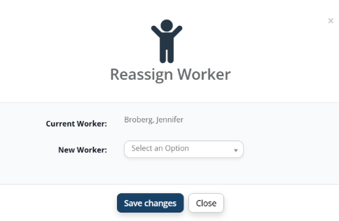 |

| Placement Notes Data Grid (CoBRIS Screenshot) |
| --- |
| 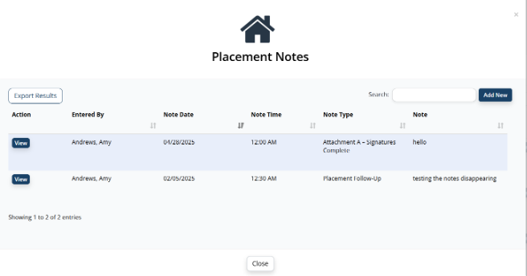 |

| {Add} Placement Note (CoBRIS Screenshot) |
| --- |
| 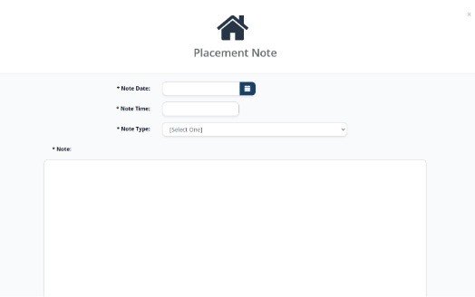 |

| [View] Placement Note (CoBRIS Screenshot) |
| --- |
| 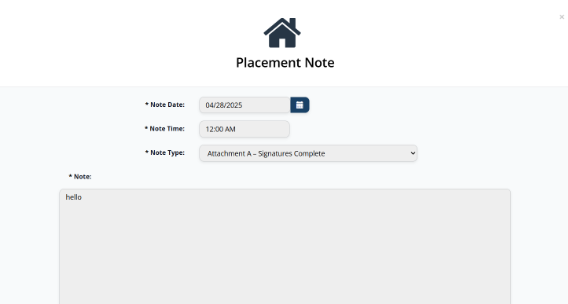 |

| Finalize Placement (no prior placement in ECAP) (CoBRIS Screenshot) |
| --- |
| 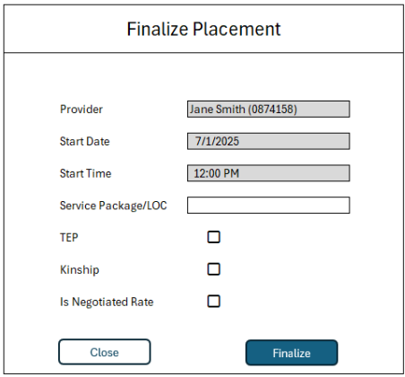 |

| Finalize Placement (Prior placement was closed in ECAP) (CoBRIS Screenshot) |
| --- |
| 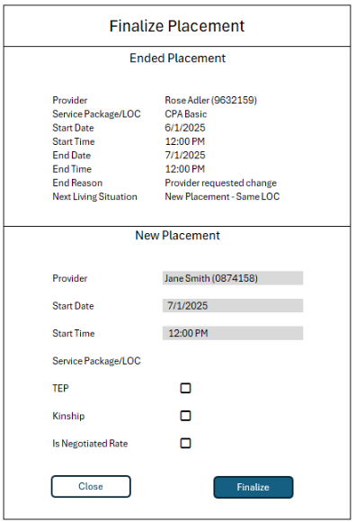 |

## 7.2 Dashboard – Business Rules

| # | Rule Description |
| --- | --- |
| Placement Request Dashboard – General |  |
| 1. | Dashboard displays submitted Intake records.  When the placement is made in ECAP, the dashboard data will be updated. |
| 2. | Display My Requests Only Checkbox filters the dashboard by the logged in user. |
| 3. | Request Status values: Awaiting Placement – Intake has been submitted to ECAP Placement Confirmed – Placement data has been successfully received from ECAP Rejected from ECAP – Placement data was rejected for a validation error |
| 4. | Placement Validations: Client’s Removal Date must be less than or equal to the Placement Begin Date Client cannot have more than one open Paid placement at a time Provider must be selected and exist in TFI One Provider’s Agency must have contracted rates within the placement dates Start Date is required Start Date must be less than or equal to the End Date Start Date must be less than or equal to current date A placement can have multiple agencies during the placement's date range.  The system will look at the provider’s first agency record and the latest agency record to validate that the placement’s date range falls between the earliest agency start date and the latest agency’s end date. Additional validations may be configured. |
| 5. | Rate validations are defined in the Client FDS: Client Placement. |
| 6. | Data exchange between ECAP and TFI One will be defined in the API documentation. |
| 7. | [Add New Request] button is permission based and should only display if the user has the permission. |
| Add New Placement |  |
| 1. | When [Submit] is selected, the request record will queue to the dashboard with a status = Awaiting Placement. |
| 2. | Client dropdown will display all active clients.  If a new client needs to be created, the user will go through the Intake process (See Client FDS – Intake/Admission) |
| 3. | Region and State of Custody values will be defined in the Configuration document. |
| 4. | Worker dropdown values will display all workers filtered by role = TBD. |
| 5. | This functionality should only be used if a placement is not going through ECAP (e.g. kinship placements). |
| Actions Column Actions Menu |  |
| 1. | The Actions menu under the Actions Column displays the following button options: [Cancel Request] [Reassign Worker] [Request PDF] |
| Cancel Request Form |  |
| 1. | Cancel Reason dropdown values are specific to the organization. |
| Reassign Worker Form |  |
| 1. | Current Worker value is pre-populated with the Worker currently linked to the request.  If no worker is currently assigned the value will be blank. |
| 2. | New Worker dropdown values are specific to the organization’s available workers. |
| Request PDF |  |
| 1. | The [Request PDF] Button brings the user to a read-only PDF of the Request Information document in a new browser. |
| Client Column Actions Menu |  |
| 1. | The Actions Menu under the Client Column displays the following menu options: [View Client Facesheet] [Finalize Placement] |
| 2. | View brings the user to the client’s face sheet |
| Placement Notes Data Grid |  |
| 1. | The [View] button brings the user to a read-only view of the placement note |
| {Add/View} Placement Note |  |
| 1. | Note type dropdown values are specific to the user’s organization and note types used. |
| 2. | The [View] button opens the placement note in a read-only format with labels and values.  The placement note is only editable by the user who created the note. |
| Finalize Placement |  |
| 1. | [Finalize Placement] will become enabled when the Request Status = Placement Confirmed |
| 2. | Finalize Placement screen will display read-only data received from ECAP. |
| 3. | See Client FDS – Placement – Placement Worksheet for business rules surrounding TEP, Kinship, Negotiated Rate and Service Package/Tier validations. |
| 4. | Fields will be editable by permission. |

## 7.3 Dashboard – Element Descriptions

| Element Name | Description/ Attributes | Element Type | Editable | Required | Core |
| --- | --- | --- | --- | --- | --- |
| Placement Request Dashboard |  | Dashboard |  |  | Y |
| Header Text | Text: “Placement Request Dashboard” | Header | N/A | N/A | Y |
| Add New Request Button | Text: “Add New Request” See business rules. | Button | N/A | N/A | Y |
| Display My Requests Only Checkbox | Label: “Display My Requests Only” See business rules. | Checkbox | Y | N | Y |
| Export Results Button | Text: “Export Results” | Button | N/A | N/A | Y |
| Intake Date/Time Column | Column Header: “Intake Date/Time” Column Value: “{Intake Date/Time}” | Date/Time Column | N | N/A | Y |
| Due Date Column | Column Header: “Due Date” Column Value: “{Due Date}” | Date Column | N | N/A | Y |
| Request Type Column | Column Header: “Request Type” Column Value: “{Request Type} – {Request Sub-type}” | Text Column | N | N/A | Y |
| Client Column | Column Header: “Client” Column Value: “{Last Name}, {First Name} {(PID: {PID Number})} {(Age: {Age}- Gender: {Gender})}” Button: [Actions] | Text and Button Column | N | N/A | Y |
| Region Column | Column Header: “Region” Column Value: “{Region}” | Text Column | N | N/A | Y |
| State of Custody Column | Column Header: “State of Custody” Column Value: “{State of Custody}” | Text Column | N | N/A | Y |
| County Column | Column Header: “County” Column Value: “{County}” | Text Column | N | N/A | Y |
| Worker Column | Column Header: “Worker” Column Value: “{Worker Last Name}, {First Name}” | Text Column | N | N/A | Y |
| Request Status Column | Column Header: “Request Status” Column Value: “{Request Status}” | Text Column | N | N/A | Y |
| Note Column | Column Header: “Note” Button(s): [Add/Edit] | Button Column | N/A | N/A | Y |
| Actions Column | Column Header: “Actions” Button(s): [Actions] | Button Column | N/A | N/A | Y |
| Add New Request |  |  |  |  |  |
| Header | Text: “Placement Request” | Header | N/A | N/A | Y |
| Intake Date | Label: “Intake Date” | Date Field | Y | Y | Y |
| Intake Time | Label: “Intake Time” | Time Field | Y | Y | Y |
| Due Date | Label: “Due Date” | Date Field | Y | Y | Y |
| Request Type | Label: “Request Type” Dropdown Values: Select Type (Default) Emergency Non-Emergency | Dropdown | Y | Y | Y |
| Request Sub-type | Label: “Request Sub-Type” Dropdown Values: Select Sub-Type (Default) Paid Non-Paid | Dropdown | Y | Y | Y |
| Client | Label: “Client” Dropdown Values: Select Client (Default) See business rules. | Dropdown | Y | Y | Y |
| Region | Label: “Region” Dropdown Values: Select Region (Default) See business rules. | Dropdown | Y | Y | Y |
| State of Custody | Label: “State of Custody” Dropdown Values: Select State (Default) See business rules. | Dropdown | Y | Y | Y |
| Worker | Label: “Worker” Dropdown Values: Select Worker (Default) See business rules. | Dropdown | Y | Y | Y |
| Close Button | Text: “Close” | Button | N/A | N/A | Y |
| Submit Button | Text: “Submit” | Button | N/A | N/A | Y |
| Actions Menu |  | Menu |  |  | Y |
| Actions Menu | Client Column Button Values: View Client Facesheet Finalize Placement | Menu | N/A | N/A | Y |
| Actions Menu |  | Menu |  |  | Y |
| Actions Menu | Action Column Button Values: [Cancel Request] [Reassign Worker] [Request PDF] | Menu | N/A | N/A | Y |
| Cancel Request Modal |  | Modal |  |  | Y |
| Header Text | Text: “Cancel Request” | Header | N/A | N/A | Y |
| Cancel Reason | Label: “Cancel Reason” Dropdown Values: Select Reason (default) See business rules. | Dropdown | Y | Y | Y |
| Date | Label: “Date” | Date Picker | Y | Y | Y |
| Time | Label: “Time” | Time Picker | Y | Y | Y |
| Notes | Label: “Notes” | Multi-Line Textbox | Y | Y | Y |
| Cancel Button | Text: “Cancel” | Button | N/A | N/A | Y |
| Save Changes | Text: “Save Changes” | Button | N/A | N/A | Y |
| Reassign Worker Modal |  | Modal |  |  | Y |
| Header Text | Text: “Reassign Worker” | Header | N/A | N/A | Y |
| Current Worker | Label: “Current Worker” Value: “{Worker Last Name}, {First Name}” See business rules. | Label and Value | N/A | N/A | Y |
| New Worker | Label: “New Worker” Dropdown Values: Select Worker (Default) See business rules. | Dropdown | Y | N | Y |
| Cancel Button | Text: “Cancel” | Button | N/A | N/A | Y |
| Save Changes Button | Text: “Save Changes” | Button | N/A | N/A | Y |
| Add/Edit Placement Notes |  | Data Grid |  |  | Y |
| Header Text | Text: “Placement Notes” | Header | N/A | N/A | Y |
| Add Note Button | Text: “Add Note” | Button | N/A | N/A | Y |
| Export Results Button | Text: “Export Results” | Button | N/A | N/A | Y |
| Entered By Column | Column Header: “Entered By” Column Value: “{Last Name}, {First Name}” | Text Column | N | N/A | Y |
| Note Date Column | Column Header: “Note Date” Column Value: “{Date}” | Date Column | N | N/A | Y |
| Note Time Column | Column Header: “Note Time” Column Value: “{Time XX:XX AM/PM}” | Time Column | N | N/A | Y |
| Note Type Column | Column Header: “Note Type” Column Value: “{Type}” | Text Column | N | N/A | Y |
| Note Column | Column Header: “Note” Column Value: “{Note}” | Text Column | N | N/A | Y |
| Actions Column | Column Header: “Actions” Button(s): [View] | Button Column | N/A | N/A | Y |
| Placement Note Modal |  | Modal |  |  | Y |
| Header Text | Text: “Placement Note” | Header | N/A | N/A | Y |
| Note Date | Label: “Note Date” | Date Picker | Y | Y | Y |
| Note Time | Label: “Note Time” | Time Picker | Y | Y | Y |
| Note Type | Label: “Note Type” Dropdown Values: Select Note Type (Default) See business rules. | Dropdown | Y | Y | Y |
| Note | Label: “Note” | Multi-Line Textbox | Y | Y | Y |
| Cancel Button | Text: “Cancel” | Button | N/A | N/A | Y |
| Save Changes Button | Text: “Save Changes” | Button | N/A | N/A | Y |
| Finalize Placement – No prior placement in ECAP |  |  |  |  |  |
| Header Text | Text: “Finalize Placement” | Header | N/A | N/A | Y |
| Provider | Label: “Provider” | Text | N | N | Y |
| Start Date | Label: “Start Date” | Date | N | N | Y |
| Start Time | Label: “Start Time” | Time | N | N | Y |
| Service Package/Tier | Label: “Service Package/Tier” Dropdown Values: Select Service Package/Tier (Default) See business rules. | Dropdown | Y | Y | Y |
| TEP | Label: “TEP” | Checkbox | Y | N | Y |
| Kinship | Label: “Kinship” | Checkbox | Y | N | Y |
| Is Negotiated Rate | Label: “Is Negotiated Rate” See business rules. | Checkbox | Y | N | Y |
| Negotiated Rate | Label: “Negotiated Rate” See business rules. | Textbox | Y | Y | Y |
| Finalize Placement – Prior Placement ended in ECAP |  |  |  |  |  |
| Header Text | Text: “Finalize Placement” | Header | N/A | N/A | Y |
| Sub header Text | Text: “Ended Placement” | Sub Header | N/A | N/A | Y |
| Provider | Label: “Provider” Value: “{Provider Name (Provider RID)}” | Label and Value | N/A | N/A | Y |
| Service Package/Tier | Label: “Service Package/Tier” Value: “{Service Package/Tier}” | Label and Value | N/A | N/A | Y |
| Start Date | Label: “Start Date” Value: “{Start Date}” | Label and Value | N/A | N/A | Y |
| Start Time | Label: “Start Time” Value: “{Start Time}” | Label and Value | N/A | N/A | Y |
| End Date | Label: “End Date” Value: “{End Date}” | Label and Value | N/A | N/A | Y |
| End Time | Label: “End Time” Value: “{End Time}” | Label and Value | N/A | N/A | Y |
| End Reason | Label: “End Reason” Value: “{End Reason}” | Label and Value | N/A | N/A | Y |
| Next Living Situation | Label: “Next Living Situation” Value: “{Next Living Situation}” | Label and Value | N/A | N/A | Y |

## 7.4 Dashboard – Security

| Permission Type | Permission Name | Description |
| --- | --- | --- |
| Access | AccessPlacementRequestDashboard | Access to the placement request dashboard and data grid |
| Action | ViewPlacementRequestDashboard | Ability to view the placement request dashboard |
| Action | CreatePlacementRequest | Ability to create a placement request |
| Action | CancelRequest | Ability to cancel requests made |
| Action | ManageRequestWorker | Ability to reassign worker associated with placement |
| Action | EditPlacementInformation | Ability to edit the read-only fields |
| Action | CreatePlacementNotes | Ability to create a new placement note |
| Action | ViewNotes | Ability to view notes in read-only view |
